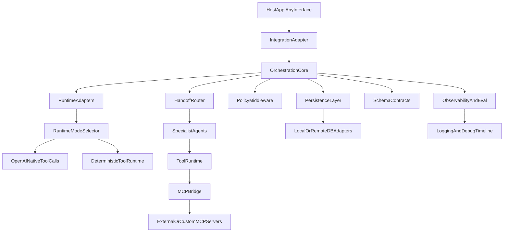

# Target Architecture (New Repository)

## Layered System Blueprint



## Proposed Package Structure

```text
new-agent-system/
  src/
    integration/
      host_adapter.py
    core/
      orchestrator.py
      event_router.py
      session_context.py
    runtime/
      runtime_adapter.py
      mode_selector.py
      openai_agents_runtime.py
      openai_compatible_runtime.py
      custom_runtime.py
      capability_map.py
      assistants_compat_runtime.py
    agents/
      factories.py
      registries.py
      handoff_router.py
      plugins/
    tools/
      descriptors.py
      registry.py
      executor.py
      decorators.py
      plugins/
    mcp/
      mcp_registry.py
      mcp_client_adapter.py
      mcp_tool_adapter.py
    persistence/
      contracts.py
      session_store.py
      checkpoint_store.py
      workflow_store.py
      audit_store.py
      event_store.py
      adapters/
        postgres_adapter.py
        sqlite_adapter.py
      factory.py
    policies/
      middleware.py
      guardrails.py
      risk_gates.py
    schemas/
      events.py
      tool_io.py
      outputs.py
    observability/
      logging.py
      timeline.py
      tracing.py
      metrics.py
      evaluations.py
    config/
      settings.py
      provider_registry.py
  tests/
    integration/
    regression/
    performance/
```

## Core Interfaces (Concrete)

### `RuntimeAdapter`
- Goal: isolate runtime backend (OpenAI Agents SDK, Assistants compatibility, others).
- Contract:
  - `start_session(session_id: str, metadata: dict | None = None) -> SessionHandle`
  - `run_turn(session_id: str, user_input: str, context: dict) -> AsyncIterator[RuntimeEvent]`
  - `submit_tool_results(session_id: str, run_id: str, tool_results: list[ToolResult]) -> AsyncIterator[RuntimeEvent]`
  - `get_capabilities() -> ProviderCapabilityMap`
  - `healthcheck() -> HealthStatus`

### `ToolRuntime`
- Goal: deterministic tool execution independent from model runtime.
- Contract:
  - `resolve(tool_name: str) -> ToolDescriptor`
  - `execute(call: ToolCallContext) -> ToolResult`

### `PolicyMiddleware`
- Goal: pre/post gates around tool and model outputs.
- Contract:
  - `before_tool_call(context: ToolCallContext) -> PolicyDecision`
  - `after_tool_call(result: ToolResult) -> ToolResult`
  - `before_output(output: OutputEnvelope) -> OutputEnvelope`

### `HandoffRouter`
- Goal: explicit dynamic routing across specialist agents/layers.
- Contract:
  - `route(intent: IntentProfile, state: SessionState) -> AgentRoute`
  - `fallback(route: AgentRoute, reason: str) -> AgentRoute`

### `LoggingModule`
- Goal: debug-first visibility across parallel and background execution.
- Contract:
  - `start_span(context: RuntimeContext) -> SpanHandle`
  - `log_event(event: RuntimeLogEvent) -> None`
  - `emit_timeline(job_id: str) -> list[RuntimeLogEvent]`
  - `query(filters: LogQuery) -> list[RuntimeLogEvent]`

### `PersistenceModule`
- Goal: durable and portable state persistence for sessions, checkpoints, workflows, audit, and timeline/event data.
- Contract:
  - `get_session_store() -> SessionStore`
  - `get_checkpoint_store() -> CheckpointStore`
  - `get_workflow_store() -> WorkflowStore`
  - `get_audit_store() -> AuditStore`
  - `get_event_store() -> EventStore`

## Embeddable Framework Rules
- The framework is a module/SDK, not a standalone UI product.
- Any host app (API, mobile backend, worker service, chat UI) integrates through `integration/host_adapter.py`.
- Agent plugins and tool plugins must be hot-swappable.
- Runtime mode can switch per task between provider-native and deterministic tool execution.
- Default provider-native tool calling stays available, with deterministic mode used when policies require stricter execution control.
- MCP support is first-class: plug external MCP servers or custom internal MCP servers without changing orchestration core.
- Decorator-based customization is supported for tools (validation, authz, audit, rate limit, PII redaction, retries).
- Persistence is first-class through provider-agnostic stores, supporting local and remote database backends with the same contracts.

## Design Principles
- Apply KISS first: prefer minimal abstractions and only add complexity when a measured requirement appears.
- Favor event-driven architecture (EDA) internally for orchestration, scheduling, and observability flows.
- Treat AI as infrastructure/commodity: the framework owns orchestration and policy, models are pluggable backends.
- Support workflow portability: load workflow definitions from provider exports (when available) or local workflow files.
- Support OpenAI Agents SDK features as capabilities, including handoffs, tools, structured outputs, guardrails, and tracing where available.
- Support open-source LLMs through adapter contracts and capability maps, not through hardcoded provider assumptions.

## Provider Plug-In / Plug-Out Model
- OpenAI Agents SDK is one runtime adapter, not the orchestration core.
- Add runtime adapters for:
  - OpenAI-native (`OpenAIAgentsRuntimeAdapter`)
  - OpenAI-compatible endpoints (`OpenAICompatibleRuntimeAdapter`, for example vLLM)
  - Custom provider runtimes (`CustomRuntimeAdapter`, for example llama.cpp or TGI)
- Route execution mode by capability + policy:
  - read-only low-risk tasks may use provider-native flow
  - risky or state-changing tasks must use deterministic tool runtime
- Keep provider features behind `capability_map.py` so handoffs/tool-calls/structured outputs are enabled only when supported.

## Transport Guidance (WebSocket vs Others)
- WebSockets are optional, not required by core architecture.
- Core stays transport-agnostic; host adapters decide transport (`HTTP`, `SSE`, `WebSocket`, queue/worker).
- Use WebSockets only when bidirectional low-latency interaction is required by the host product.

## Why This Fits Your Goal
- Embeddable by design: thin integration adapter for any host interface.
- Multi-layered by design (runtime, orchestration, routing, tools, policies, observability, logging).
- Dynamic through registries/descriptors and plugin loading.
- Deterministic where required (tool runtime + policy gates), flexible where useful (agent handoffs and OpenAI-native runtime mode).

## References
- Upstream repository: https://github.com/SavinRazvan/flexiai-toolsmith
- Snapshot commit: `3f8b0c7a0996117dc95f0a8b93678dae44a5b0d6`
- Naming conventions for project/repo/package/symbols:
  - `30-project-naming-and-conventions.md`
- Background context docs:
  - https://github.com/SavinRazvan/flexiai-toolsmith/blob/3f8b0c7a0996117dc95f0a8b93678dae44a5b0d6/README.md
  - https://github.com/SavinRazvan/flexiai-toolsmith/blob/3f8b0c7a0996117dc95f0a8b93678dae44a5b0d6/docs/ARCHITECTURE.md
  - https://github.com/SavinRazvan/flexiai-toolsmith/blob/3f8b0c7a0996117dc95f0a8b93678dae44a5b0d6/docs/WORKFLOW.md
- Provider capability strategy:
  - `10-provider-capability-matrix.md`
