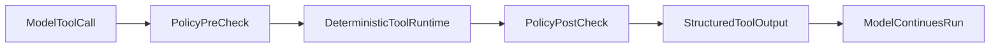

# Tool Calling Decision: FlexiAI vs OpenAI-Native

## Decision Goal
Choose the tool-calling execution model for the new repository based on determinism, flexibility, observability, and safety.

## Option A: Reuse FlexiAI-Style Deterministic Tool Runtime

### Strengths
- Explicit `tool_name -> callable` control.
- Predictable behavior and simpler debugging.
- Easier policy interception before execution.
- Strong fit for high-risk operations (security, system changes, critical business actions).

### Weaknesses
- More orchestration code to maintain.
- You must implement/maintain richer metadata and plugin lifecycle.

## Option B: OpenAI-Native Tool Calling in Agents SDK

### Strengths
- Faster integration with SDK-native workflows.
- Better default alignment with handoffs and model-side orchestration.
- Less custom plumbing for early prototyping.

### Weaknesses
- Harder to guarantee deterministic behavior in complex tool chains without extra guards.
- Requires strong additional observability/policy wrappers for production safety.

## Recommended Hybrid Strategy
- Use OpenAI Agents SDK for agent lifecycle, handoffs, and high-level orchestration.
- Keep deterministic local `ToolRuntime` as the execution authority for actual tool side effects.
- Treat model tool calls as requests, not direct execution rights.
- Let each agent/tool plugin declare preferred runtime mode, with policy middleware able to override it.
- Use provider capability maps to gate provider-native execution (especially for open-source/OpenAI-compatible backends).

## Hybrid Execution Flow

## Decision Rule
- If operation is low risk and read-only: OpenAI-native path is acceptable.
- If operation is state-changing, expensive, or security-sensitive: deterministic tool runtime is mandatory.
- If provider capability is partial/unknown: default to deterministic runtime until validated.

## References
- Upstream repository: https://github.com/SavinRazvan/flexiai-toolsmith
- Snapshot commit: `3f8b0c7a0996117dc95f0a8b93678dae44a5b0d6`
- Key deterministic tooling references:
  - https://github.com/SavinRazvan/flexiai-toolsmith/blob/3f8b0c7a0996117dc95f0a8b93678dae44a5b0d6/flexiai/core/handlers/tool_call_executor.py
  - https://github.com/SavinRazvan/flexiai-toolsmith/blob/3f8b0c7a0996117dc95f0a8b93678dae44a5b0d6/flexiai/toolsmith/tools_registry.py
  - https://github.com/SavinRazvan/flexiai-toolsmith/blob/3f8b0c7a0996117dc95f0a8b93678dae44a5b0d6/flexiai/toolsmith/tools_manager.py
- OpenAI Agents SDK experiments:
  - https://github.com/SavinRazvan/flexiai-toolsmith/blob/3f8b0c7a0996117dc95f0a8b93678dae44a5b0d6/agents_experiments/OpenAI_AgentsSDK/tools_and_functions.py
  - https://github.com/SavinRazvan/flexiai-toolsmith/blob/3f8b0c7a0996117dc95f0a8b93678dae44a5b0d6/agents_experiments/OpenAI_AgentsSDK/handoffs_coordination.py
- Capability model:
  - `10-provider-capability-matrix.md`
