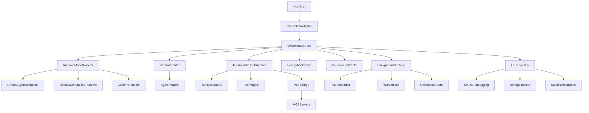

# Project Structure Blueprint

## Goal
Provide a single implementation-ready reference for repository layout and cross-layer architecture flow.

## Proposed Repository Layout

```text
new-agent-framework/
  pyproject.toml
  README.md
  .env.template
  src/
    integration/
      host_adapter.py
      event_sink_router.py
    core/
      orchestrator.py
      event_router.py
      session_store.py
      task_graph.py
      scheduler.py
      worker_pool.py
      background_runtime.py
      checkpoint_store.py
      workflow_loader.py
      result_aggregator.py
    runtime/
      runtime_adapter.py
      mode_selector.py
      capability_map.py
      openai_agents_runtime.py
      openai_compatible_runtime.py
      custom_runtime.py
    agents/
      factories.py
      registries.py
      handoff_router.py
      plugins/
        plugin_contract.py
        plugin_manager.py
    tools/
      descriptors.py
      registry.py
      executor.py
      decorators.py
      plugins/
        plugin_contract.py
        plugin_manager.py
    mcp/
      mcp_registry.py
      mcp_client_adapter.py
      mcp_tool_adapter.py
    policies/
      middleware.py
      guardrails.py
      risk_gates.py
    schemas/
      events.py
      tool_io.py
      outputs.py
      workflow_schema.py
    observability/
      logging.py
      timeline.py
      tracing.py
      metrics.py
      evaluations.py
    config/
      settings.py
      provider_registry.py
  tests/
    unit/
    integration/
    regression/
    performance/
  docs/
    architecture_mvp.md
    runtime_contracts.md
    plugin_lifecycle.md
    workflow_loading.md
    mcp_integration.md
```

## Architecture Flow (High Level)



## Layer Responsibility Notes
- `integration/`: host boundary only, no orchestration logic.
- `core/`: orchestration, scheduling, lifecycle, background runtime.
- `runtime/`: provider runtime adapters and capability-driven routing.
- `tools/`: deterministic execution authority for side-effecting operations.
- `mcp/`: external/custom MCP server integration.
- `policies/`: allow/deny/escalate decision system.
- `schemas/`: strict contracts and versioned IO.
- `observability/`: correlation-aware logs, traces, timeline reconstruction.

## Vertical Slice Map
1. `integration/host_adapter.py` receives turn input.
2. `core/orchestrator.py` creates runtime context and selects mode.
3. `runtime/*` emits model/tool events.
4. `tools/executor.py` runs deterministic calls via policies/decorators.
5. `observability/*` records full timeline with correlation IDs.
6. `integration/event_sink_router.py` returns output to host.

## References
- `02-target-architecture.md`
- `08-module-requirements-matrix.md`
- `10-provider-capability-matrix.md`
- `12-bootstrap-checklist.md`
