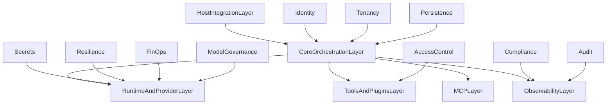

# Enterprise Readiness Modules

## Goal
Extend the core architecture to enterprise-grade production readiness while preserving modular, dynamic, embeddable design.

## Status Framing
- Core architecture and MVP planning are complete.
- Enterprise readiness requires additional governance, security, reliability, and operations modules.

## Priority Model
- `P0`: mandatory before production onboarding of real tenants.
- `P1`: required for scale, compliance confidence, and operational maturity.
- `P2`: advanced optimization and governance depth.

## Additional Modules

## `identity/` (`P0`)
Purpose: authentication and service identity.

Must:
- support machine and human identities
- support token validation and key rotation
- support service-to-service authn for adapters/plugins

Acceptance:
- unauthorized calls are denied with auditable reason
- key rotation does not break runtime sessions

## `access_control/` (`P0`)
Purpose: authorization for tools, agents, and workflows.

Must:
- support RBAC and policy-based access decisions
- enforce per-tool and per-plugin permissions
- support approval workflows for high-risk actions

Acceptance:
- privileged actions require explicit entitlement/approval
- deny/escalate decisions are traceable in logs

## `tenancy/` (`P0`)
Purpose: strict tenant isolation and governance boundaries.

Must:
- isolate sessions, jobs, logs, and checkpoints per tenant
- support tenant-level quotas and rate limits
- support per-tenant policy overlays

Acceptance:
- cross-tenant data access is prevented by default
- tenant quota violations return structured policy errors

## `secrets/` (`P0`)
Purpose: secure provider keys, plugin credentials, and signing material.

Must:
- integrate with secret manager/KMS
- avoid plaintext secrets in runtime memory/logs where possible
- support secret rotation and lease expiry

Acceptance:
- secrets are never written to logs
- secret rotation can be performed without redeploying all services

## `persistence/` (`P1`)
Purpose: durable storage abstractions.

Must:
- provide storage interfaces for sessions, checkpoints, workflows, logs
- support configurable backends (sql/object/kv)
- support retention and archival policies

Acceptance:
- restart recovery restores unfinished jobs from checkpoints
- retention rules can purge/archive data by policy

## `resilience/` (`P1`)
Purpose: fault tolerance and deterministic recovery.

Must:
- circuit breaker for failing providers/tools
- retry policy library with idempotency controls
- dead-letter queues for exhausted failures
- compensating action hooks for side effects

Acceptance:
- repeated provider failure triggers open circuit behavior
- exhausted retries route to DLQ with full context

## `compliance/` (`P1`)
Purpose: policy and evidence for regulated environments.

Must:
- data classification tags (PII, sensitive, restricted)
- policy-driven redaction and retention
- audit evidence export for control verification

Acceptance:
- sensitive fields are redacted in all exported logs
- evidence bundle can be generated for a selected period

## `audit/` (`P1`)
Purpose: immutable operational and security audit trail.

Must:
- append-only records for policy/tool/plugin/runtime decisions
- signed event chain or tamper-evident storage
- searchable by correlation and tenant identifiers

Acceptance:
- audit trail shows complete decision lineage for any job
- tampering attempts are detectable

## `finops/` (`P1`)
Purpose: cost and budget governance.

Must:
- cost attribution by tenant/job/provider/model/tool
- budget guardrails and hard stops
- forecast and anomaly detection hooks

Acceptance:
- every completed job has cost attribution metadata
- budget breaches enforce configured policy action

## `model_governance/` (`P1`)
Purpose: model/provider lifecycle governance.

Must:
- versioned model registry with capability metadata
- rollout strategy support (canary/blue-green/rollback)
- evaluation gates before production promotion

Acceptance:
- rollback to last known good model is one operation
- promotion requires passing configured eval thresholds

## `deployment/` (`P2`)
Purpose: runtime environment lifecycle and release controls.

Must:
- environment promotion workflow (dev/stage/prod)
- infrastructure templates and policy checks
- release channels and feature-flag governance

Acceptance:
- deployment artifacts are reproducible
- feature flags can disable state-changing/high-impact capabilities without redeploy

## `sre/` (`P2`)
Purpose: reliability engineering and operational targets.

Must:
- SLO definitions for latency, success rate, recovery time
- alerting strategy tied to critical signals
- runbooks for common incident classes

Acceptance:
- critical alerts map to runbook actions
- SLO compliance is measurable from observability stack

## Enterprise Architecture Overlay

## Implementation Order Recommendation
1. `identity`, `access_control`, `tenancy`, `secrets` (`P0`)
2. `persistence`, `resilience`, `compliance`, `audit`, `finops`, `model_governance` (`P1`)
3. `deployment`, `sre` (`P2`)

## Gate to Call Project Enterprise-Ready
- All `P0` and `P1` modules implemented with passing tests.
- Evidence of tenant isolation, policy enforcement, and audit integrity.
- Provider and model changes controlled by governance gates.
- Cost, reliability, and compliance signals visible and actionable.

## Related Docs
- `08-module-requirements-matrix.md`
- `09-definition-of-done-and-quality-gates.md`
- `10-provider-capability-matrix.md`
- `12-bootstrap-checklist.md`
- `13-project-structure-blueprint.md`
- `15-enterprise-quality-gates.md`
