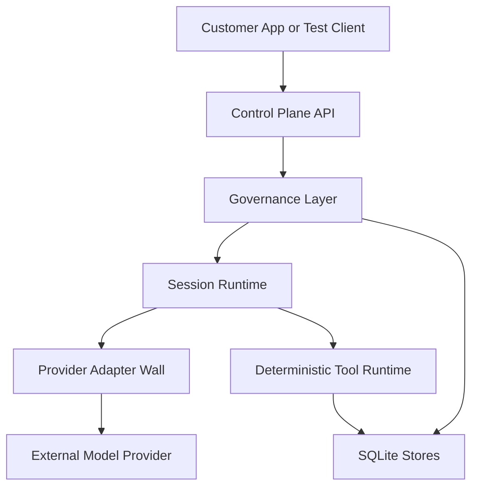

<!--
File: README.md
Path: README.md
Role: Public repository overview, maturity boundary, quick start, and architecture map.
Used By:
 - Contributors and evaluators
 - docs/README.md
 - docs/strategy/*
Depends On:
 - MAINTAINER_STATUS.md
 - STATUS.md
 - docs/architecture/governed-execution-pipeline.md
 - docs/strategy/governed-execution-positioning.md
 - docs/strategy/next-directions.md
Notes:
 - Keep public claims evidence-aligned with STATUS.md.
-->

# eXo-brain

**Independent reference implementation of governed agentic AI execution.**

eXo-brain explores how to put a server-side control plane around tool-using AI
systems: policy gates, deterministic tool execution, provider-neutral runtime
adapters, tenant-scoped governance, audit events, and runtime control.

> **Maturity note:** this is a single-maintainer research project, not a
> production enterprise platform, SaaS product, or supported deployment
> template. See [MAINTAINER_STATUS.md](MAINTAINER_STATUS.md) and
> [STATUS.md](STATUS.md) before using it for serious evaluation.
>
> Build model: **AI-assisted implementation**, with human-owned architecture,
> review, and evidence. See `MAINTAINER_STATUS.md` § “How This Project Is Built”.

## What This Is

- A **control-plane reference implementation** for governed agent execution:
  ingress gates, policy middleware, deterministic tool runtime, audit, tenancy,
  quotas, and runtime control.
- A **provider-neutral orchestration example**: provider SDKs stay behind runtime
  adapter modules, while core orchestration depends on contracts, capabilities,
  and policy.
- A **portfolio and design-partner artifact** for teams thinking about safe
  tool use, adapter boundaries, MCP/tool governance, and audit-ready AI
  workflows.

## What This Is Not

- Not a commercial SaaS product.
- Not an enterprise-supported distribution, SLA-backed vendor offering, or
  certified compliance product.
- Not a complete provider-adapter marketplace. The strongest adapter path today
  is OpenAI-oriented; broader adapter breadth remains roadmap work.
- Not a production deployment template. `docker-compose.yml` is intentionally a
  local single-node development stack.
- Not a generic chatbot wrapper or raw model-access resale surface.

## Architecture at a Glance



Default governed turn flow:

1. Authenticate tenant and session.
2. Evaluate entitlements and ingress gates.
3. Start the governed runtime path.
4. Stream through the orchestrator.
5. Route high-risk or state-changing tool calls through deterministic execution.
6. Apply policy before and after tool execution.
7. Persist audit and runtime-control evidence.

The canonical ordering reference is
[docs/architecture/governed-execution-pipeline.md](docs/architecture/governed-execution-pipeline.md).

## Delivered Today

The public repository currently includes:

- **FastAPI control plane** with REST plus streaming turn surfaces.
- **11 API router modules** covering sessions, turns, tools, agents, providers,
  runtime control, audit, admin keys, Prometheus metrics, and OpenAI-compatible
  ingress.
- **12 policy modules** under `src/policies/` for middleware, ingress gates,
  risk gates, policy templates, signed plugins, classifier support, and BYOC
  fairness.
- **Deterministic tool execution** through `src/tools/executor.py`.
- **Capability + policy execution-mode selection** through
  `src/runtime/mode_selector.py`.
- **Provider-neutral runtime adapter contracts** under `src/runtime/`.
- **Tenant runtime composition** through `src/runtime/tenant_runtime.py`.
- **SQLite-backed persistence** for local sessions, agents, tools, providers,
  audit events, run control, and rate limiting.
- **BYOC tool-runtime primitives** for customer-owned tool execution paths.
- **MCP integration baseline** for registering MCP tools into the internal tool
  ecosystem.
- **Architecture checks** under `scripts/architecture/` for layer validation and
  forbidden provider imports.
- **Test corpus** under `tests/` with module-scoped coverage for governance,
  runtime, tools, persistence, API, and architecture scripts.

See [STATUS.md](STATUS.md) for a public maturity matrix.

## Known Limits

The current public posture is intentionally conservative:

- Persistence is SQLite-oriented; there is no packaged Postgres or HA datastore
  distribution.
- The compose file is local-development only.
- Human approval lifecycle APIs are planned, not complete.
- Standard telemetry hooks exist, but enterprise collector and dashboard
  certification are not complete.
- Adapter ecosystem breadth is not complete.
- No formal compliance attestation is claimed.

## Local Quick Start

### Requirements

- Python 3.12+
- Docker and Docker Compose, if using the compose stack
- A local virtual environment is recommended

### Install

```bash
python -m venv .venv
source .venv/bin/activate
pip install -r requirements.txt
```

### Run Tests

```bash
python -m pytest -q
python scripts/architecture/validate_layers.py
python scripts/architecture/scan_forbidden_imports.py
```

### Run Locally with Docker Compose

```bash
docker compose up --build
```

The API listens on `http://127.0.0.1:8000` by default.

`docker-compose.yml` is explicitly marked as **not a production or enterprise
template**. It sets `EXO_ENV=development` and uses a local SQLite volume. Do not
use it as a deployment blueprint without a separate hardening pass.

## Repository Map

- `src/api/` - FastAPI app, routers, middleware, bootstrap.
- `src/core/` - orchestrator, scheduler, run control primitives.
- `src/runtime/` - runtime adapter contracts, factory loading, tenant runtime.
- `src/policies/` - policy middleware, ingress gates, risk gates, templates.
- `src/tools/` - deterministic tool executor, BYOC runtime, sandbox helpers.
- `src/tenancy/` - tenant governance and policy overlay support.
- `src/persistence/` - in-memory and SQLite persistence adapters.
- `src/mcp/` - MCP registry and tool-adapter bridge.
- `tests/` - module-aligned regression suites and architecture checks.
- `docs/strategy/` - product boundary, governance posture, monetization and
  deployment thinking.
- `docs/architecture/` - architecture references and governed execution order.


## Design Principles

- Provider SDKs stay behind runtime adapters.
- State-changing tool work must be policy-wrapped and deterministic when risk
  requires it.
- Capability + policy decide execution mode; core should not branch on provider
  names.
- Tenant-scoped configuration should be API-driven.
- Claims must be backed by code, tests, docs, or explicitly marked as planned.

## Roadmap

The roadmap lives in [docs/strategy/next-directions.md](docs/strategy/next-directions.md).
Near-term areas that remain especially relevant:

- MCP governance depth.
- Human approval lifecycle APIs.
- Stronger deployment packaging and production-hardening evidence.
- Broader adapter conformance and publish certification.
- Better standard telemetry evidence.

## Design-Partner Work

The maintainer is open to paid design-partner or embedded engineering work
around governed AI execution, adapter-neutral orchestration, policy-wrapped tool
execution, and related architecture reviews.

This repository can be used as a reference implementation or starting point, but
production deployment should go through a separate hardening process.

## License

Apache License 2.0. See [LICENSE](LICENSE) and [NOTICE](NOTICE).
