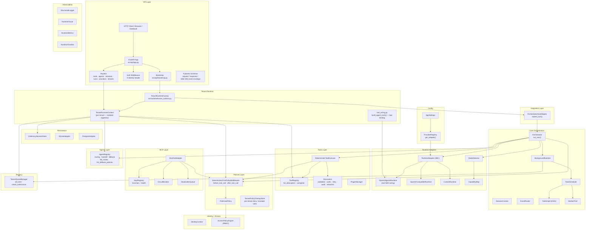
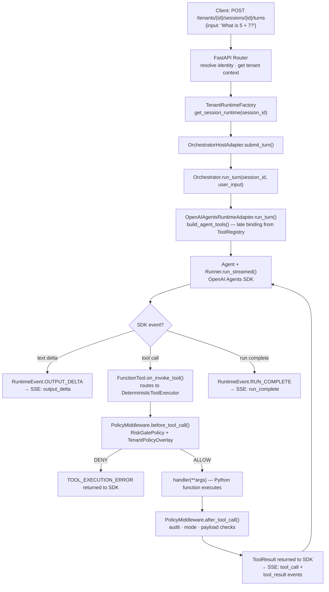
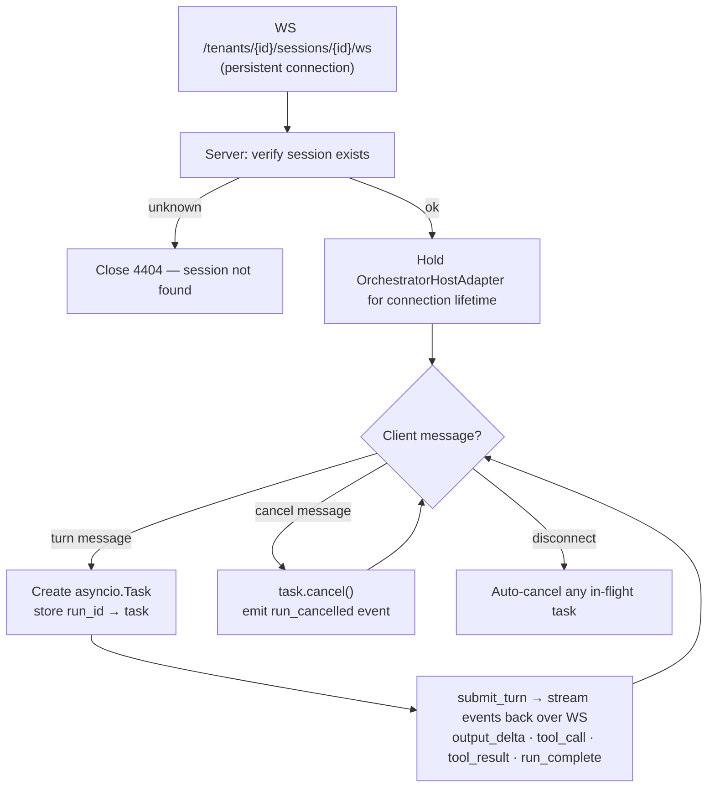
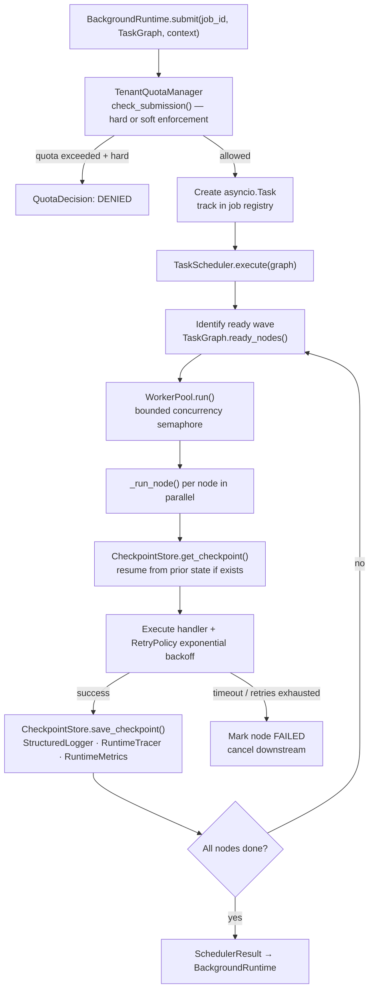
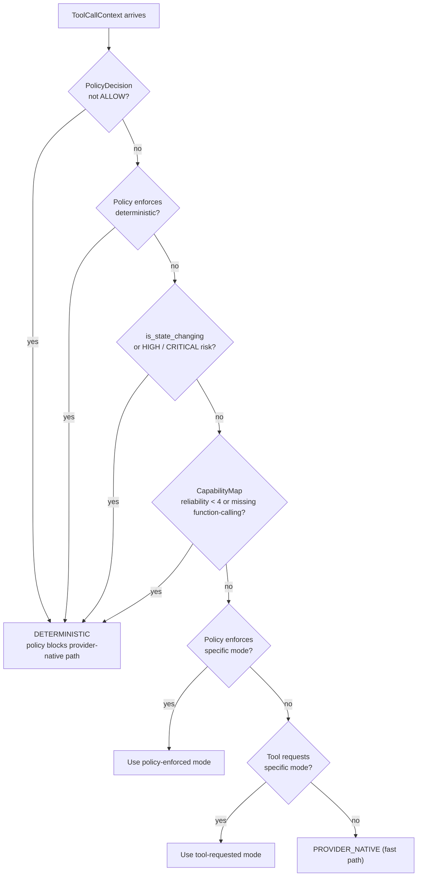

# eXo-brain

Provider-neutral AI orchestration platform with deterministic tool execution, multi-tenant runtime isolation, and a REST/SSE/WebSocket API for single-agent and multi-agent workloads.

## What this repository provides

- **API Platform** — FastAPI application with tenant-scoped tool/agent registration, SSE and WebSocket streaming, and live policy/quota management.
- **Provider-neutral runtime contracts** — `RuntimeAdapter` ABC with pluggable backends (OpenAI Agents SDK, custom adapters).
- **Deterministic-first tool execution** — every state-changing or high-impact tool call is routed through `DeterministicToolExecutor` and `PolicyMiddleware`.
- **Policy middleware** — auditable `before_tool_call` / `after_tool_call` decisions (`allow`, `deny`, `escalate`) with per-tenant overlay support.
- **Multi-tenant isolation** — `TenantRuntimeFactory` gives each tenant its own `ToolRegistry`, `AgentRegistry`, `PolicyMiddleware`, and session store.
- **MCP integration** — trust-tier and per-server health controls for MCP tool calls.
- **Background runtime** — task graph (DAG), scheduler, bounded worker pool, checkpoint/resume.

---

## Quick start

```bash
# 1. Create and activate a virtual environment
python -m venv .exo_env && source .exo_env/bin/activate

# 2. Install dependencies
pip install -r requirements.txt

# 3. Copy environment template and set your API key
cp .env.template .env
# Edit .env and set OPENAI_API_KEY=sk-...

# 4. Run tests
python -m pytest -q

# 5. Run architecture checks
python scripts/architecture/validate_layers.py
python scripts/architecture/scan_forbidden_imports.py

# 6. Start the API server
uvicorn src.api.app:create_app --factory --reload --port 8000
# API docs: http://localhost:8000/docs
```

---

## Project status (how it's going)

- **Purpose**: Build a provider-neutral AI orchestration platform where model providers are pluggable adapters and core orchestration remains deterministic, auditable, and tenant-isolated.
- **Current state**: Core bootstrap, API slices, and P2 expansion roadmap work are marked complete in the project checklist.
- **Progress tracking**:
  - `.cursor/research-for-refactor/12-bootstrap-checklist.md`
  - `docs/plans/p2-expansion-roadmap.md`
- **Operational health check**: run `python -m pytest -q`, `python scripts/architecture/validate_layers.py`, and `python scripts/architecture/scan_forbidden_imports.py`.

---

## Architecture principles

- Keep provider SDK code inside `src/runtime/*adapter*` modules only — never in core.
- Keep orchestration core provider-neutral — no branching on provider name.
- Route state-changing/high-impact tool operations through deterministic policy-governed execution.
- Preserve strict layer boundaries: `api → integration → core → runtime / tools / policies / persistence / observability`.
- Per-tenant isolation: each tenant's tools, agents, policies, and sessions are fully independent.

---

## Architecture

### Full layer map



---

### API request → tool execution flow



---

### WebSocket multi-turn flow



---

### Background job execution flow



---

### Policy and mode-selection decision tree



---

### Key design principles

| Principle | Where enforced |
|---|---|
| Provider SDK never touches core | `RuntimeAdapter` ABC — adapters import SDK, orchestrator imports only ABC |
| Tool calls are intent, not execution | `FunctionTool.on_invoke_tool` delegates to `DeterministicToolExecutor` |
| State-changing ops are always deterministic | `ModeSelector` and `PolicyMiddleware` enforce unconditionally |
| Policy wraps every side-effect path | `before_tool_call` + `after_tool_call` on all execution paths |
| Per-tenant isolation | `TenantRuntimeFactory` — each tenant owns independent registries and session store |
| Policy changes are live | `TenantPolicyOverlayStore.set_overlay()` takes effect on the next tool call, no restart |
| Audit trail is tamper-evident | SHA-256 hash chain in `AuditChainRecord` |
| Secrets are never logged | `StructuredLogger._redact_context()` auto-redacts `secret/token/password/api_key` keys |
| Adapter plug-and-play | Implement 5-method `RuntimeAdapter` ABC → register in `ProviderRegistry` → selectable by `provider_id` |

---

## API endpoints (v1)

| Method | Path | Description |
|---|---|---|
| `GET` | `/health` | Platform health check |
| `POST` | `/tenants/{id}/tools` | Register a tool (`handler_ref`, `description`, `parameters_schema`, risk tier) |
| `GET/DELETE` | `/tenants/{id}/tools[/{name}]` | List / get / delete tools |
| `POST` | `/tenants/{id}/agents` | Register agent (`instructions`, `capability_tags`, model metadata) |
| `GET/DELETE` | `/tenants/{id}/agents[/{agent_id}]` | List / get / delete agents |
| `POST/GET` | `/tenants/{id}/agents/routes` | Add / list handoff routes |
| `POST/GET` | `/tenants/{id}/agents/fallback` | Set / list fallback policies |
| `POST` | `/tenants/{id}/sessions` | Create a session (`agent_id`, `provider_id`) |
| `GET` | `/tenants/{id}/sessions/{session_id}` | Get session state |
| `POST` | `/tenants/{id}/sessions/{session_id}/turns` | Submit a turn — returns `text/event-stream` (SSE) |
| `WS` | `/tenants/{id}/sessions/{session_id}/ws` | WebSocket — persistent multi-turn with cancellation |
| `GET` | `/providers` | List all registered providers |
| `GET` | `/providers/{id}/health` | Provider health check |
| `GET` | `/providers/{id}/capabilities` | Provider capability map |
| `GET/PUT` | `/tenants/{id}/policy` | Read / apply tenant policy overlay |
| `GET/PUT` | `/tenants/{id}/quota` | Read / update tenant job quota |

---

## PR workflow

- Use PR-first delivery and branch-per-slice.
- Produce and keep `.local/review.md`, `.local/prep.md`, `.local/merge.md`.
- Merge only after tests and architecture checks pass:
  - `python -m pytest -q`
  - `python scripts/architecture/validate_layers.py`
  - `python scripts/architecture/scan_forbidden_imports.py`
