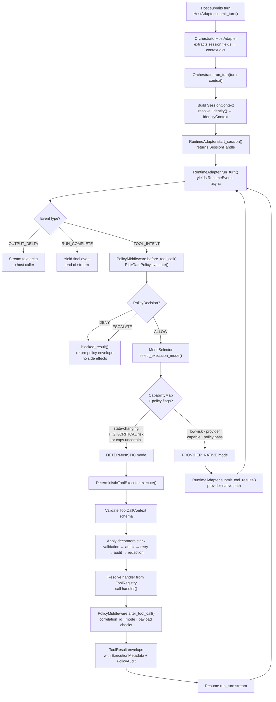
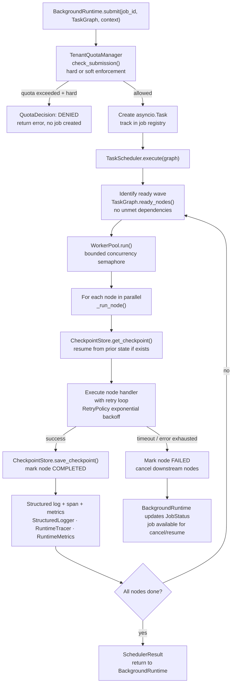
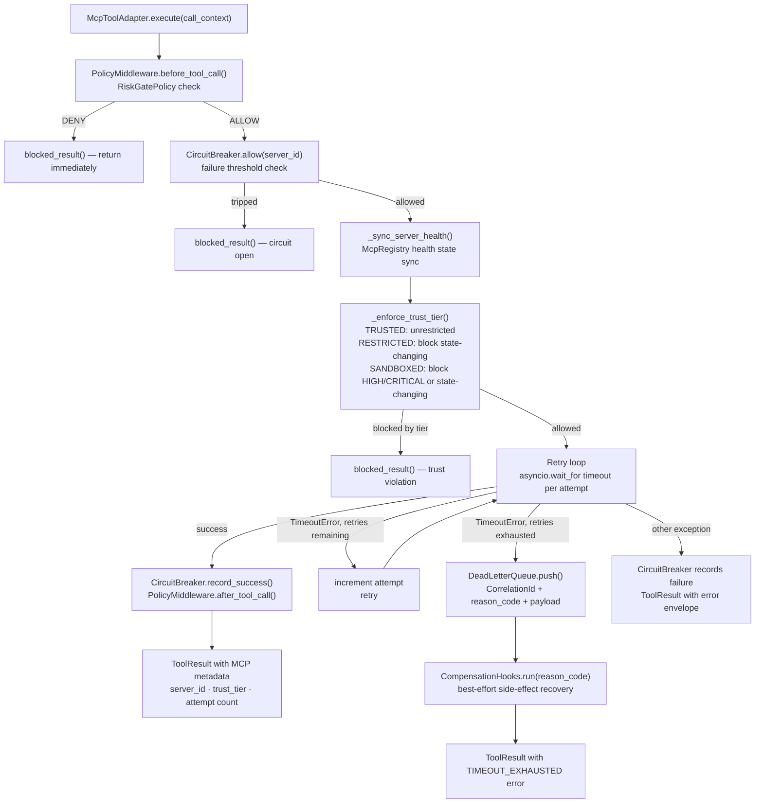
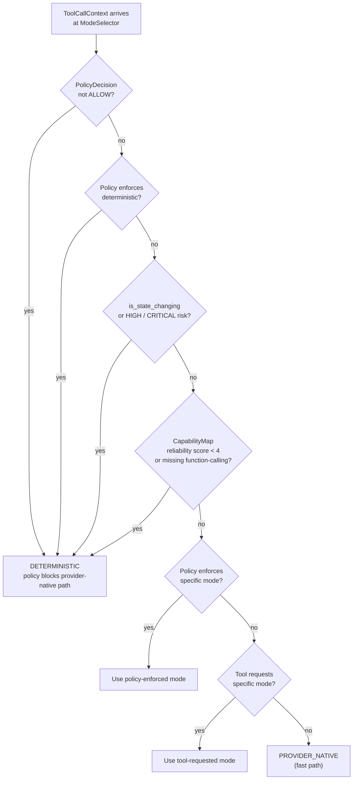

# eXo-brain

Provider-neutral orchestration framework for deterministic tool execution, multi-adapter runtime flows, and background multi-agent workloads.

## What this repository provides
- Provider-neutral runtime contracts and adapter boundary.
- Deterministic-first tool execution for state-changing/high-impact operations.
- Policy middleware with auditable decisions (`allow`, `deny`, `escalate`).
- MCP integration boundary with trust-tier and per-server health controls.
- Background runtime primitives (task graph, scheduler, worker pool, checkpoint/resume).

## Quick start
1. Create a Python virtual environment and install project dependencies.
2. Copy `.env.template` to `.env` and set required values.
3. Run tests:
   - `python -m pytest -q`
4. Run architecture checks:
   - `python scripts/architecture/validate_layers.py`
   - `python scripts/architecture/scan_forbidden_imports.py`

## Architecture principles
- Keep provider SDK specifics inside `src/runtime/*adapter*` modules.
- Keep orchestration core provider-neutral.
- Route state-changing/high-impact tool operations through deterministic policy-governed execution.
- Preserve strict layer boundaries (`integration -> core -> runtime/tools/policies/persistence/observability`).

## Architecture

### Layer map

```mermaid
flowchart TB
    subgraph external [External Callers]
        HOST["Host / API / CLI"]
    end

    subgraph integration [Integration Layer]
        HA["HostAdapter\nOrchestratorHostAdapter"]
    end

    subgraph core [Core Orchestration]
        ORCH["Orchestrator\nrun_turn()"]
        SC["SessionContext"]
        ER["EventRouter"]
        BR["BackgroundRuntime"]
        SCHED["TaskScheduler"]
        TG["TaskGraph (DAG)"]
        WP["WorkerPool"]
        WL["WorkflowLoader"]
    end

    subgraph runtime [Runtime Adapters]
        RA["RuntimeAdapter (ABC)"]
        OAR["OpenAIAgentsRuntime"]
        OCR["OpenAICompatibleRuntime"]
        CR["CustomRuntime"]
        MS["ModeSelector"]
        CM["CapabilityMap"]
    end

    subgraph tools [Tools Layer]
        TR["ToolRegistry"]
        TE["DeterministicToolExecutor"]
        DEC["Decorators\nvalidation · authz · retry · audit · redaction"]
        PM["PluginManager"]
    end

    subgraph policies [Policies Layer]
        MW["PolicyMiddleware\nDeterministicFirstPolicyMiddleware"]
        RG["RiskGatePolicy\nbefore_tool_call · after_tool_call"]
        RR["ReleaseGuardrails\ncan_release()"]
    end

    subgraph agents [Agents Layer]
        AR["AgentRegistry\nrouting · handoff · fallback"]
        APM["AgentPluginManager\nlifecycle audit"]
    end

    subgraph mcp [MCP Layer]
        MTA["McpToolAdapter\nexecute()"]
        MR["McpRegistry\ntrust tiers · health"]
        CB["CircuitBreaker"]
        DLQ["DeadLetterQueue"]
        CH["CompensationHooks"]
    end

    subgraph persistence [Persistence Layer]
        PC["Contracts ABC\nSessionStore · CheckpointStore\nEventStore · AuditStore · WorkflowStore"]
        SQLITE["SQLiteAdapter"]
        POSTGRES["PostgresAdapter"]
        FACTORY["PersistenceBundle\nbuild_default_persistence_bundle()"]
    end

    subgraph resilience [Resilience Layer]
        RP["RetryPolicy\nexponential backoff"]
        CB2["CircuitBreaker"]
        DLQ2["DLQ"]
        COMPH["CompensationHooks"]
    end

    subgraph observability [Observability Layer]
        LOG["StructuredLogger\ncorrelation_id · redaction"]
        TRACE["RuntimeTracer\nspan lifecycle"]
        METRICS["RuntimeMetrics\ncounters · latency · gauges"]
        TL["RuntimeTimeline\nappend-only"]
        GATE["GateEvaluator\nSLO thresholds"]
    end

    subgraph identity_access [Identity + Access Control]
        IC["IdentityContext\nActorType · TokenValidationState"]
        IRE["resolve_identity()"]
        ACE["AccessPolicyEngine\nRBAC · audit-only mode"]
        RBAC["aggregate_permissions()"]
    end

    subgraph tenancy_secrets [Tenancy + Secrets]
        TC["TenantContext"]
        QM["TenantQuotaManager"]
        POL["TenantPolicyOverlayStore"]
        SP["SecretsProvider\nEnv · Cached · rotation hook"]
    end

    subgraph audit_compliance [Audit + Compliance]
        AT["AuditChainRecord\nSHA-256 hash chain"]
        EB["EvidenceBundle\nbuild_evidence_bundle()"]
    end

    subgraph config [Config Layer]
        SET["AppSettings\nall runtime defaults"]
        PRR["ProviderRegistry\nstartup validation · healthcheck · fallback"]
    end

    HOST --> HA
    HA --> ORCH
    ORCH --> SC
    ORCH --> ER
    ORCH --> RA
    RA --> OAR & OCR & CR
    ORCH --> MS
    MS --> CM
    ORCH --> MW
    MW --> RG
    RG --> ACE
    ORCH --> TE
    TE --> TR
    TE --> DEC
    TE --> MW
    ORCH --> AR
    ORCH --> BR
    BR --> QM
    BR --> SCHED
    SCHED --> TG
    SCHED --> WP
    SCHED --> RP
    SCHED --> PC
    MTA --> MR
    MTA --> CB
    MTA --> DLQ
    MTA --> CH
    MTA --> MW
    PC --> SQLITE & POSTGRES & FACTORY
    SET --> PRR
    PRR --> RA
    PRR --> SP
```

---

### Single-turn execution flow

---

### Background job execution flow

---

### MCP tool execution flow

---

### Policy and mode-selection decision tree

---

### Key design principles

| Principle | Where enforced |
|---|---|
| Provider SDK never touches core | `RuntimeAdapter` ABC — adapters import SDK, orchestrator imports only ABC |
| Tool calls are intent, not execution | `TOOL_INTENT` event → orchestrator decides execution path |
| State-changing ops are always deterministic | `ModeSelector` hardcodes this unconditionally |
| Policy wraps every side-effect path | `PolicyMiddleware.before_tool_call` + `after_tool_call` on all three paths |
| Tenant isolation fails closed | `PersistenceIsolationError` raised on any cross-tenant read |
| Audit trail is tamper-evident | SHA-256 hash chain in `AuditChainRecord` |
| Release gates fail closed | `can_release()` returns `False` if evidence is absent |
| Secrets are never logged | `StructuredLogger._redact_context()` auto-redacts `secret/token/password/api_key` keys |

---

## PR workflow
- Use PR-first delivery and branch-per-slice.
- Produce and keep `.local/review.md`, `.local/prep.md`, `.local/merge.md`.
- Merge only after tests and architecture checks pass.
