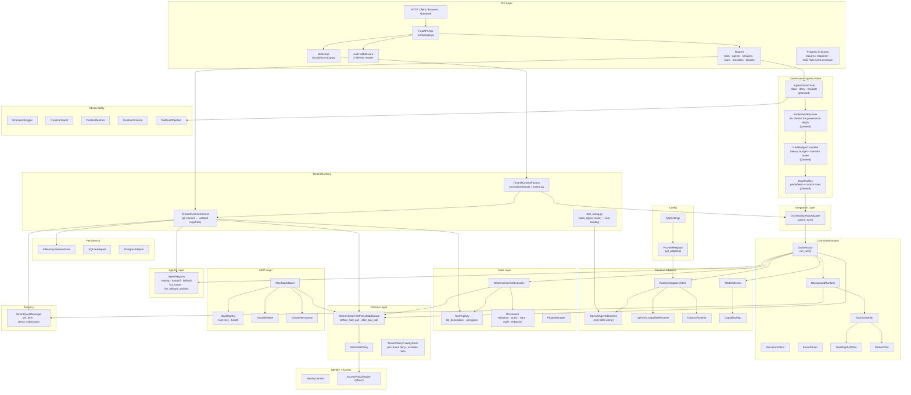
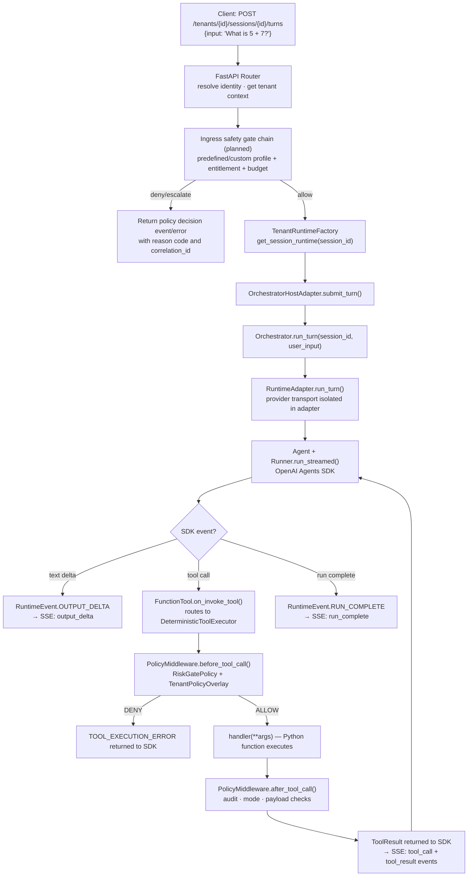
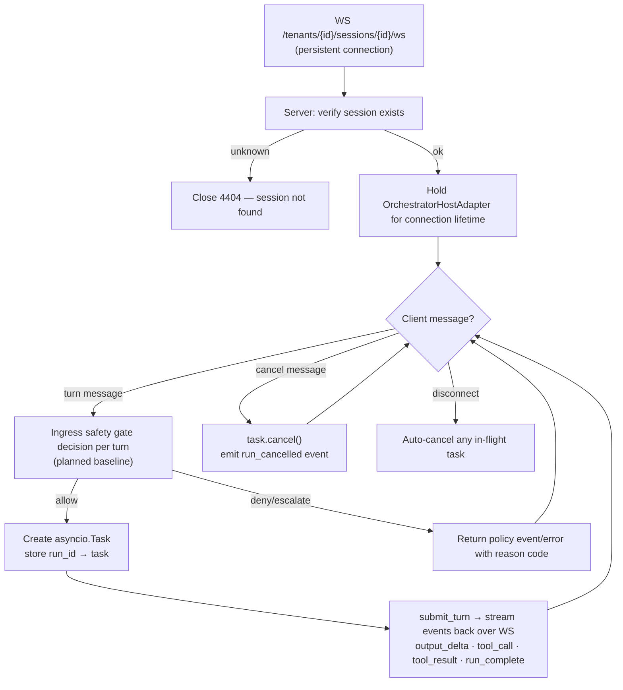
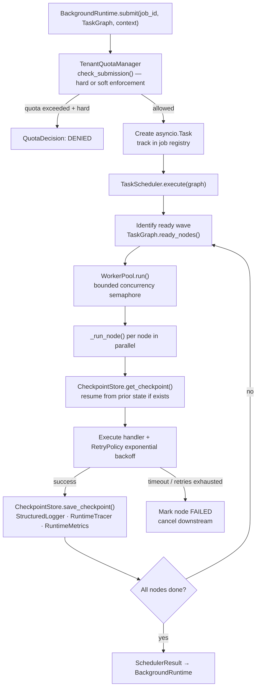
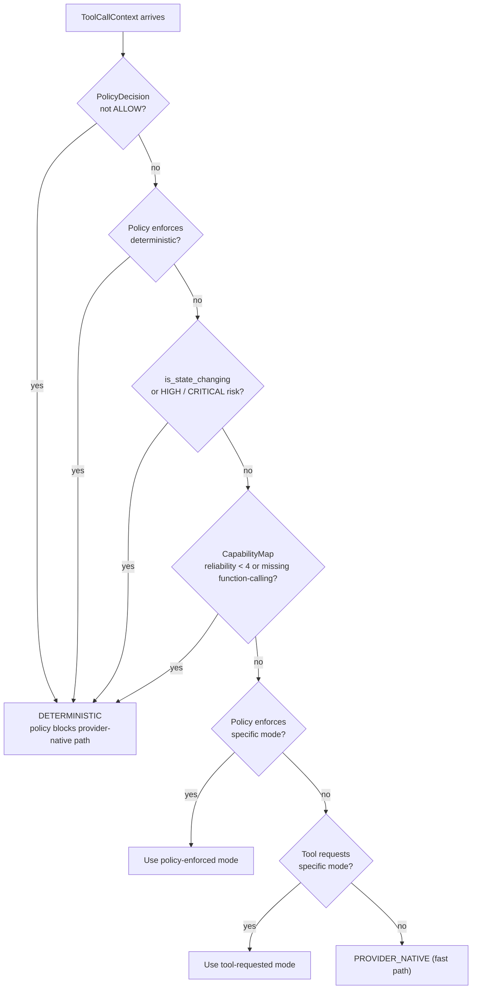
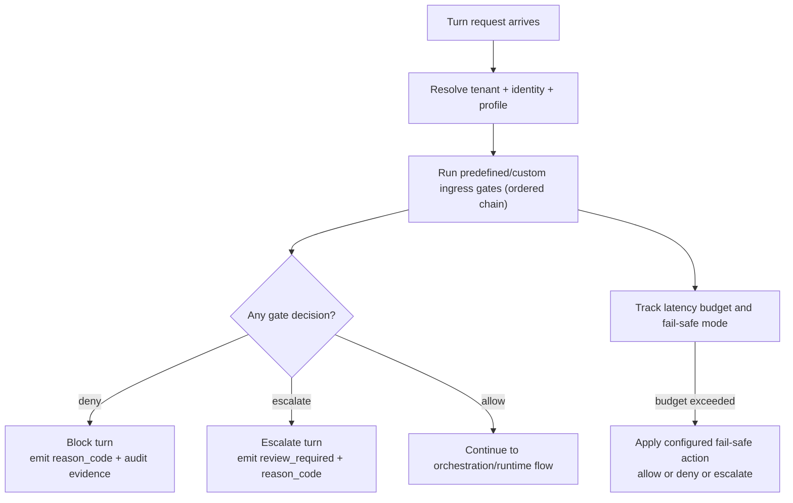

<!--
File: README.md
Path: README.md
Role: Repository overview, quick start, architecture diagrams, and maintainer workflow summary.
Used By: Contributors, onboarding, cross-links from docs/strategy and docs indexes.
Depends On: docs/README.md, docs/plans/tenant-tool-execution-architecture.md, scripts/pr/prepare.py (gate order).
Notes: Keep PR / quality gate bullets aligned with `scripts/pr/prepare.py` `GATES` and CI workflows.
-->

# eXo-brain

Provider-neutral AI orchestration platform with deterministic tool execution, multi-tenant runtime isolation, and a REST/SSE/WebSocket API for single-agent and multi-agent workloads.

## What this repository provides

- **API Platform** — FastAPI application with tenant-scoped tool/agent registration, SSE and WebSocket streaming, and live policy/quota management.
- **Provider-neutral runtime contracts** — `RuntimeAdapter` ABC with pluggable backends (OpenAI Agents SDK, custom adapters).
- **Adapter packaging** — provider-neutral package split with `exo-brain-core-contracts`, `exo-brain-adapter-sdk`, and `exo-adapter-openai` under `packages/`.
- **Deterministic-first tool execution** — every state-changing or high-impact tool call is routed through `DeterministicToolExecutor` and `PolicyMiddleware`.
- **Policy middleware** — auditable `before_tool_call` / `after_tool_call` decisions (`allow`, `deny`, `escalate`) with per-tenant overlay support.
- **Governance ingress direction (next slices)** — pre-model safety gate chain with predefined/custom profiles, explicit reason codes, and performance budgets.
- **Multi-tenant isolation** — `TenantRuntimeFactory` gives each tenant its own `ToolRegistry`, `AgentRegistry`, `PolicyMiddleware`, and session store.
- **Shared control-state mode** — optional SQLite-backed run control and rate limiter backends for multi-process admission consistency.
- **MCP integration** — trust-tier and per-server health controls for MCP tool calls.
- **Background runtime** — task graph (DAG), scheduler, bounded worker pool, checkpoint/resume.
- **Runtime control and audit APIs** — admin runtime-control, BYOC control endpoints, and signed audit export/verify flows.

## Current reality (Mar 2026)

- API-first Option C is the active delivery path (no required UI/dashboard mount).
- Tool-level deterministic policy enforcement is implemented; turn-level **governance ingress** (pre-model gate chain) is advanced in code and docs—see the canonical plan for **implemented vs planned** detail.
- Prioritized roadmap tiers: `docs/strategy/next-directions.md` (strategy package; canonical strategy lives under `docs/strategy/` only).
- Canonical implementation status + queued slices: `docs/plans/tenant-tool-execution-architecture.md`.
- Documentation authority, lifecycle, and archive pointers: `docs/plans/docs-authority-map.md`, `docs/plans/docs-inventory-master.md`, `docs/plans/docs-archive-index.md`.
- Top-level doc index: `docs/README.md`.

---

## Adapter vs gateway boundary

This repository uses a strict separation between internal provider execution and external client API surfaces.

- **Southbound (provider-facing)**: runtime adapters in `src/runtime/*` implement `RuntimeAdapter` and isolate provider SDK/protocol details.
- **Northbound (client-facing)**: API routes in `src/api/*` define what external apps call.
- A provider can be OpenAI-compatible at the adapter layer without automatically exposing public OpenAI-compatible gateway endpoints.

Current northbound API is tenant/session/turn oriented (`/tenants/{tenant_id}/sessions/...`).  
OpenAI-compatible northbound gateway parity (`/v1/...`) is tracked as a planned Option C next-phase slice.

See:
- `docs/runtime_contracts.md` for runtime boundary contracts and mode ownership.
- `docs/plans/tenant-tool-execution-architecture.md` for canonical implementation status and queued slices.

### Interaction mode ownership

| Mode | Primary owner | Notes |
|---|---|---|
| `chat` | API gateway + runtime adapter | OpenAI-compatible chat/completions style request and streaming response path |
| `agents` | Runtime adapter | Agents SDK-style execution path behind provider-neutral runtime contract |
| `workflow` | Core orchestration (`src/core/*`) | Multi-step orchestration state/graph stays in core, not provider adapters |

---

## Quick start

```bash
# 1. Create and activate a virtual environment
python -m venv .exo_env && source .exo_env/bin/activate

# 2. Install dependencies
pip install -r requirements.txt

# 3. Copy environment template and set your API key
cp .env.template .env
# Edit .env and set OPENAI_API_KEY=sk-...

# 4. Local quality gates — same **order** as scripts/pr/prepare.py GATES (then CI governance when relevant)
python scripts/pr/check_testing_artifacts.py
python -m pytest -q
python scripts/architecture/validate_layers.py
python scripts/architecture/scan_forbidden_imports.py
python scripts/architecture/check_governance_consistency.py

# 5. Start the API server
uvicorn src.api.app:create_app --factory --reload --port 8000
# API docs: http://localhost:8000/docs
```

### Docker (optional)

```bash
docker compose up --build
# Liveness: http://localhost:8000/health
# Readiness (SQLite PRAGMA quick_check): http://localhost:8000/ready
```

**Operations-oriented environment variables** (non-exhaustive):

| Variable | Purpose |
|----------|---------|
| `EXO_CONTROL_STATE_BACKEND` | `memory` (default) or `sqlite` — shared SQLite run-control registry and per-tenant rate limiters for multi-worker/multi-process deployments (`src/api/bootstrap.py`). |
| `EXO_CONTROL_STATE_SQLITE_DB_PATH` | SQLite file path when `EXO_CONTROL_STATE_BACKEND=sqlite` (default `.exo_data/exo_control_state.db`). |
| `EXO_SESSION_RUNTIME_IDLE_TTL_SECONDS` | Process-local tenant session cache idle TTL in seconds; `0` disables idle eviction (`RuntimeSettings.session_runtime_idle_ttl_seconds`). |
| `EXO_SESSION_RUNTIME_MAX_CACHED_SESSIONS` | Max cached sessions per tenant runtime; `0` means no cap (`RuntimeSettings.session_runtime_max_cached_sessions`). |
| `EXO_RUN_CONTROL_MAX_TERMINAL_RECORDS_PER_TENANT` | Prune terminal run-control rows per tenant; `0` means unlimited automatic pruning (`RuntimeSettings.run_control_max_terminal_records_per_tenant`). |
| `EXO_ENABLE_PROMETHEUS_METRICS` | When `1`, exposes `GET /metrics` (Prometheus text). |
| `OTEL_EXPORTER_OTLP_ENDPOINT` | Base URL for OTLP HTTP export (traces + metrics); optional per-signal overrides in `telemetry_export.py`. |
| `EXO_CORS_ORIGINS` | Comma-separated allowed origins; unset + non-dev `EXO_ENV` disables wildcard CORS. |
| `EXO_ENABLE_OPENAPI` | When `0`, disables `/docs`, `/redoc`, and `/openapi.json`. |

---

## Beginner quick map (2-minute view)

If you are new to this project, read the system in this order:

1. **You call the API** (`REST`, `SSE`, or `WebSocket`).
2. **Tenant context is resolved** (identity, tenant scope, policy/quota state).
3. **Governance checks run**:
   - tool-level policy gates are enforced on tool execution,
   - turn-level ingress governance is implemented/planned per slice—see `docs/plans/tenant-tool-execution-architecture.md` for current status.
4. **Orchestrator runs provider-neutral logic** and delegates model transport to adapters.
5. **Tool calls are policy-gated** and deterministic for risky/state-changing operations.
6. **Events and audit evidence are emitted** with correlation IDs for traceability.

For acronym help, see `docs/operations/abbreviations-notepad.md`.

---

## Documentation map

- Primary docs index: `docs/README.md`
- Plans index: `docs/plans/README.md`
- Operations index: `docs/operations/README.md`
- Module docs index: `docs/modules/README.md`
- Docs authority and precedence: `docs/plans/docs-authority-map.md`
- Abbreviations notepad: `docs/operations/abbreviations-notepad.md`

---

## Makefile shortcuts (optional)

Thin wrappers around versioned scripts (outputs under `.local/` where noted):

| Target | Purpose |
|--------|---------|
| `make rc-signoff` | Generate `.local/rc-signoff.md` via `scripts/release/rc_signoff.py` |
| `make rc-signoff-json` | Parse signoff markdown → `.local/rc-signoff.json` |
| `make db-backup` / `db-restore` / `db-validate` | Local SQLite safety helpers |
| `make coverage-index` | Full `pytest --cov` run + regenerate `.local/index-and-planning/current/coverage-index.md` |

---

## Notebooks (tutorials, checks, edge cases)

Interactive notebooks live under `notebooks/`. **Source of truth** is the build scripts—regenerate `.ipynb` files from Python builders; see `notebooks/README.md` for the full index, kernel setup, and naming rules.

| Category | Examples | Build script |
|----------|----------|----------------|
| `tutorial_*` | `tutorial_01_core_framework.ipynb` → `tutorial_07_governance_and_anomaly.ipynb` (learning order in notebook README) | `python notebooks/build_tutorials.py` |
| `check_*` | `check_01_core_orchestrator.ipynb` … `check_04_tenant_and_limits.ipynb` | `python notebooks/build_checks.py` |
| `edge_*` | `edge_01_ingress_policy_conflicts.ipynb`, `edge_02_tool_error_envelopes.ipynb` | `python notebooks/build_checks.py` |

Cells marked `[REQUIRES API KEY]` skip when `OPENAI_API_KEY` is unset; most checks run without a live model.

---

## Architecture principles

- Keep provider SDK code inside `src/runtime/*adapter*` modules only — never in core.
- Keep orchestration core provider-neutral — no branching on provider name.
- Route state-changing/high-impact tool operations through deterministic policy-governed execution.
- Preserve strict layer boundaries: `api → integration → core → runtime / tools / policies / persistence / observability`.
- Per-tenant isolation: each tenant's tools, agents, policies, and sessions are fully independent.

---

## Architecture

### Full layer map



---

### API request → tool execution flow



---

### WebSocket multi-turn flow



---

### Background job execution flow



---

### Policy and mode-selection decision tree



---

### Governance ingress decision tree (target)



---

## Abbreviations notepad (quick reference)

Use `docs/operations/abbreviations-notepad.md` for a beginner-friendly glossary of all common abbreviations used in this repository.

---

### Key design principles

| Principle | Where enforced |
|---|---|
| Provider SDK never touches core | `RuntimeAdapter` ABC — adapters import SDK, orchestrator imports only ABC |
| Tool calls are intent, not execution | `FunctionTool.on_invoke_tool` delegates to `DeterministicToolExecutor` |
| State-changing ops are always deterministic | `ModeSelector` and `PolicyMiddleware` enforce unconditionally |
| Policy wraps every side-effect path | `before_tool_call` + `after_tool_call` on all execution paths |
| Per-tenant isolation | `TenantRuntimeFactory` — each tenant owns independent registries and session store |
| Policy changes are live | `TenantPolicyOverlayStore.set_overlay()` takes effect on the next tool call, no restart |
| Audit trail is tamper-evident | SHA-256 hash chain in `AuditChainRecord` |
| Secrets are never logged | `StructuredLogger._redact_context()` auto-redacts `secret/token/password/api_key` keys |
| Adapter plug-and-play | Implement 5-method `RuntimeAdapter` ABC → register in `ProviderRegistry` → selectable by `provider_id` |

---

## API endpoints (v1, current)

| Method | Path | Description |
|---|---|---|
| `GET` | `/health` | Platform health check |
| `POST` | `/tenants/{id}/tools` | Register a tool (`handler_ref`, `description`, `parameters_schema`, risk tier) |
| `POST` | `/tenants/{id}/tools/import-schema` | Normalize/prefill OpenAI-style tool JSON |
| `POST` | `/tenants/{id}/tools/upload` | Upload tool package/version with validation and optional activation |
| `GET` | `/tenants/{id}/tools/validate/{tool_name}` | Retrieve tool validation state (active or explicit version) |
| `GET` | `/tenants/{id}/tools/versions/{tool_name}` | List persisted versions for a tenant tool |
| `POST` | `/tenants/{id}/tools/versions/{tool_name}/{version}/deactivate` | Deactivate active tool version |
| `POST` | `/tenants/{id}/tools/versions/{tool_name}/rollback` | Roll back active version |
| `DELETE` | `/tenants/{id}/tools/versions/{tool_name}/{version}` | Revoke a tool package version |
| `GET/DELETE` | `/tenants/{id}/tools[/{name}]` | List / get / delete tools |
| `POST` | `/tenants/{id}/agents` | Register agent (`instructions`, `capability_tags`, model metadata) |
| `GET/DELETE` | `/tenants/{id}/agents[/{agent_id}]` | List / get / delete agents |
| `POST/GET` | `/tenants/{id}/agents/routes` | Add / list handoff routes |
| `POST/GET` | `/tenants/{id}/agents/fallback` | Set / list fallback policies |
| `POST` | `/tenants/{id}/sessions` | Create a session (`agent_id`, `provider_id`) |
| `GET` | `/tenants/{id}/sessions/{session_id}` | Get session state |
| `POST` | `/tenants/{id}/sessions/{session_id}/turns` | Submit a turn — returns `text/event-stream` (SSE) |
| `WS` | `/tenants/{id}/sessions/{session_id}/ws` | WebSocket — persistent multi-turn with cancellation |
| `POST` | `/providers` | Dynamically register a provider adapter |
| `DELETE` | `/providers/{id}` | Unregister provider (with optional graceful drain controls) |
| `GET` | `/providers` | List all registered providers |
| `GET` | `/providers/{id}/health` | Provider health check |
| `GET` | `/providers/{id}/capabilities` | Provider capability map |
| `GET/PUT` | `/tenants/{id}/policy` | Read / apply tenant policy overlay |
| `GET/PUT` | `/tenants/{id}/quota` | Read / update tenant job quota |
| `GET/POST/DELETE` | `/tenants/{id}/admin/runtime/*` | Runtime control stats, cancellations, run controls, BYOC worker/job operations |
| `GET/POST` | `/tenants/{id}/admin/audit/*` | Audit events/report/cleanup/export/verify |
| `POST/GET/DELETE` | `/admin/keys*` | API key management (create/list/revoke) |

---

## PR workflow (maintainers)

Tracked automation lives under `scripts/pr/` and `.github/workflows/`. Use **PR-first** delivery and short-lived branches (`feature/`, `fix/`, `chore/`).

1. **After push / before merge** — verify publication and linkage:
   - `python scripts/pr/verify_publish.py --branch "$(git branch --show-current)"`
   - `gh pr view --json number,url,headRefName,state,mergeStateStatus`
2. **Phases (in order)** — `review-pr` → `prepare-pr` → `merge-pr` (skills or manual equivalent). Scripts:
   - `python scripts/pr/review.py --pr <id|url> --actor "…" --agents "review-pr"`
   - `python scripts/pr/prepare.py --pr <id|url> --actor "…" --agents "review-pr | prepare-pr"` (runs gates unless `--skip-gates`)
   - `python scripts/pr/merge.py --pr … --check-only` then merge via `gh`, then `merge.py` again with `--merge-sha <oid>`
3. **Local artifacts** (scripts write under **`.local/workflow-artifacts/pr/`**): `review.md`, `prep.md`, `merge.md`. For **architecture-impacting** changes, also maintain `alignment-audit.md` and `alignment-todos.md` under **`.local/workflow-artifacts/alignment/`**, and pass `--arch-impacting` to `merge.py` so both files are enforced.
4. **Merge gates** — must match `scripts/pr/prepare.py` `GATES` (canonical order):
   - `python scripts/pr/check_testing_artifacts.py`
   - `python -m pytest -q` (CI also enforces coverage thresholds on PRs)
   - `python scripts/architecture/validate_layers.py`
   - `python scripts/architecture/scan_forbidden_imports.py`
   - `python scripts/architecture/check_governance_consistency.py` (run locally when touching governance/workflows; CI runs it in `architecture-fitness`)
5. **Docs** — on architecture/workflow changes, follow `docs/operations/documentation-maintenance-checklist.md`; optional `python scripts/docs/check_docs_metadata.py`.
6. **After merge** — sync `main`, then `python scripts/pr/finalize.py --branch <feature-branch>` (optional `--delete-merged-local`); confirm remote branch deletion per team policy.

**Local IDE/agent files** (e.g. Cursor rules, optional `AGENTS.md`) may be maintained per developer and are **not** required for a minimal clone—the repo’s enforced contracts are in `scripts/`, tests, and GitHub Actions.

---
