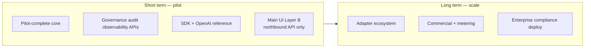
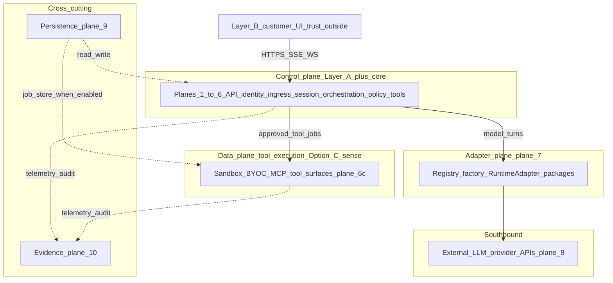
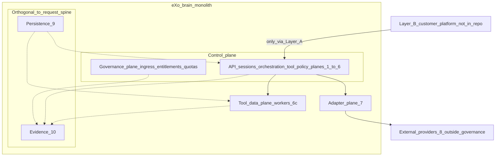
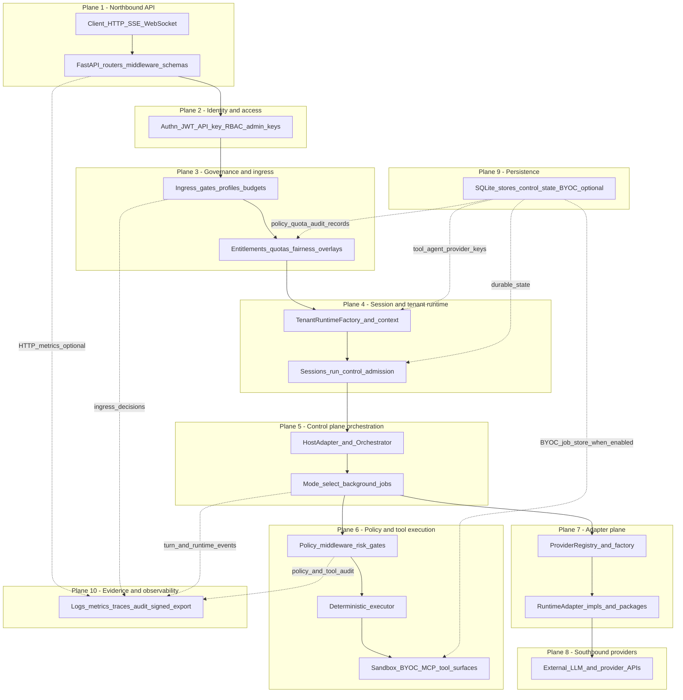
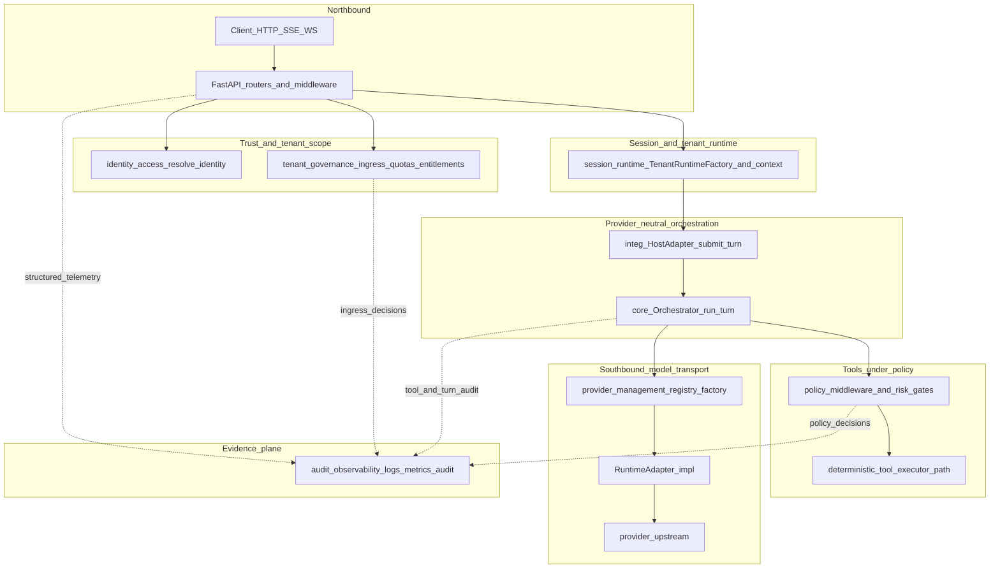
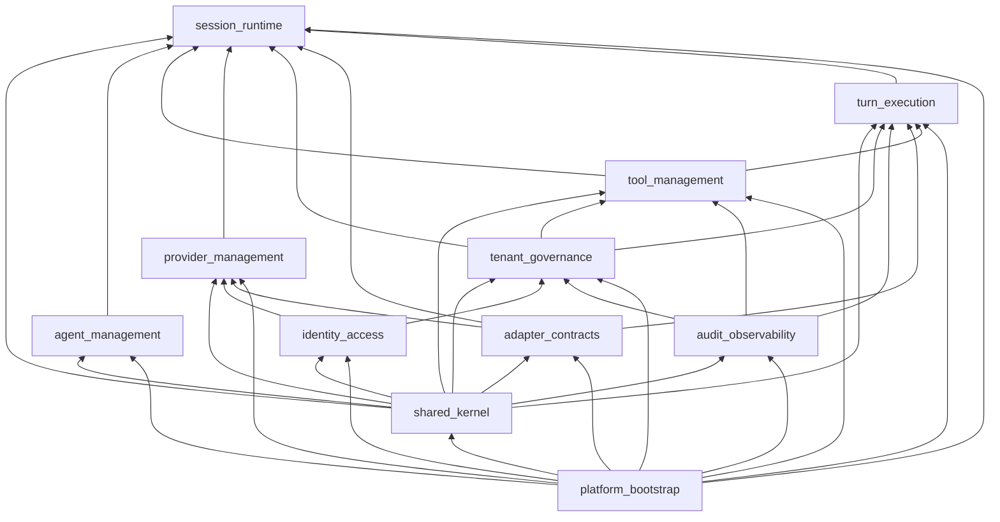

<!--
File: ARCHITECTURE.md
Path: docs/architecture/ARCHITECTURE.md
Role: Consolidated system architecture map — all planes (stack), request path, layers, modular monolith, packages, persistence, and plans × concerns.
Used By:
 - docs/README.md (reading spine)
 - docs/architecture/README.md
 - Onboarding and enterprise architecture readers
Depends On:
 - docs/architecture/mvp.md
 - docs/architecture/workspace-architecture.md
 - docs/plans/README.md
 - docs/plans/control-plane-product-alignment-plan.md
 - docs/plans/short-long-term-execution-plan.md
 - docs/strategy/traceability-matrix.md
 - README.md (repository diagrams)
Notes:
 - Canonical implementation status and slice queue: docs/plans/tenant-tool-execution-architecture.md
 - Enforcement: scripts/architecture/validate_layers.py, scan_forbidden_imports.py
 - Maintainer accuracy checklist: §14
-->

# System architecture (consolidated map)

This document ties together **runtime layers** (`src/*`), the **modular monolith** contract (`src/modules/*`), **PyPI adapter packages**, the **data plane**, and **canonical plans** under `docs/plans/`. Use it as a single map; deep dives stay in the linked files.

---

## 1. Architecture style (implemented)

| Characteristic | Evidence |
|----------------|----------|
| **Modular monolith** | Single deployable (FastAPI app); module boundaries and import rules in [`workspace-architecture.md`](workspace-architecture.md), enforced via [`src/modules/contracts.py`](../../src/modules/contracts.py) and [`scripts/architecture/validate_layers.py`](../../scripts/architecture/validate_layers.py). |
| **Provider-neutral core** | Orchestration and policy avoid provider SDKs; adapters implement [`RuntimeAdapter`](../../src/runtime/runtime_adapter.py). See [`scan_forbidden_imports.py`](../../scripts/architecture/scan_forbidden_imports.py). |
| **Northbound vs southbound** | **Northbound:** HTTP API (`src/api/*`) — **control plane** ingress plus optional **customer bridge** `/v1` (OpenAI-shaped, feature flag). **Southbound:** **provider runtime adapters** (`src/runtime/*` + PyPI `exo-adapter-*`). Product vocabulary: [`governed-execution-positioning.md`](../strategy/governed-execution-positioning.md), [`control-plane-product-alignment-plan.md`](../plans/control-plane-product-alignment-plan.md). See root [`README.md`](../../README.md) “Adapter vs gateway boundary”. |
| **Deterministic-first tools** | Model emits tool intent; side effects run through policy-wrapped deterministic execution ([`src/tools/executor.py`](../../src/tools/executor.py), [`src/policies/middleware.py`](../../src/policies/middleware.py)). |

### 1.1 Execution horizons (short vs long term)

Product execution is split into **near-term pilot proof** and **long-term platform maturity** without changing the modular monolith or adapter wall. Full text, rules, and tier emphasis: [`short-long-term-execution-plan.md`](../plans/short-long-term-execution-plan.md). Root [`README.md`](../../README.md) carries the same diagrams for onboarding.

---

## 2. All architecture planes (stack view)

Single picture of **every major plane** inside the deployable monolith: request **spine** (top → bottom), **persistence** (orthogonal durable state), and **evidence** (telemetry and audit sinks). It extends the **three-part model** in [`docs/strategy/goal.md`](../strategy/goal.md) §5 (core / adapter SDK / provider adapters) into finer slices for navigation.

**If you are looking for “control plane / user plane / data plane” language:** the repository does **not** use a formal **“user plane”** name. What people often mean is spelled out below under [Strategy vocabulary vs these planes](#strategy-vocabulary-vs-these-planes).

### Strategy vocabulary vs these planes

Terms below come from [`docs/strategy/goal.md`](../strategy/goal.md), [`docs/strategy/interface-strategy.md`](../strategy/interface-strategy.md), [`docs/plans/tenant-tool-execution-architecture.md`](../plans/tenant-tool-execution-architecture.md), and [`docs/operations/abbreviations-notepad.md`](../operations/abbreviations-notepad.md) (**Option C** row). Use this table to map **strategy speak** → **§2 numbered planes**.

| Strategy term | Where it is defined | What it means | Maps to §2 planes |
|---------------|---------------------|---------------|-------------------|
| **Control plane** | [`goal.md`](../strategy/goal.md) Part 1 (“control plane and governance plane”), [`core.md`](../strategy/core.md), [`interface-strategy.md`](../strategy/interface-strategy.md) Layer A (“Public API … authoritative control plane”) | Non-bypassable **orchestration, policy, tenant/API surfaces, audit/observability contracts** — the trust boundary customers integrate with | **1–6** (API through tool/policy execution), plus **9–10** as supporting stores and evidence |
| **Governance plane** | Same Part 1 heading in `goal.md` | **Ingress, policy gates, tenant governance** inside core (overlaps control plane) | **3** (ingress, entitlements, quotas, overlays), **6** (tool policy middleware / risk gates) |
| **Governance ingress plane** | [`traceability-matrix.md`](../strategy/traceability-matrix.md), [`next-directions.md`](../strategy/next-directions.md) | **Pre-model** allow/deny/escalate + profiles/budgets before runtime/model work | **3** |
| **Adapter plane** | [`abbreviations-notepad.md`](../operations/abbreviations-notepad.md) Option C; [`tenant-tool-execution-architecture.md`](../plans/tenant-tool-execution-architecture.md) (enterprise deployment bullets) | **Provider/runtime adapter packages** and registry/factory — southbound from neutral core | **7** (and **8** as external endpoints adapters call) |
| **Data plane (tool execution)** | Option C + [`option-c-worker-isolation-contract.md`](../plans/option-c-worker-isolation-contract.md); tenant plan (“data-plane workers”) | **Hosted sandbox + BYOC** workers that run approved tool jobs; must not bypass policy | **6** (`P6c` sandbox/BYOC path) |
| **Data plane connectors** (wording) | [`goal.md`](../strategy/goal.md) Part 3 title: “pluggable **data plane connectors**” | Here **data plane** means **provider adapters** as connectors to LLM/provider APIs (not tool workers) | **7 → 8** |
| **Layer A — Public API** | [`interface-strategy.md`](../strategy/interface-strategy.md) §3 | **Authoritative** HTTP API for all governed operations | **1** exposes it; **2–6** implement it behind routers |
| **Layer B — Customer UI/platform** | `interface-strategy.md` §3 | **Outside** eXo-brain trust boundary: customer-built UX consuming Layer A | **Not an internal plane** — clients of **plane 1** |
| **“User plane”** | *(not a defined term in repo docs)* | Usually informal shorthand for **end users** hitting a **customer app** that calls Layer A, or confusion with **`docs/plans/*` planning docs** | Treat as **Layer B** + **plane 1** contract, or ignore if you meant **markdown plans** |

**Option C shorthand** (abbreviations notepad): **control plane + adapter plane + data plane** means **core governance/API/orchestration** + **provider adapters** + **tool worker execution** (sandbox/BYOC) — i.e. roughly **planes 1–6 + 9–10**, **7**, and the **worker half of 6**, not persistence alone.

#### Diagram A — Option C workflow (who calls whom)

Northbound request **enters** the control plane (Layer A / planes 1–6). The orchestrator path **uses** the adapter plane to reach external LLMs, and **dispatches** tool work to the **tool data plane** (sandbox/BYOC). This is the **operational** story. **Diagram B** (below) shows how strategy terms nest; **Diagram C** lists all **ten numbered planes** in stack order.

**Naming reminder:** **`goal.md` Part 3** calls provider adapters “**data plane connectors**” (adapter-to-LLM hop). That is the **Adapter plane → plane 8** leg above, **not** the **tool worker** box (Option C “data plane”).

#### Diagram B — Strategy terms: nesting and relationships

Shows **containment** (governance and the rest of the core path are **both** inside **control plane** — no sequential edge between them), **external** Layer B, and **orthogonal** persistence/evidence. Other arrows are **logical** (invocation, storage, telemetry), not the full HTTP sequence (see Diagram A and §3).

#### Diagram C — Ten numbered planes (full stack)

**Layout note:** After plane 5, **plane 7→8** (model transport) and **plane 6** (policy + tools including sandbox/BYOC) are **parallel facets** of a turn, not a strict waterfall. The spine order is **notional** for readability; real execution interleaves adapter streaming and tool rounds.

| # | Plane | What it is | Primary `src/` / `packages/` |
|---|--------|------------|------------------------------|
| **1** | **Northbound API** | Tenant-scoped HTTP, SSE, WebSocket; OpenAPI; no provider SDKs | `src/api/` |
| **2** | **Identity and access** | Bearer/JWT/API key resolution, RBAC-style checks, admin key surfaces | `src/identity/`, `src/access_control/`, `src/api/middleware/auth.py` |
| **3** | **Governance and ingress** | Pre-model gate chain, profiles, budgets, entitlements, quotas, fairness, tenant policy overlays | `src/policies/ingress_*`, `src/policies/entitlements.py`, `src/tenancy/` |
| **4** | **Session and tenant runtime** | Per-tenant tool/agent/policy registries, session handles, run control, rate limits | `src/runtime/tenant_runtime.py`, `src/core/session_store.py`, `src/core/run_control_registry.py`, session routers |
| **5** | **Control plane orchestration** | Provider-neutral turn pipeline, host adapter, orchestrator, background runtime / scheduler | `src/integration/`, `src/core/orchestrator.py`, `src/core/background_runtime.py` |
| **6** | **Policy and tool execution** | Before/after tool policy, deterministic execution, sandbox, BYOC connector, MCP tools | `src/policies/middleware.py`, `src/tools/`, `src/mcp/` |
| **7** | **Adapter plane** | Registry, factory loading, `RuntimeAdapter` implementations; PyPI packages | `src/config/provider_registry.py`, `src/runtime/adapter_factory.py`, `src/runtime/*adapter*`, PyPI `exo-adapter-*` + `exo-brain-core-contracts` |
| **8** | **Southbound providers** | Customer-chosen model endpoints and protocols (outside your governance boundary) | Network egress from adapter implementations only |
| **9** | **Persistence** | SQLite default stores, optional shared control-state SQLite, BYOC stores; memory in tests | `src/persistence/`, `src/api/bootstrap.py` |
| **10** | **Evidence and observability** | Structured logs, metrics, traces, tool/turn audit, optional Prometheus/OTLP, compliance evidence helpers | `src/observability/`, `src/audit/`, `src/compliance/` (bundle/evidence paths per `contracts.py`), `src/api/routers/prometheus_metrics.py`, `src/api/routers/audit.py` |

**Note:** Plane **6** both **enforces** policy on tools and hosts **tool data-plane** execution (sandbox/BYOC). That is the **Option C “data plane”** in [`abbreviations-notepad.md`](../operations/abbreviations-notepad.md); do **not** confuse it with **`goal.md` Part 3** wording where **provider adapters** are called “data plane **connectors**” (here: **planes 7–8**). Option C worker contract: [`option-c-worker-isolation-contract.md`](../plans/option-c-worker-isolation-contract.md). Plane **10** is **emit / observe** relative to the request spine: exporters must not break governed execution ([`workspace-architecture.md`](workspace-architecture.md)).

---

## 3. End-to-end request path (conceptual)

Primary **data and control flow** for a governed turn (northbound → control plane → southbound). This is a **runtime sequence**, not the static module import graph (that is §6).

**How to read it (aligned with product goals):**

1. **Northbound** — HTTP/SSE/WebSocket only; no provider SDKs here ([`src/api/*`](../../src/api/)). Optional **OpenAI-shaped** `POST /v1/chat/completions` (feature flag `EXO_ENABLE_OPENAI_COMPAT_GATEWAY`) reuses the same ingress/entitlement/run-control spine as tenant turn routes — see [`docs/archive/plans/northbound-v1-gateway.md`](../archive/plans/northbound-v1-gateway.md). **Naming** (control plane vs customer bridge vs provider adapter): [`docs/strategy/governed-execution-positioning.md`](../strategy/governed-execution-positioning.md), [`docs/plans/control-plane-product-alignment-plan.md`](../plans/control-plane-product-alignment-plan.md).
2. **Trust + tenant scope** — Authentication / API keys ([`identity_access`](../../src/modules/contracts.py)); **pre-model ingress** + quotas + entitlement-aware surfaces live under **tenant_governance** mapping ([`src/policies/ingress_*`](../../src/policies/), [`src/tenancy/`](../../src/tenancy/)).
3. **Session plane** — Per-tenant cached runtime context, sessions, run control ([`src/runtime/tenant_runtime.py`](../../src/runtime/tenant_runtime.py), session routers).
4. **Orchestration** — [`OrchestratorHostAdapter`](../../src/integration/host_adapter.py) → [`Orchestrator`](../../src/core/orchestrator.py); **mode and capability selection stay provider-neutral** ([`src/runtime/mode_selector.py`](../../src/runtime/mode_selector.py)).
5. **Southbound** — [`ProviderRegistry`](../../src/config/provider_registry.py) / factory resolves a concrete [`RuntimeAdapter`](../../src/runtime/runtime_adapter.py); only adapters talk provider protocols.
6. **Tools plane** — Tool **intent** from the model is executed on the **deterministic** path with **policy before/after** ([`src/tools/executor.py`](../../src/tools/executor.py), [`src/policies/middleware.py`](../../src/policies/middleware.py)). Additional tool rounds and streaming are driven by the **orchestrator ↔ adapter** loop (not every edge is drawn).
7. **Evidence plane** — Dashed edges: observability and audit **consume** events from the hot path; exporters must not weaken safety ([`workspace-architecture.md`](workspace-architecture.md) enterprise notes).

**Modular names** for the same concerns: see §5 and [`src/modules/contracts.py`](../../src/modules/contracts.py).

---

## 4. Code layers vs `src/` trees

These are the **technical layers** (MVP model). They overlap the **business modules** in §5 — same system, two views.

| Layer | Role | Primary locations |
|-------|------|-------------------|
| **api** | HTTP transport, routers, Pydantic schemas, middleware | `src/api/` |
| **integration** | Thin host seam into orchestration (`submit_turn`, envelopes) | `src/integration/` |
| **core** | Orchestrator, session/background runtime, scheduling, run control | `src/core/` |
| **runtime** | `RuntimeAdapter` implementations, tenant runtime factory, mode/capability selection | `src/runtime/` |
| **tools** | Tool registry, deterministic executor, sandbox/BYOC execution adapters, artifacts | `src/tools/` |
| **policies** | Policy middleware, risk gates, ingress gates/profiles, entitlements | `src/policies/` |
| **agents** | Agent registry, routing/fallback contracts | `src/agents/` |
| **mcp** | MCP registry and tool adapter | `src/mcp/` |
| **persistence** | Store contracts + SQLite (default) and test drivers | `src/persistence/` |
| **observability** | Logging, metrics, tracing, tool audit pipeline, OTLP/Prometheus export | `src/observability/` |
| **identity / access_control** | Identity resolution, JWT/API key, RBAC-style engine | `src/identity/`, `src/access_control/` |
| **tenancy** | Tenant context, quotas, rate limiting, overlays | `src/tenancy/` |
| **config** | Settings and provider registry wiring | `src/config/` |
| **modules** | Facade services per business capability; composition root | `src/modules/*/` |

**Allowed dependency direction (summary):** `api → integration → core → runtime` (and siblings: `tools`, `policies`, `persistence`, `observability`) with **no** provider SDK imports outside adapter paths. Full module **DAG** is in §6.

Detail: [`mvp.md`](mvp.md).

---

## 5. Modular monolith (business capabilities)

Each row is a **named module** with a **public service** and **allowed dependencies**. CI validates imports against [`src/modules/contracts.py`](../../src/modules/contracts.py).

| Module | Owns (doctrine) | Public entry | Typical `src/` homes (also mapped in contracts) |
|--------|-----------------|--------------|--------------------------------------------------|
| **shared_kernel** | Immutable schemas, shared reason codes | `src.schemas` (+ identity contracts) | `src/schemas/`, `src/identity/contracts.py` (per `contracts.py`) |
| **adapter_contracts** | Runtime + tool execution adapter interfaces | `RuntimeAdapter`, `ToolExecutionAdapter` surfaces | PyPI `exo-brain-core-contracts`, `src/runtime/runtime_adapter.py`, `src/tools/execution_adapter.py` |
| **identity_access** | Authn, API keys, RBAC, admin trust | `src.modules.identity_access.service` | `src/identity/`, `src/access_control/`, `src/api/middleware/auth.py` |
| **tenant_governance** | Overlays, rate limits, quotas, entitlements, fairness | `src.modules.tenant_governance.service` | `src/tenancy/`, `src/policies/` |
| **provider_management** | Provider registration, protocol typing, adapter lookup | `src.modules.provider_management.service` | `src/config/provider_registry.py`, `src/runtime/adapter_factory.py` |
| **agent_management** | Durable agent definitions | `src.modules.agent_management.service` | `src/agents/` |
| **tool_management** | Tool metadata, versions, artifacts, upload governance | `src.modules.tool_management.service` | `src/tools/registry.py`, `user_tools`, routers |
| **turn_execution** | Orchestration flow, mode selection, host adapter seam | `src.modules.turn_execution.service` | `src/core/`, `src/integration/` |
| **session_runtime** | Tenant/session context, run control, caches | `src.modules.session_runtime.service` | `src/runtime/tenant_runtime.py`, session APIs |
| **audit_observability** | Audit persistence, export/verify, logs/metrics/traces | `src.modules.audit_observability.service` | `src/audit/`, `src/observability/` |
| **platform_bootstrap** | Settings validation, hydration, module wiring | `src.modules.platform_bootstrap.service` | `src/api/bootstrap.py`, `app.py` factory |

Doctrine and dependency edges: [`workspace-architecture.md`](workspace-architecture.md).

---

## 6. Module dependency direction (enforced)

Edges follow [`src/modules/contracts.py`](../../src/modules/contracts.py) `allowed_dependencies`: **A → B** means **B depends on A** (B may import or compose A; A sits on the inward side of the allowed edge).

**Note:** `platform_bootstrap` composes all modules; other modules must not depend on it (see contracts). Edges follow [`workspace-architecture.md`](workspace-architecture.md) § “Allowed dependency direction”.

---

## 7. Adapter packages (PyPI)

| Distribution | Role | Boundary |
|---------|------|----------|
| **`exo-brain-core-contracts`** | Shared runtime/event/tool IO types | No provider SDK |
| **`exo-brain-adapter-sdk`** | Adapter author helpers + conformance checks | May depend on core-contracts only |
| **`exo-adapter-openai`** | OpenAI-oriented adapter implementation | Must not import `src.*` (enforced in eXo_adapters + eXo-brain conformance tests) |
| **`exo-adapter-echo`** | Second adapter for parity/conformance tests | Same portability rule |

**Authoring repo:** [SavinRazvan/eXo_adapters](https://github.com/SavinRazvan/eXo_adapters). **Install:** `requirements.txt` lockstep pins (currently **0.1.2**).

External install smoke (eXo-brain): [`scripts/packages/external_install_smoke.py`](../../scripts/packages/external_install_smoke.py).

---

## 8. Data and control state

| Concern | Default / options | Where |
|---------|-------------------|--------|
| **Durable app data** | SQLite file (`EXO_DB_PATH`, default `.exo_data/exo.db`) | [`src/api/bootstrap.py`](../../src/api/bootstrap.py) |
| **Tests** | `persistence_backend="memory"` | `bootstrap()` / test app factories |
| **Postgres-shaped adapter** | Injectable driver for parity tests | [`src/persistence/adapters/postgres.py`](../../src/persistence/adapters/postgres.py) — not the default production profile in stock bootstrap |
| **Shared run control / rate limits** | `memory` or `sqlite` via `EXO_CONTROL_STATE_*` | [`README.md`](../../README.md), `RuntimeSettings` |
| **BYOC job stores** | Configurable backends (e.g. memory, sqlite paths) | `RuntimeSettings` in [`src/config/settings.py`](../../src/config/settings.py), `src/tools/byoc/` |

SQLite connection posture (defer / honesty): [`docs/archive/plans/enterprise-audit-remediation-plan.md`](../archive/plans/enterprise-audit-remediation-plan.md).

---

## 9. Observability and audit

| Concern | Location | Notes |
|---------|----------|--------|
| Structured logs, metrics, traces | `src/observability/` | Correlation-rich execution telemetry |
| Tool / turn audit pipeline | `src/observability/tool_audit.py`, `src/audit/` | Policy and ingress decision anchors |
| Optional **Prometheus** | `GET /metrics` when enabled | [`src/api/routers/prometheus_metrics.py`](../../src/api/routers/prometheus_metrics.py) |
| Optional **OTLP** | Env-driven HTTP export | [`src/observability/telemetry_export.py`](../../src/observability/telemetry_export.py) |

Enterprise posture (partial vs roadmap): [`docs/strategy/traceability-matrix.md`](../strategy/traceability-matrix.md), [`docs/api/customer-api-integration-guide.md`](../api/customer-api-integration-guide.md) §9.2.

---

## 10. Canonical plans × architectural concerns

Plans live under [`docs/plans/README.md`](../plans/README.md). This table maps **which part of the architecture** each canonical plan governs.

| Plan | Architectural concerns covered |
|------|--------------------------------|
| [**tenant-tool-execution-architecture.md**](../plans/tenant-tool-execution-architecture.md) | **Full stack:** tenant tool lifecycle, API slices, sandbox/BYOC, execution adapters, streaming, Option C roadmap (gateway slice, mode split). **Source of truth** for implemented vs queued work. |
| [**option-c-contract-freeze.md**](../plans/option-c-contract-freeze.md) | **Frozen seams:** `RuntimeAdapter`, tool execution adapter, policy/tool IO schemas, runtime event envelopes — stability between control plane and adapters/data plane. |
| [**option-c-worker-isolation-contract.md**](../plans/option-c-worker-isolation-contract.md) | **Control vs data plane:** hosted sandbox + BYOC worker responsibilities, isolation, timeouts, no policy bypass. |
| [**option-c-performance-gates.md**](../plans/option-c-performance-gates.md) | **Scale and SLO:** latency/error targets, admission/fairness, load/ingress budget scripts (`scripts/perf/`). |
| [**enterprise-audit-remediation-plan.md**](../archive/plans/enterprise-audit-remediation-plan.md) | **Engineering quality + ops honesty:** coverage gates, CI evidence, boundary guards, compose/prod clarity, external EA reconciliation notes. |
| **Documentation governance plans** (e.g. `docs-authority-map.md`, `docs-inventory-master.md`, `docs-archive-index.md`; historical: `docs/archive/plans/documentation-cleanup-master-plan.md`) | **Docs system** and lifecycle — not runtime code paths. |

**Strategy (not “plans” folder only):** product north star and tiered roadmap — [`docs/strategy/goal.md`](../strategy/goal.md), [`next-directions.md`](../strategy/next-directions.md); decision-to-code mapping — [`traceability-matrix.md`](../strategy/traceability-matrix.md).

---

## 11. Enforcement and quality gates

| Mechanism | Script / location |
|-----------|-------------------|
| Module import boundaries | [`scripts/architecture/validate_layers.py`](../../scripts/architecture/validate_layers.py) |
| Provider SDK / FastAPI import zones | [`scripts/architecture/scan_forbidden_imports.py`](../../scripts/architecture/scan_forbidden_imports.py) |
| Docs/policy index consistency | [`scripts/architecture/check_governance_consistency.py`](../../scripts/architecture/check_governance_consistency.py) |
| PR merge gate order | [`scripts/pr/prepare.py`](../../scripts/pr/prepare.py) `GATES` |
| CI | [`.github/workflows/architecture-fitness.yml`](../../.github/workflows/architecture-fitness.yml) (pytest, layer scans, governance consistency, **`nbconvert --execute`** on `notebooks/tutorial_08_governed_execution_sandbox.ipynb`) |

---

## 12. Deeper diagrams and walkthroughs

- **§2 in this file:** **Diagram A** (Option C workflow: control → adapter → providers + tool data plane), **Diagram B** (strategy terms: governance ⊂ control, Layer B external, persistence/evidence), **Diagram C** (ten numbered planes stack).
- **Canonical turn ordering (stages 1–8):** [`governed-execution-pipeline.md`](governed-execution-pipeline.md) — use this when docs must match `turns.py` + `orchestrator.py` behavior.
- **Large component diagram** (API, tenant runtime, core, adapters, tools, policies, MCP, persistence): root [`README.md`](../../README.md) § Architecture.
- **Request → tool execution** and **WebSocket** flows: same README section.
- **Beginner narrative:** [`beginner-workflow.md`](beginner-workflow.md).
- **Hands-on evidence:** [`notebooks/README.md`](../../notebooks/README.md), [`notebooks/EVALUATOR_GUIDE.md`](../../notebooks/EVALUATOR_GUIDE.md); CI executes `tutorial_08` via `architecture-fitness` (see §11).

---

## 13. Related documents

| Document | Use when |
|----------|----------|
| [`governed-execution-pipeline.md`](governed-execution-pipeline.md) | Exact governed turn order; integrator bypass warning; `tutorial_08` proof |
| [`mvp.md`](mvp.md) | Layer list and guardrails in one page |
| [`workspace-architecture.md`](workspace-architecture.md) | Modular monolith doctrine and non-negotiables |
| [`notebooks/README.md`](../../notebooks/README.md) | Hands-on tutorials, checks, edges (14 notebooks) |
| [`docs/runtime_contracts.md`](../runtime_contracts.md) | Runtime boundary contracts |
| [`docs/plans/tenant-tool-execution-architecture.md`](../plans/tenant-tool-execution-architecture.md) | What is shipped vs next |
| [`docs/strategy/deployment-models.md`](../strategy/deployment-models.md) | Data/control-plane boundary in managed vs self-hosted offerings |

If this file and the root README diagram disagree on a **label** (e.g. historical “planned” wording), prefer **tenant-tool-execution-architecture.md** and **traceability-matrix.md** for current status.

---

## 14. Maintainer review checklist (accuracy)

Use this when changing `src/` or strategy docs and you want this file to stay truthful.

- [ ] **Planes 1–10** still match a quick pass over [`src/api/app.py`](../../src/api/app.py) router mounts and [`bootstrap.py`](../../src/api/bootstrap.py) persistence/control-state env vars.
- [ ] **Module DAG (§6)** still matches [`src/modules/contracts.py`](../../src/modules/contracts.py) `MODULE_SPECS` `allowed_dependencies` (run [`validate_layers.py`](../../scripts/architecture/validate_layers.py)).
- [ ] **Strategy table (§2)** still matches [`goal.md`](../strategy/goal.md) Part 1/3, [`interface-strategy.md`](../strategy/interface-strategy.md) §3, and [`abbreviations-notepad.md`](../operations/abbreviations-notepad.md) Option C row.
- [ ] **Canonical plans table (§10)** still aligned with [`docs/plans/README.md`](../plans/README.md) and any new `docs/plans/*` canonical doc.
- [ ] **Mermaid:** subgraph IDs stay alphanumeric/underscore; after edits, spot-render in GitHub or VS Code preview (broken mermaid fails silently in some viewers).
- [ ] **Governed pipeline doc** still matches [`turns.py`](../../src/api/routers/turns.py) ingress/entitlement hooks and [`governed-execution-pipeline.md`](governed-execution-pipeline.md) when those paths change.
- [ ] **Notebook index** ([`notebooks/README.md`](../../notebooks/README.md)) still matches builders when architecture-facing demos move.

**Known simplifications (not bugs):** Diagrams **A–C** omit MCP registry detail, background-only jobs, and some readiness/health routes; **§3** omits the orchestrator↔adapter tool loop edges on purpose (see §3 bullet 6).
