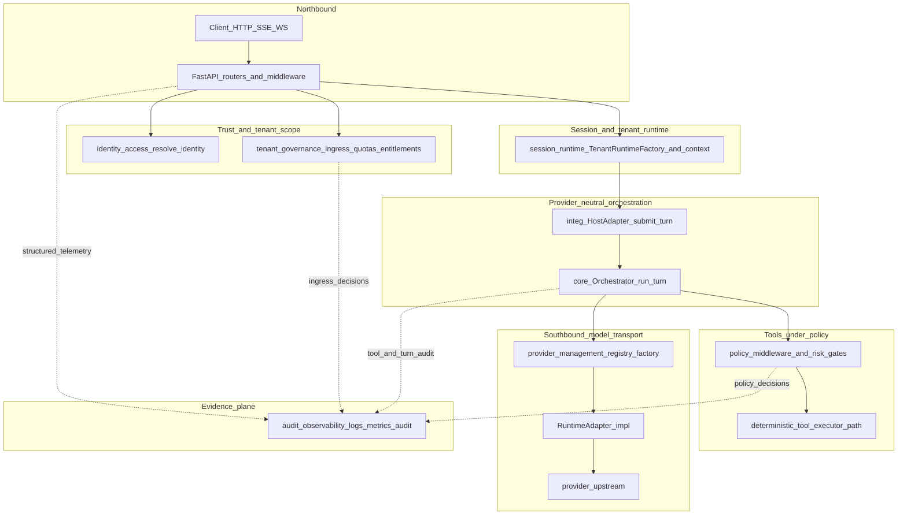
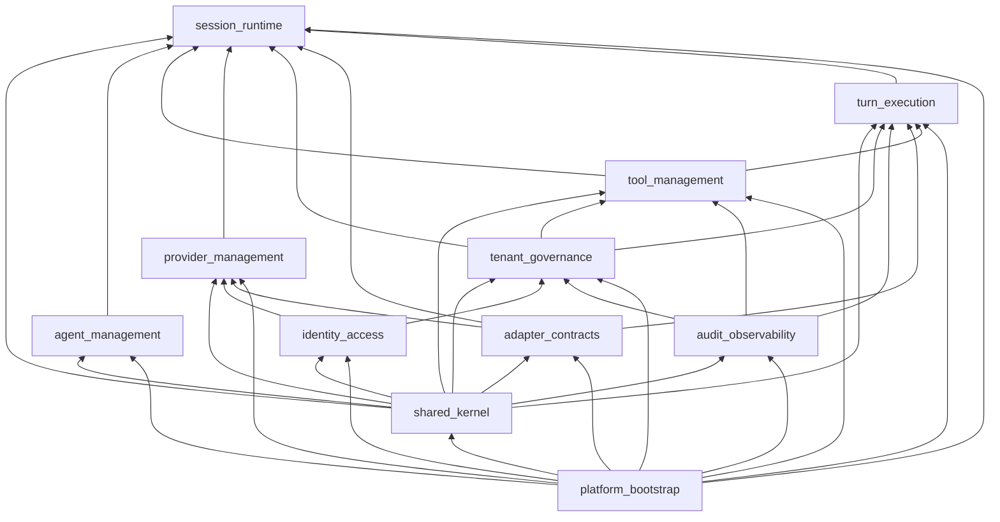

<!--
File: ARCHITECTURE.md
Path: docs/architecture/ARCHITECTURE.md
Role: Consolidated system architecture map — layers, modular monolith, packages, data plane, and how canonical plans relate to each concern.
Used By:
 - docs/README.md (reading spine)
 - docs/architecture/README.md
 - Onboarding and enterprise architecture readers
Depends On:
 - docs/architecture/mvp.md
 - docs/architecture/workspace-architecture.md
 - docs/plans/README.md
 - docs/strategy/traceability-matrix.md
 - README.md (repository diagrams)
Notes:
 - Canonical implementation status and slice queue: docs/plans/tenant-tool-execution-architecture.md
 - Enforcement: scripts/architecture/validate_layers.py, scan_forbidden_imports.py
-->

# System architecture (consolidated map)

This document ties together **runtime layers** (`src/*`), the **modular monolith** contract (`src/modules/*`), **extracted packages**, the **data plane**, and **canonical plans** under `docs/plans/`. Use it as a single map; deep dives stay in the linked files.

---

## 1. Architecture style (implemented)

| Characteristic | Evidence |
|----------------|----------|
| **Modular monolith** | Single deployable (FastAPI app); module boundaries and import rules in [`workspace-architecture.md`](workspace-architecture.md), enforced via [`src/modules/contracts.py`](../../src/modules/contracts.py) and [`scripts/architecture/validate_layers.py`](../../scripts/architecture/validate_layers.py). |
| **Provider-neutral core** | Orchestration and policy avoid provider SDKs; adapters implement [`RuntimeAdapter`](../../src/runtime/runtime_adapter.py). See [`scan_forbidden_imports.py`](../../scripts/architecture/scan_forbidden_imports.py). |
| **Northbound vs southbound** | **Northbound:** HTTP API (`src/api/*`). **Southbound:** provider/runtime adapters (`src/runtime/*`, packages under `packages/exo-adapter-*`). See root [`README.md`](../../README.md) “Adapter vs gateway boundary”. |
| **Deterministic-first tools** | Model emits tool intent; side effects run through policy-wrapped deterministic execution ([`src/tools/executor.py`](../../src/tools/executor.py), [`src/policies/middleware.py`](../../src/policies/middleware.py)). |

---

## 2. End-to-end request path (conceptual)

Primary **data and control flow** for a governed turn (northbound → control plane → southbound). This is a **runtime sequence**, not the static module import graph (that is §5).

**How to read it (aligned with product goals):**

1. **Northbound** — HTTP/SSE/WebSocket only; no provider SDKs here ([`src/api/*`](../../src/api/)).
2. **Trust + tenant scope** — Authentication / API keys ([`identity_access`](../../src/modules/contracts.py)); **pre-model ingress** + quotas + entitlement-aware surfaces live under **tenant_governance** mapping ([`src/policies/ingress_*`](../../src/policies/), [`src/tenancy/`](../../src/tenancy/)).
3. **Session plane** — Per-tenant cached runtime context, sessions, run control ([`src/runtime/tenant_runtime.py`](../../src/runtime/tenant_runtime.py), session routers).
4. **Orchestration** — [`OrchestratorHostAdapter`](../../src/integration/host_adapter.py) → [`Orchestrator`](../../src/core/orchestrator.py); **mode and capability selection stay provider-neutral** ([`src/runtime/mode_selector.py`](../../src/runtime/mode_selector.py)).
5. **Southbound** — [`ProviderRegistry`](../../src/config/provider_registry.py) / factory resolves a concrete [`RuntimeAdapter`](../../src/runtime/runtime_adapter.py); only adapters talk provider protocols.
6. **Tools plane** — Tool **intent** from the model is executed on the **deterministic** path with **policy before/after** ([`src/tools/executor.py`](../../src/tools/executor.py), [`src/policies/middleware.py`](../../src/policies/middleware.py)). Additional tool rounds and streaming are driven by the **orchestrator ↔ adapter** loop (not every edge is drawn).
7. **Evidence plane** — Dashed edges: observability and audit **consume** events from the hot path; exporters must not weaken safety ([`workspace-architecture.md`](workspace-architecture.md) enterprise notes).

**Modular names** for the same concerns: see §4 and [`src/modules/contracts.py`](../../src/modules/contracts.py).

---

## 3. Code layers vs `src/` trees

These are the **technical layers** (MVP model). They overlap the **business modules** in §4 — same system, two views.

| Layer | Role | Primary locations |
|-------|------|-------------------|
| **api** | HTTP transport, routers, Pydantic schemas, middleware | `src/api/` |
| **integration** | Thin host seam into orchestration (`submit_turn`, envelopes) | `src/integration/` |
| **core** | Orchestrator, session/background runtime, scheduling, run control | `src/core/` |
| **runtime** | `RuntimeAdapter` implementations, tenant runtime factory, mode/capability selection | `src/runtime/` |
| **tools** | Tool registry, deterministic executor, sandbox/BYOC execution adapters, artifacts | `src/tools/` |
| **policies** | Policy middleware, risk gates, ingress gates/profiles, entitlements | `src/policies/` |
| **agents** | Agent registry, routing/fallback contracts | `src/agents/` |
| **mcp** | MCP registry and tool adapter | `src/mcp/` |
| **persistence** | Store contracts + SQLite (default) and test drivers | `src/persistence/` |
| **observability** | Logging, metrics, tracing, tool audit pipeline, OTLP/Prometheus export | `src/observability/` |
| **identity / access_control** | Identity resolution, JWT/API key, RBAC-style engine | `src/identity/`, `src/access_control/` |
| **tenancy** | Tenant context, quotas, rate limiting, overlays | `src/tenancy/` |
| **config** | Settings and provider registry wiring | `src/config/` |
| **modules** | Facade services per business capability; composition root | `src/modules/*/` |

**Allowed dependency direction (summary):** `api → integration → core → runtime` (and siblings: `tools`, `policies`, `persistence`, `observability`) with **no** provider SDK imports outside adapter paths. Full module **DAG** is in §5.

Detail: [`mvp.md`](mvp.md).

---

## 4. Modular monolith (business capabilities)

Each row is a **named module** with a **public service** and **allowed dependencies**. CI validates imports against [`src/modules/contracts.py`](../../src/modules/contracts.py).

| Module | Owns (doctrine) | Public entry | Typical `src/` homes (also mapped in contracts) |
|--------|-----------------|--------------|--------------------------------------------------|
| **shared_kernel** | Immutable schemas, shared reason codes | (types/schemas) | `src/schemas/` (as bounded) |
| **adapter_contracts** | Runtime adapter interfaces only | contracts package + runtime ABC | `packages/exo-brain-core-contracts`, `src/runtime/runtime_adapter.py` |
| **identity_access** | Authn, API keys, RBAC, admin trust | `src.modules.identity_access.service` | `src/identity/`, `src/access_control/`, `src/api/middleware/auth.py` |
| **tenant_governance** | Overlays, rate limits, quotas, entitlements, fairness | `src.modules.tenant_governance.service` | `src/tenancy/`, `src/policies/` |
| **provider_management** | Provider registration, protocol typing, adapter lookup | `src.modules.provider_management.service` | `src/config/provider_registry.py`, `src/runtime/adapter_factory.py` |
| **agent_management** | Durable agent definitions | `src.modules.agent_management.service` | `src/agents/` |
| **tool_management** | Tool metadata, versions, artifacts, upload governance | `src.modules.tool_management.service` | `src/tools/registry.py`, `user_tools`, routers |
| **turn_execution** | Orchestration flow, mode selection, host adapter seam | `src.modules.turn_execution.service` | `src/core/`, `src/integration/` |
| **session_runtime** | Tenant/session context, run control, caches | `src.modules.session_runtime.service` | `src/runtime/tenant_runtime.py`, session APIs |
| **audit_observability** | Audit persistence, export/verify, logs/metrics/traces | `src.modules.audit_observability.service` | `src/audit/`, `src/observability/` |
| **platform_bootstrap** | Settings validation, hydration, module wiring | `src.modules.platform_bootstrap.service` | `src/api/bootstrap.py`, `app.py` factory |

Doctrine and dependency edges: [`workspace-architecture.md`](workspace-architecture.md).

---

## 5. Module dependency direction (enforced)

Edges follow [`src/modules/contracts.py`](../../src/modules/contracts.py) `allowed_dependencies`: **A → B** means **B depends on A** (B may import or compose A; A sits on the inward side of the allowed edge).

**Note:** `platform_bootstrap` composes all modules; other modules must not depend on it (see contracts). Edges follow [`workspace-architecture.md`](workspace-architecture.md) § “Allowed dependency direction”.

---

## 6. Packages (repository layout)

| Package | Role | Boundary |
|---------|------|----------|
| **`packages/exo-brain-core-contracts`** | Shared runtime/event/tool IO types | No provider SDK |
| **`packages/exo-brain-adapter-sdk`** | Adapter author helpers + conformance checks | May depend on core-contracts only |
| **`packages/exo-adapter-openai`** | OpenAI-oriented adapter implementation | Must not import `src.*` (enforced by forbidden-import scan) |
| **`packages/exo-adapter-echo`** | Second adapter for parity/conformance tests | Same monorepo-import rule |

External install smoke: [`scripts/packages/external_install_smoke.py`](../../scripts/packages/external_install_smoke.py).

---

## 7. Data and control state

| Concern | Default / options | Where |
|---------|-------------------|--------|
| **Durable app data** | SQLite file (`EXO_DB_PATH`, default `.exo_data/exo.db`) | [`src/api/bootstrap.py`](../../src/api/bootstrap.py) |
| **Tests** | `persistence_backend="memory"` | `bootstrap()` / test app factories |
| **Postgres-shaped adapter** | Injectable driver for parity tests | [`src/persistence/adapters/postgres.py`](../../src/persistence/adapters/postgres.py) — not the default production profile in stock bootstrap |
| **Shared run control / rate limits** | `memory` or `sqlite` via `EXO_CONTROL_STATE_*` | [`README.md`](../../README.md), `RuntimeSettings` |
| **BYOC job stores** | Configurable backends (e.g. memory, sqlite paths) | `RuntimeSettings` in [`src/config/settings.py`](../../src/config/settings.py), `src/tools/byoc/` |

SQLite connection posture (defer / honesty): [`docs/plans/enterprise-audit-remediation-plan.md`](../plans/enterprise-audit-remediation-plan.md).

---

## 8. Observability and audit

| Concern | Location | Notes |
|---------|----------|--------|
| Structured logs, metrics, traces | `src/observability/` | Correlation-rich execution telemetry |
| Tool / turn audit pipeline | `src/observability/tool_audit.py`, `src/audit/` | Policy and ingress decision anchors |
| Optional **Prometheus** | `GET /metrics` when enabled | [`src/api/routers/prometheus_metrics.py`](../../src/api/routers/prometheus_metrics.py) |
| Optional **OTLP** | Env-driven HTTP export | [`src/observability/telemetry_export.py`](../../src/observability/telemetry_export.py) |

Enterprise posture (partial vs roadmap): [`docs/strategy/traceability-matrix.md`](../strategy/traceability-matrix.md), [`docs/api/customer-api-integration-guide.md`](../api/customer-api-integration-guide.md) §9.2.

---

## 9. Canonical plans × architectural concerns

Plans live under [`docs/plans/README.md`](../plans/README.md). This table maps **which part of the architecture** each canonical plan governs.

| Plan | Architectural concerns covered |
|------|--------------------------------|
| [**tenant-tool-execution-architecture.md**](../plans/tenant-tool-execution-architecture.md) | **Full stack:** tenant tool lifecycle, API slices, sandbox/BYOC, execution adapters, streaming, Option C roadmap (gateway slice, mode split). **Source of truth** for implemented vs queued work. |
| [**option-c-contract-freeze.md**](../plans/option-c-contract-freeze.md) | **Frozen seams:** `RuntimeAdapter`, tool execution adapter, policy/tool IO schemas, runtime event envelopes — stability between control plane and adapters/data plane. |
| [**option-c-worker-isolation-contract.md**](../plans/option-c-worker-isolation-contract.md) | **Control vs data plane:** hosted sandbox + BYOC worker responsibilities, isolation, timeouts, no policy bypass. |
| [**option-c-performance-gates.md**](../plans/option-c-performance-gates.md) | **Scale and SLO:** latency/error targets, admission/fairness, load/ingress budget scripts (`scripts/perf/`). |
| [**enterprise-audit-remediation-plan.md**](../plans/enterprise-audit-remediation-plan.md) | **Engineering quality + ops honesty:** coverage gates, CI evidence, boundary guards, compose/prod clarity, external EA reconciliation notes. |
| **Documentation governance plans** (e.g. `docs-authority-map.md`, `docs-inventory-master.md`, `documentation-cleanup-master-plan.md`) | **Docs system** and lifecycle — not runtime code paths. |

**Strategy (not “plans” folder only):** product north star and tiered roadmap — [`docs/strategy/goal.md`](../strategy/goal.md), [`next-directions.md`](../strategy/next-directions.md); decision-to-code mapping — [`traceability-matrix.md`](../strategy/traceability-matrix.md).

---

## 10. Enforcement and quality gates

| Mechanism | Script / location |
|-----------|-------------------|
| Module import boundaries | [`scripts/architecture/validate_layers.py`](../../scripts/architecture/validate_layers.py) |
| Provider SDK / FastAPI import zones | [`scripts/architecture/scan_forbidden_imports.py`](../../scripts/architecture/scan_forbidden_imports.py) |
| Docs/policy index consistency | [`scripts/architecture/check_governance_consistency.py`](../../scripts/architecture/check_governance_consistency.py) |
| PR merge gate order | [`scripts/pr/prepare.py`](../../scripts/pr/prepare.py) `GATES` |
| CI | [`.github/workflows/architecture-fitness.yml`](../../.github/workflows/architecture-fitness.yml) |

---

## 11. Deeper diagrams and walkthroughs

- **Large component diagram** (API, tenant runtime, core, adapters, tools, policies, MCP, persistence): root [`README.md`](../../README.md) § Architecture.
- **Request → tool execution** and **WebSocket** flows: same README section.
- **Beginner narrative:** [`beginner-workflow.md`](beginner-workflow.md).

---

## 12. Related documents

| Document | Use when |
|----------|----------|
| [`mvp.md`](mvp.md) | Layer list and guardrails in one page |
| [`workspace-architecture.md`](workspace-architecture.md) | Modular monolith doctrine and non-negotiables |
| [`docs/runtime_contracts.md`](../runtime_contracts.md) | Runtime boundary contracts |
| [`docs/plans/tenant-tool-execution-architecture.md`](../plans/tenant-tool-execution-architecture.md) | What is shipped vs next |

If this file and the root README diagram disagree on a **label** (e.g. historical “planned” wording), prefer **tenant-tool-execution-architecture.md** and **traceability-matrix.md** for current status.
