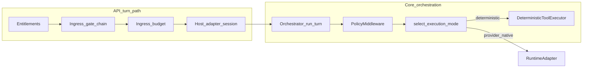

<!--
File: governed-execution-pipeline.md
Path: docs/architecture/governed-execution-pipeline.md
Role: Canonical control-plane ordering for governance, orchestration, policy, and deterministic tool execution.
Used By:
 - docs/strategy/goal.md
 - docs/api/customer-api-integration-guide.md
 - docs/modules/policies.md
Depends On:
 - src/api/routers/turns.py
 - src/core/orchestrator.py
 - src/policies/ingress_gates.py
 - src/policies/middleware.py
 - src/tools/executor.py
 - src/runtime/mode_selector.py
Notes:
 - Distinguishes API-wrapped turns from direct Orchestrator use; ingress is not implemented inside orchestrator.py.
-->

# Governed execution pipeline

## Purpose

This note is the **single ordering reference** for how entitlements, ingress, session/runtime, orchestration, tool policy, execution mode, and the deterministic tool runtime compose for **default** customer traffic (REST/SSE/WebSocket turns). Use it when extending governance or when docs must stay evidence-aligned with code.

## Ordered stages (default API turn)

1. **Authentication and tenant scope** — API middleware (`src/api/*`).
2. **Entitlements** — tier-gated features (`src/api/middleware/entitlements.py`) evaluated on the turn path where applicable.
3. **Ingress gate chain** — pre-model allow/deny/escalate with reason codes and audit correlation (`src/policies/ingress_gates.py`, driven from `src/api/routers/turns.py` with tenant overlay / profile resolution).
4. **Ingress latency budget** — profile-scoped budget and fail-open/fail-closed behavior (`src/observability/ingress_budget.py`, invoked from the turn path).
5. **Session / host adapter** — wires into runtime adapter and session context (`src/integration/host_adapter.py` and related runtime wiring from turns).
6. **Orchestrator** — `Orchestrator.run_turn` (`src/core/orchestrator.py`): streams `RuntimeAdapter.run_turn`, applies `PolicyMiddleware.before_tool_call` on tool intent, selects mode via `select_execution_mode` (`src/runtime/mode_selector.py`), runs `DeterministicToolExecutor.execute` on the deterministic branch, and submits results back through the adapter.
7. **Tool policy (risk gates)** — `DeterministicFirstPolicyMiddleware` / `RiskGatePolicy` (`src/policies/middleware.py`, `src/policies/risk_gates.py`); evaluated in the orchestrator and again at the executor boundary for defense in depth.
8. **Deterministic tool runtime** — registry resolution and handler execution (`src/tools/executor.py`) when mode is deterministic; policy `after_tool_call` post-checks apply to envelopes leaving the executor.

Provider-native continuation (when capability and policy allow) remains **inside the runtime adapter** after the orchestrator yields the tool-intent event; core does not re-implement the full provider tool loop in `orchestrator.py`.

## Mermaid (control-plane data flow)

## Integrator warning: direct `Orchestrator` use

Calling **`Orchestrator.run_turn` without the API ingress wrapper** (for example in a custom harness or alternate entrypoint) **skips** the ingress gate chain, entitlement checks tied to that path, and any turn-level budget enforcement that runs only in `turns.py`. That is an **integrator responsibility**: replicate the same gates or accept a weaker posture. The reference product path is always **SSE/WS (or governed OpenAI bridge) through `src/api/routers/turns.py`**.

## PolicyAction.ESCALATE (today)

For **tool** policy (`RiskGatePolicy` via `DeterministicFirstPolicyMiddleware`):

- **`ESCALATE`** means **do not execute** the registered tool handler for this turn step. The executor returns a **blocked-style** envelope (for example `ToolStatus.BLOCKED` with policy reason metadata), and the orchestrator treats any decision **other than `ALLOW`** the same way for progression (no separate “pause for human” queue in core yet).
- **`review_required`**, **`review_channel`**, and reason codes are **signals** for operators and future approval APIs.

For **ingress** policy, a non-`ALLOW` ingress decision (including **`ESCALATE`**) **stops the turn** before model/orchestration; HTTP/stream behavior is defined on the API path (see customer integration guide).

**Human approve/reject lifecycle** for escalations is **planned**; see [`docs/strategy/traceability-matrix.md`](../strategy/traceability-matrix.md) (Human approval workflow surface).

## Hands-on proof: why deterministic tools matter

The governed lab notebook [`notebooks/tutorial_08_governed_execution_sandbox.ipynb`](../../notebooks/tutorial_08_governed_execution_sandbox.ipynb) includes a deliberate **anti-guessing** demo (Part **4** locally, Part **8** §3 optional live):

| What the model sees | What only the handler knows |
|---------------------|-----------------------------|
| Tool arguments **`a`** and **`b`** (e.g. 11 and 33) | A per-kernel **`random_operand`** derived from `NB_FORMULA_SECRET` |
| — | **`sum = a + b + random_operand`** and an unpredictable **`proof_token`** |

**Value for product and security conversations:**

1. **Plain mental math is wrong on purpose** — answering **44** for “11+33” without calling the tool proves the model **did not** use your governed runtime.
2. **Deterministic execution is the source of truth** — policy + `DeterministicToolExecutor` run **your** Python handler; the model only narrates typed **`ToolResult`** JSON.
3. **Governed vs raw contrast (Part 8, diagnostic)** — optional live turns compare governed vs notebook-only raw Agents SDK. **§1 ingress** usually **PASS**es on the governed path; **§2–§4** often **FAIL** when the model will not call tools — the notebook’s **`§N VERIFICATION`** and closing summary record that honestly (local Parts 1–7 remain ground truth).

Regenerate the notebook from [`notebooks/build_tutorials.py`](../../notebooks/build_tutorials.py) after editing the lab; see [`notebooks/README.md`](../../notebooks/README.md) and [`notebooks/EVALUATOR_GUIDE.md`](../../notebooks/EVALUATOR_GUIDE.md).

**Enterprise acceptance (Part 4 local; Part 8 optional live is diagnostic):** Part 4 prints **`[PASS] Part 4 local proof`** when handler JSON matches the kernel baseline. Part 8 **`PASS`** requires **`tool_progress` completed** for the tool under test — matching assistant text without completion is **`FAIL`**. Operator baseline sum/token are **not** in model prompts. §3 **`PASS`** only when **`safe_add_proven`** completes then cites kernel sum/token; §2 requires **`admin_reset`** **`tool_intent`** plus **`POLICY_BLOCKED`** progress (model refusal without a tool call is **`FAIL`**).

## Related documents

- [`docs/api/customer-api-integration-guide.md`](../api/customer-api-integration-guide.md) — wire-level turn and tier behavior.
- [`docs/strategy/traceability-matrix.md`](../strategy/traceability-matrix.md) — row-level code and test anchors.
- [`docs/plans/tenant-tool-execution-architecture.md`](../plans/tenant-tool-execution-architecture.md) — tool platform and slice status.
- [`notebooks/tutorial_08_governed_execution_sandbox.ipynb`](../../notebooks/tutorial_08_governed_execution_sandbox.ipynb) — story-driven lab with the three-operand **`safe_add_proven`** proof (see **Hands-on proof** above).
