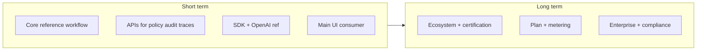
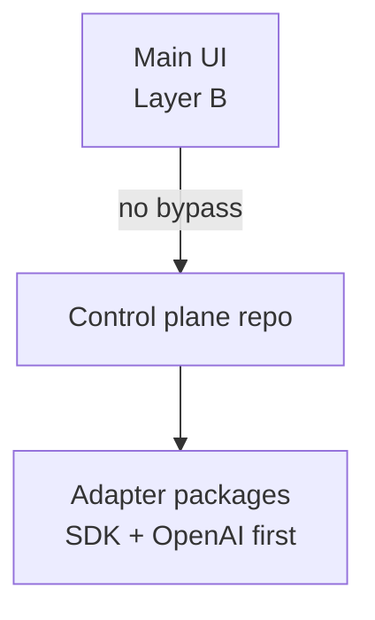

<!--
File: workspace-architecture.md
Path: docs/architecture/workspace-architecture.md
Role: Durable workspace architecture notes (adapter portability, deterministic execution, enterprise controls).
Used By:
 - AGENTS.md, implementer profile, local planning stubs
Depends On:
 - AGENTS.md
 - .cursor/rules/provider-neutral-adapter-wall.mdc
 - docs/plans/short-long-term-execution-plan.md
Notes:
 - Live execution trackers stay under `.local/index-and-planning/current/`; edit this file for enduring doctrine.
-->

# Workspace architecture notes

## Product model (strategy link)

Enduring vocabulary for **control plane** monetization and **integration surfaces** (provider runtime adapter vs control plane API vs customer bridge) lives in `docs/strategy/governed-execution-positioning.md`, `docs/strategy/goal.md` (section 5a), and the cross-cutting plan [`docs/plans/control-plane-product-alignment-plan.md`](../plans/control-plane-product-alignment-plan.md). Use that language in module boundaries and PR discussions so “adapter” is not overloaded.

**Repository scope:** This workspace is the **control-plane** codebase. **Adapter package source** belongs in **separate repositories**; any in-tree `packages/` is **transitional** per `governed-execution-positioning.md` (**Repository boundary**).

## Enterprise separation of concerns (engineering view)

- **Subscription / entitlements (commercial layer):** Maps to tier-enforced API and middleware behavior; must not leak into provider adapters as “special SDK paths.”
- **Trust boundary (control plane):** Module responsibilities below (`tenant_governance`, `turn_execution`, `audit_observability`, etc.) implement **non-bypassable** governance — the layer you **monetize for safety**.
- **Connectivity (provider runtime adapters):** `adapter_contracts`, `provider_management`, and **out-of-repo** adapter artifacts loaded at runtime — **portability**, not pricing moat by itself. (Transitional: `packages/` until extraction.)
- **Customer attach (northbound):** `src/api/*` and optional customer bridge; same policy spine as any other entrypoint.

Full four-layer table and messaging guardrails: `docs/strategy/governed-execution-positioning.md`.

## Execution horizons (short vs long term)

Canonical plan: [`docs/plans/short-long-term-execution-plan.md`](../plans/short-long-term-execution-plan.md). **Short term** stresses pilot-complete core, governance/observability/audit **via APIs**, adapter SDK + OpenAI reference, and a **main UI platform** that attaches only through **northbound** APIs (Layer B). **Long term** stresses full adapter ecosystem, commercial operability, and enterprise procurement depth.

## Non-negotiable boundaries
- Core orchestration stays provider-neutral.
- Provider SDK behavior remains behind runtime adapters.
- Customer-owned provider credentials and provider-native adapter configuration stay outside the core governance boundary.
- Policy middleware remains in the execution path for all state-changing operations.
- `platform_bootstrap` is the only composition root; application modules must depend on facades, not raw `app.state` objects.

## Modular monolith contract
- `identity_access` owns authentication, API keys, RBAC, and platform-admin trust boundaries.
- `tenant_governance` owns overlays, rate limits, quotas, entitlements, and fairness controls.
- `provider_management` owns provider registration, protocol typing, health checks, and adapter lookup.
- `agent_management` owns durable agent definitions and their public contracts.
- `tool_management` owns tool metadata, versions, artifacts, and upload governance inputs.
- `session_runtime` owns tenant context lookup, session creation, run control, and runtime caches.
- `turn_execution` owns orchestration flow, mode selection, progress semantics, and host-adapter seams.
- `audit_observability` owns audit persistence, signed export/verify settings, logs, metrics, tracing sinks, and standard telemetry export adapters.
- `platform_bootstrap` owns settings validation, default bootstrap provider wiring, module installation, and startup hydration.
- `shared_kernel` stays limited to immutable schemas and shared reason-code contracts.
- `adapter_contracts` owns runtime/execution adapter interfaces only.

## Allowed dependency direction
- `shared_kernel` depends on nothing.
- `adapter_contracts` may depend only on `shared_kernel`.
- `identity_access`, `agent_management`, and `audit_observability` may depend only on `shared_kernel`.
- `tenant_governance` may depend on `shared_kernel`, `identity_access`, and `audit_observability`.
- `provider_management` may depend on `shared_kernel`, `identity_access`, and `adapter_contracts`.
- `tool_management` may depend on `shared_kernel`, `tenant_governance`, and `audit_observability`.
- `turn_execution` may depend on `shared_kernel`, `tenant_governance`, `audit_observability`, `adapter_contracts`, and `tool_management`.
- `session_runtime` may depend on `shared_kernel`, `agent_management`, `tool_management`, `provider_management`, `tenant_governance`, `adapter_contracts`, and `turn_execution`.
- `platform_bootstrap` may compose all modules but must not leak their concrete internals back out as the primary app contract.

## Adapter independence model
- Adapters are loadable by class reference (factory/registry path only).
- Each adapter owns its provider-specific configuration schema.
- Core depends on adapter contracts, not provider names.

## Enterprise requirements
- Versioned adapter contract compatibility check at load time.
- Capability handshake for routing (capability + policy, never provider hardcoding).
- Config validation before provider registration and before startup hydration.
- Deterministic tool governance preserved regardless of adapter selection.
- OpenTelemetry/Prometheus interoperability belongs behind `audit_observability`; exporter failure must not affect governed execution safety.

## Resource consumption controls
- Execution placement policy: hosted/byoc/blocked.
- Budget and quota gates before expensive tool calls.
- Tenant fairness/rate/concurrency controls with structured reason codes.

## Open questions
- Do we require signed adapters for all profiles or enterprise-only profiles?
- What minimum compatibility matrix is required for external adapter packages?
