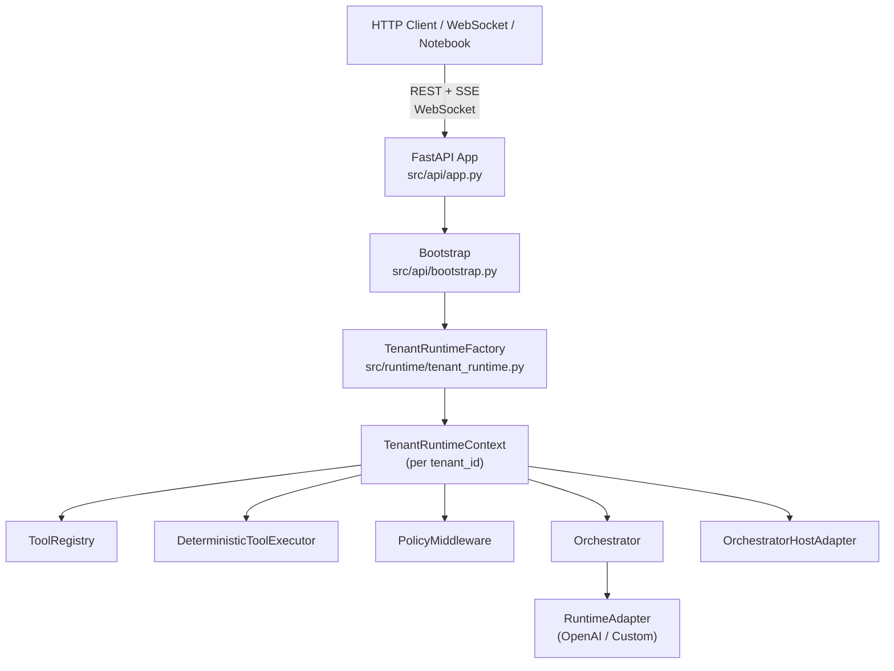

# eXo-brain API Platform Plan

> Status: **Decisions locked — ready to build**
> Last updated: Mar 2, 2026
> Branch: to be created (`feature/api-platform`)

---

## What we are building

Two modules on top of the existing eXo-brain runtime core:

- **Module 1 — Tool & Agent Management** (management plane): users register their Python tools, set agent instructions, configure handoff routes
- **Module 2 — Adapter Playground** (data plane): users create sessions, talk to the AI via any registered adapter, and see the full execution trace — tool intercepted → policy gate → Python executed → result returned → model response — in real time

A **Tenant Runtime Isolation** layer is the foundational prerequisite for both. Without it, one user's tools and sessions leak into another user's context.

---

## Architecture Overview



---

## Gap Analysis

### Already built (reusable as-is)

> **Note on adapters:** `OpenAIAgentsRuntimeAdapter` (`src/runtime/openai_agents_runtime.py`) is currently a **stub** — it echoes input and emits `TOOL_INTENT` events from a pre-planned context dict. It does not call the OpenAI SDK. The real SDK wiring lives in the notebooks (`notebooks/build_notebooks.py`). Slice 0 wires `build_agent_tools` into this adapter to make it functional.

| Component | File |
|---|---|
| `ToolRegistry` + `ToolDescriptor` | `src/tools/registry.py` |
| `DeterministicToolExecutor` | `src/tools/executor.py` |
| `PolicyMiddleware` + `DeterministicFirstPolicyMiddleware` | `src/policies/middleware.py` |
| `RiskGatePolicy` | `src/policies/risk_gates.py` |
| `Orchestrator` | `src/core/orchestrator.py` |
| `OrchestratorHostAdapter` | `src/integration/host_adapter.py` |
| `SessionContext` + `InMemorySessionStore` | `src/core/session_context.py`, `src/core/session_store.py` |
| `AgentRegistry` + `AgentSpec` + `HandoffRoute` | `src/agents/registry.py`, `src/agents/contracts.py` |
| `TenantQuotaManager` | `src/tenancy/quotas.py` |
| `TenantPolicyOverlayStore` | `src/tenancy/policy_overlay.py` |
| `BackgroundRuntime` + `WorkerPool` | `src/core/background_runtime.py`, `src/core/worker_pool.py` |
| `IdentityContext` + `resolve_identity` | `src/identity/contracts.py`, `src/identity/resolver.py` |
| `AccessPolicyEngine` | `src/access_control/policy_engine.py` |
| `ProviderRegistry` | `src/config/provider_registry.py` |
| `AppSettings` | `src/config/settings.py` |
| `OpenAIAgentsRuntimeAdapter` | `src/runtime/openai_agents_runtime.py` |
| `RuntimeAdapter` ABC | `src/runtime/runtime_adapter.py` |

### Missing (must be built)

| Gap | Slice | Verified against source |
|---|---|---|
| `ProviderRegistry.get_adapter()` public method | Slice 0 pre-req | `_adapters` is private — confirmed |
| `AgentSpec.instructions: str` field | Slice 0 pre-req | Field absent — confirmed |
| `ToolRegistry.list_descriptors()` method | Slice 0 pre-req | Only `list_tools() -> list[str]` exists — confirmed |
| `ToolDescriptor.description` + `parameters_schema` fields | Slice 0 pre-req | Fields absent — confirmed |
| `ToolRegistry.unregister()` method | Slice 0 pre-req | Plugin manager notes this gap — confirmed |
| `src/runtime/tool_wiring.py` — dynamic tool-to-adapter wiring | Slice 0 | New file |
| `OpenAIAgentsRuntimeAdapter` — real SDK wiring; constructor takes `(provider_id, tool_registry, tool_executor)` | Slice 0 | Stub today; P1+P4+P5 fixes applied |
| `AgentRegistry.list_routes()` + `list_fallback_policies()` methods | Slice 2 | Methods absent — routing state is write-only |
| `PluginManager.unload_plugin` — call `registry.unregister()` for each tool | Slice 0 cleanup | Documented gap in plugin_manager.py ~line 42 |
| `TenantRuntimeContext` — tenant-scoped only (no `orchestrator`/`host_adapter`) | Slice 0 | P2 fix |
| `TenantRuntimeFactory` — `create_session_runtime()` + `_session_runtimes` cache | Slice 0 | P3 fix; new file |
| FastAPI app factory, bootstrap, DI wiring | Slice 1 | New directory |
| Auth middleware (`IdentityContext` from headers) | Slice 1 | New file |
| SSE + WebSocket event envelope format | Slice 1 | New file |
| Pydantic request/response schemas | Slice 1 | New files |
| Tool & agent CRUD endpoints (incl. `description`+`parameters_schema` on POST /tools) | Slice 2 | New files |
| Session create/get endpoints | Slice 3 | New files |
| Turn execution — SSE streaming | Slice 3 | New file |
| Turn execution — WebSocket (persistent, multi-turn) | Slice 3 | New file |
| Provider health + capabilities endpoints | Slice 3 | New file |
| Tenant policy + quota management endpoints | Slice 4 | New file |

---

## Slice 0 — Tenant Runtime Isolation (Foundation)

**Why first:** Both modules need a dedicated `ToolRegistry`, `Orchestrator`, and `SessionStore` per tenant. Without this, registering a tool in one tenant's context makes it visible to every other tenant.

### Pre-requisite contract changes (make before building Slice 0)

All five changes below are verified against the actual source files. Each is a targeted addition; no existing public method is altered.

---

**1. Add `get_adapter()` to `ProviderRegistry` (`src/config/provider_registry.py`)**

`ProviderRegistry._adapters: dict[str, RuntimeAdapter]` is private. The factory needs to resolve a live adapter instance by `provider_id`. Add one public method:

```python
def get_adapter(self, provider_id: str) -> RuntimeAdapter:
    adapter = self._adapters.get(provider_id)
    if adapter is None:
        raise KeyError(f"No adapter bound for provider '{provider_id}'")
    return adapter
```

---

**2. Add `instructions` field to `AgentSpec` (`src/agents/contracts.py`)**

`AgentSpec` currently has only `agent_id`, `role`, `capability_tags`, and `metadata: dict`. Agent instructions are first-class data needed by every adapter at `start_session` time. Add a dedicated field:

```python
@dataclass(slots=True)
class AgentSpec:
    agent_id: str
    role: str
    capability_tags: set[AgentCapabilityTag] = field(default_factory=set)
    instructions: str = ""          # NEW — adapter reads this at start_session
    metadata: dict[str, Any] = field(default_factory=dict)
```

`metadata` is kept for adapter-specific extras (model name, temperature overrides, etc.).

---

**3. Add `list_descriptors()` to `ToolRegistry` (`src/tools/registry.py`)**

`ToolRegistry` currently exposes only `list_tools() -> list[str]` (sorted names) and `resolve(name) -> ToolDescriptor`. The `build_agent_tools` helper iterates full descriptors to generate `FunctionTool` wrappers, requiring a method that returns all descriptors at once:

```python
def list_descriptors(self) -> list[ToolDescriptor]:
    return sorted(self._tools.values(), key=lambda d: d.name)
```

---

**4. Add `description` and `parameters_schema` fields to `ToolDescriptor` (`src/tools/registry.py`)**

Current `ToolDescriptor` fields: `name`, `handler`, `risk_tier`, `is_state_changing`, `timeout_ms`, `metadata`. The OpenAI SDK's `FunctionTool` requires a `description` string and a `params_json_schema` dict to generate the tool's JSON schema. Add both:

```python
@dataclass(slots=True)
class ToolDescriptor:
    name: str
    handler: ToolCallable
    risk_tier: RiskTier = RiskTier.LOW
    is_state_changing: bool = False
    timeout_ms: int = 30000
    description: str = ""                           # NEW — human-readable tool purpose
    parameters_schema: dict[str, Any] = field(default_factory=dict)  # NEW — JSON Schema for arguments
    metadata: dict[str, Any] = field(default_factory=dict)
```

For tools registered via `POST /tools`, `parameters_schema` is provided in the request body. For tools registered at startup (e.g., in tests), it defaults to `{}`.

---

**5. Add `unregister()` to `ToolRegistry` (`src/tools/registry.py`)**

`AgentRegistry` already has `unregister(agent_id)` but `ToolRegistry` has no equivalent. The `DELETE /tenants/{tenant_id}/tools/{name}` endpoint (Slice 2) cannot work without it. Add:

```python
def unregister(self, tool_name: str) -> None:
    if tool_name not in self._tools:
        raise KeyError(f"Tool '{tool_name}' is not registered")
    del self._tools[tool_name]
```

Note: `PluginManager.unload_plugin` documents this gap (`# Registry currently has no explicit unregister API`). Adding `unregister` resolves that comment as well.

---

**6. `DeterministicToolExecutor.execute()` is synchronous — async wiring note**

`executor.execute()` is `def execute(...)` (synchronous), not `async def`. The `build_agent_tools` helper's `_execute` body must be `async def` (required by the OpenAI SDK), so the call is:

```python
async def _execute(**kwargs: Any) -> Any:
    result = tool_executor.execute(call)   # sync call inside async function — OK
    return result.result
```

No change to `execute()` is required. Calling a sync function from inside an `async def` is valid — it runs in the same event loop thread. Only add `await` if `execute()` becomes async in the future.

---

### New file: `src/runtime/tenant_runtime.py`

#### `TenantRuntimeContext` — tenant-scoped state only (Problem 2 fix)

`orchestrator` and `host_adapter` are removed. They are per-session, not per-tenant. Two sessions on the same tenant can use different providers — they must own their own orchestrator.

```python
@dataclass(slots=True)
class TenantRuntimeContext:
    tenant_id: str
    tool_registry: ToolRegistry
    policy_middleware: PolicyMiddleware
    tool_executor: DeterministicToolExecutor
    agent_registry: AgentRegistry
    session_store: SessionStore
    quota_manager: TenantQuotaManager
    # orchestrator and host_adapter intentionally absent — see TenantRuntimeFactory
```

#### `TenantRuntimeFactory` — tenant cache + session runtime cache (Problem 3 fix)

```python
class TenantRuntimeFactory:
    def __init__(self, provider_registry: ProviderRegistry, settings: AppSettings) -> None
        # _contexts: dict[str, TenantRuntimeContext] — tenant cache
        # _session_runtimes: dict[str, OrchestratorHostAdapter] — session cache

    def get_or_create(self, tenant_id: str) -> TenantRuntimeContext
        # Returns cached context or builds fresh: ToolRegistry, PolicyMiddleware,
        # DeterministicToolExecutor, AgentRegistry, InMemorySessionStore, TenantQuotaManager

    def create_session_runtime(
        self,
        tenant_context: TenantRuntimeContext,
        agent_id: str,
        provider_id: str,
        session_id: str,
    ) -> OrchestratorHostAdapter
        # Problem 4 fix: resolve AgentSpec HERE — adapter never needs agent_registry
        # 1. spec = tenant_context.agent_registry.get(agent_id)  → AgentSpec (or KeyError → 404)
        # 2. adapter = provider_registry.get_adapter(provider_id)
        #      constructed with (provider_id, tool_registry, tool_executor) — Problem 1 fix
        # 3. await adapter.start_session(session_id, metadata={
        #        "instructions": spec.instructions,
        #        "agent_id": spec.agent_id,
        #        "model": spec.metadata.get("model", "gpt-4o-mini"),
        #    })
        # 4. orchestrator = Orchestrator(adapter, policy_middleware, tool_executor, agent_registry)
        # 5. host_adapter = OrchestratorHostAdapter(orchestrator)
        # 6. _session_runtimes[session_id] = host_adapter
        # 7. return host_adapter

    def get_session_runtime(self, session_id: str) -> OrchestratorHostAdapter
        # raises KeyError if session_id not found — caller handles 404

    def list_tenants(self) -> list[str]

    def destroy(self, tenant_id: str) -> None
        # clears tenant context AND all session_runtimes for that tenant
```

`Orchestrator.__init__` signature is **unchanged** — it still takes a single `RuntimeAdapter`. No existing tests break.

**Full session lifetime flow** (all 5 problems resolved):

```
POST /sessions  { "agent_id": "math-agent", "provider_id": "openai-gpt4o-mini" }
  → get_or_create(tenant_id)                             → TenantRuntimeContext
  → create_session_runtime(context, agent_id, provider_id, session_id)
      → agent_registry.get("math-agent")                → AgentSpec   [P4: resolved here, not in adapter]
      → get_adapter("openai-gpt4o-mini")                → OpenAIAgentsRuntimeAdapter
           constructed with (provider_id, tool_registry, tool_executor)  [P1: no TRC ref, no circular dep]
      → adapter.start_session(session_id, metadata={    [P4: flat dict passed to adapter]
            "instructions": spec.instructions,
            "agent_id": spec.agent_id,
            "model": spec.metadata.get("model", "gpt-4o-mini"),
        })
      → Orchestrator(adapter, policy_middleware, tool_executor, agent_registry)  [P2: per-session orch]
      → OrchestratorHostAdapter(orchestrator)
      → _session_runtimes[session_id] = host_adapter    [P3: cached by session_id in factory]
  → session_store.save_session(SessionRecord)
  → return { "session_id": "..." }

POST /sessions/{id}/turns  { "input": "What is 5 + 7?" }
  → get_session_runtime(session_id)                     → OrchestratorHostAdapter
  → host_adapter.submit_turn(session_ctx, user_input)
      → orchestrator.run_turn(...)
          → adapter.run_turn(...)
              → build_agent_tools(tool_registry, executor)  [P5: rebuilt fresh — no stale tools]
              → Agent(instructions=..., tools=fresh_tools)
              → Runner.run_streamed(agent, user_input)
              → yield RuntimeEvent stream

WS /sessions/{id}/ws  (connect)
  → get_session_runtime(session_id)                     → OrchestratorHostAdapter (held for connection)
  → on "turn" message: host_adapter.submit_turn(...)
  → on "cancel" message: cancel in-flight asyncio.Task
  → on disconnect: auto-cancel in-flight task

factory.destroy(tenant_id)
  → evicts tenant context + all _session_runtimes for that tenant
```

---

### Dynamic tool-to-adapter wiring (automated delegating wrapper)

This is the automated version of the manual `@function_tool` wiring from the notebooks.

**Problem:** Tools are registered dynamically via `POST /tools`. If the adapter builds `Agent(tools=[...])` once at `start_session` and caches it, any tool registered after the session is created is invisible to the model.

**Solution — late binding: rebuild tools on every `run_turn` call (Problem 5 fix)**

`build_agent_tools` is called inside `run_turn`, not `start_session`. The registry is read fresh each turn. Tools registered between turns are immediately available. No stale agent state. The performance cost is negligible — registry iteration over an in-memory dict.

**`build_agent_tools(tool_registry, tool_executor)` helper:**

Called at the start of every `run_turn`:
1. Lists all current descriptors from `tool_registry`
2. For each descriptor, builds a `FunctionTool` whose execute body calls `DeterministicToolExecutor.execute()`
3. Returns the list to `Agent(tools=[...])` constructed inline

```python
def build_agent_tools(
    tool_registry: ToolRegistry,
    tool_executor: DeterministicToolExecutor,
) -> list[FunctionTool]:
    tools = []
    for descriptor in tool_registry.list_descriptors():          # needs list_descriptors() — pre-req #3
        def make_tool(desc: ToolDescriptor) -> FunctionTool:
            async def _execute(ctx: Any, args_str: str) -> str:
                import json
                kwargs = json.loads(args_str)
                call = ToolCallContext(
                    tool_name=desc.name,
                    arguments=kwargs,
                    schema_version="1.0",
                )
                result = tool_executor.execute(call)              # sync call — no await needed
                return str(result.result)
            return FunctionTool(
                name=desc.name,
                description=desc.description,                     # needs description field — pre-req #4
                params_json_schema=desc.parameters_schema,        # needs parameters_schema field — pre-req #4
                on_invoke_tool=_execute,
            )
        tools.append(make_tool(descriptor))
    return tools
```

`FunctionTool.on_invoke_tool` receives `(context, args_as_json_string)` — the SDK serialises arguments to JSON before calling the handler, so the wrapper must deserialise. Return value must be a `str`; the SDK feeds it back to the model as the tool output string.

This helper lives in `src/runtime/tool_wiring.py` and is imported only by adapters — never by core layers.

**New file:** `src/runtime/tool_wiring.py`

---

### Real adapter implementation — wire OpenAI Agents SDK into `OpenAIAgentsRuntimeAdapter`

The review confirmed `src/runtime/openai_agents_runtime.py` is a stub: `run_turn` echoes input and reads a pre-planned `context["planned_tool_call"]`. The real SDK wiring only exists in `notebooks/build_notebooks.py`. This must be promoted into the production adapter as part of Slice 0.

**Changes to `src/runtime/openai_agents_runtime.py`:**

**Problem 1 fix — constructor takes only what it needs, no `TenantRuntimeContext`:**
```python
def __init__(
    self,
    provider_id: str,
    tool_registry: ToolRegistry,
    tool_executor: DeterministicToolExecutor,
) -> None:
    self._provider_id = provider_id
    self._tool_registry = tool_registry
    self._tool_executor = tool_executor
    # No reference to TenantRuntimeContext — circular dependency eliminated
```

**Problem 4 fix — `start_session` receives agent spec as flat metadata, resolved by caller:**

The session creation endpoint resolves `AgentSpec` from `agent_registry` before calling `start_session`. The adapter receives a plain dict — no registry dependency:

```python
async def start_session(
    self,
    session_id: str,
    metadata: dict[str, Any] | None = None,
) -> SessionHandle:
    # metadata contains: {"instructions": str, "agent_id": str, "model": str}
    # resolved by TenantRuntimeFactory.create_session_runtime before this call
    self._session_metadata[session_id] = metadata or {}
    return SessionHandle(session_id=session_id, provider_id=self._provider_id, metadata={})
```

**Problem 5 fix — `run_turn` rebuilds tools fresh every call (late binding):**

```python
async def run_turn(
    self,
    session_id: str,
    user_input: str,
    context: dict[str, Any],
) -> AsyncIterator[RuntimeEvent]:
    session_meta = self._session_metadata.get(session_id, {})

    # Late binding: read current registry state — picks up any tools registered after start_session
    tools = build_agent_tools(self._tool_registry, self._tool_executor)

    agent = Agent(
        name=session_meta.get("agent_id", "exo-agent"),
        instructions=session_meta.get("instructions", ""),
        model=session_meta.get("model", "gpt-4o-mini"),
        tools=tools,
    )

    # Stream SDK events and map to RuntimeEvent
    async for event in Runner.run_streamed(agent, user_input):
        if isinstance(event, TextDeltaEvent):
            yield RuntimeEvent(type=RuntimeEventType.OUTPUT_DELTA, ...)
        elif isinstance(event, FunctionCallItem):
            yield RuntimeEvent(type=RuntimeEventType.TOOL_CALL, ...)
        elif isinstance(event, FunctionCallOutputItem):
            yield RuntimeEvent(type=RuntimeEventType.TOOL_RESULT, ...)
    yield RuntimeEvent(type=RuntimeEventType.RUN_COMPLETE, ...)
```

`submit_tool_results` is not used in the delegating-wrapper pattern — tool execution happens inside `on_invoke_tool` during `run_turn`. Emit `RUN_COMPLETE` immediately if called.

**New Slice 0 acceptance tests for real adapter:**
- `start_session` stores metadata; `run_turn` reads instructions and model from it
- New tool registered after `start_session` → next `run_turn` call includes that tool in `build_agent_tools` output
- `run_turn` streams `OUTPUT_DELTA` and `RUN_COMPLETE` events
- Tool registered in registry → `build_agent_tools` output has matching `FunctionTool` name
- Two sessions on same adapter with different agent specs use independent metadata

---

### `PluginManager` comment cleanup (tracked)

`src/tools/plugins/plugin_manager.py` line ~42 contains:
```python
# Registry currently has no explicit unregister API; keep loaded tools immutable once registered.
```
Once `ToolRegistry.unregister()` is added (pre-req #5), this comment must be removed and `unload_plugin` should call `registry.unregister(tool_name)` for each tool in the plugin. This is a Slice 0 cleanup task.

---

**Acceptance tests:**

*Pre-req contract changes:*
- `ProviderRegistry.get_adapter("unknown")` raises `KeyError` — `get_adapter("known")` returns the adapter
- `AgentSpec` with `instructions="You are a math agent"` round-trips through `AgentRegistry`
- `ToolRegistry.list_descriptors()` returns sorted descriptors; empty registry returns `[]`
- `ToolDescriptor` with `description` and `parameters_schema` round-trips through registry correctly
- `ToolRegistry.unregister("name")` removes tool; `resolve("name")` raises `KeyError` afterwards

*Tenant isolation (Problem 2):*
- Register tool in tenant A — `TenantRuntimeContext` for tenant B has empty registry
- `TenantRuntimeContext` has no `orchestrator` or `host_adapter` field

*Session runtime lifecycle (Problem 3):*
- `create_session_runtime(ctx, agent_id, provider_id, session_id)` stores in `_session_runtimes`
- `get_session_runtime(session_id)` returns the stored `OrchestratorHostAdapter`
- `get_session_runtime("unknown-session")` raises `KeyError`
- `destroy(tenant_id)` evicts tenant context AND clears all session runtimes for that tenant

*Agent spec resolution (Problem 4):*
- `create_session_runtime` with unknown `agent_id` raises `KeyError` before adapter is constructed
- Adapter's `_session_metadata[session_id]` contains `instructions`, `agent_id`, `model` from `AgentSpec`
- Adapter constructor has no reference to `AgentRegistry` — verified by inspecting `__init__` args

*Late binding tools (Problem 5):*
- Register tool AFTER `start_session` → next `run_turn` call includes that tool in `build_agent_tools` output
- `build_agent_tools` with two descriptors produces two `FunctionTool` objects; invoking either routes through `DeterministicToolExecutor`

*Quota:*
- Quota manager correctly counts active jobs per tenant and blocks when limit is hit

> **Test file placement:** `src/config/provider_registry.py` has zero test coverage. Pre-req tests go in `tests/modules/config/test_provider_registry.py`. Slice 0 isolation + session runtime tests go in `tests/modules/runtime/test_tenant_runtime.py`.

---

## Slice 1 — API Transport Layer

**New directory:** `src/api/`

```
src/api/
  app.py              # FastAPI app factory: create_app() -> FastAPI
  bootstrap.py        # Wire ProviderRegistry, TenantRuntimeFactory, TenantPolicyOverlayStore into app.state
  dependencies.py     # FastAPI Depends() providers
  middleware/
    auth.py           # Resolve IdentityContext from X-Identity header (plain JSON, MVP). JWT Bearer upgrade path: swap this file only.
  schemas/
    tool_schemas.py
    agent_schemas.py
    session_schemas.py
    turn_schemas.py
    provider_schemas.py
  routers/            # (populated in Slices 2–4)
```

**`dependencies.py` key providers:**
```python
async def get_tenant_context(tenant_id: str, request: Request) -> TenantRuntimeContext
async def get_identity(request: Request) -> IdentityContext
async def require_valid_identity(identity: IdentityContext = Depends(get_identity)) -> IdentityContext
```

### Shared event envelope (SSE + WebSocket)

Both transports emit the same JSON event shape so clients don't need separate parsers:

```json
{"event": "output_delta",  "delta": "The result is",     "correlation_id": "..."}
{"event": "tool_call",     "tool_name": "calculate_result", "arguments": {"operation": "add", "operand1": 5, "operand2": 7, "operand3": 0}}
{"event": "tool_result",   "tool_name": "calculate_result", "result": 110.0, "policy": "LOW_RISK_ALLOWED", "mode": "DETERMINISTIC"}
{"event": "run_complete",  "run_id": "...",               "correlation_id": "..."}
{"event": "error",         "code": "TOOL_EXECUTION_ERROR", "message": "..."}
```

**Acceptance tests:**
- App starts without errors
- Auth middleware rejects requests with missing or `INVALID`/`EXPIRED` identity tokens
- `get_tenant_context` returns the correct isolated context per `tenant_id`

---

## Slice 2 — Module 1: Tool & Agent Management API

**New files:** `src/api/routers/tools.py`, `src/api/routers/agents.py`

### Tool endpoints

| Method | Path | Description |
|---|---|---|
| `POST` | `/tenants/{tenant_id}/tools` | Register a tool. Body: `name`, `handler_ref` (`"module.path:fn_name"`), `description`, `parameters_schema` (JSON Schema object), `risk_tier`, `is_state_changing`, `timeout_ms` |
| `GET` | `/tenants/{tenant_id}/tools` | List all registered tool names + metadata |
| `GET` | `/tenants/{tenant_id}/tools/{name}` | Get full `ToolDescriptor` detail for one tool |
| `DELETE` | `/tenants/{tenant_id}/tools/{name}` | Unregister tool |

`handler_ref` format: `"module.path:function_name"` (e.g., `"src.tools.math:calculate_result"`). Resolved via `importlib` **at registration time** — if the module or function is not found, `422` is returned immediately and the tool is never stored. The function must exist in the deployed codebase. No code upload, no sandboxing, no eval. See Decision 2.

### Agent endpoints

| Method | Path | Description |
|---|---|---|
| `POST` | `/tenants/{tenant_id}/agents` | Register `AgentSpec` (id, role, `capability_tags`, `instructions`, optional `metadata` for model overrides) |
| `GET` | `/tenants/{tenant_id}/agents` | List all registered agents |
| `GET` | `/tenants/{tenant_id}/agents/{agent_id}` | Get agent detail |
| `DELETE` | `/tenants/{tenant_id}/agents/{agent_id}` | Unregister agent (cascades route/fallback cleanup) |
| `POST` | `/tenants/{tenant_id}/agents/routes` | Add a `HandoffRoute` between two agents |
| `GET` | `/tenants/{tenant_id}/agents/routes` | List all registered handoff routes for this tenant |
| `POST` | `/tenants/{tenant_id}/agents/fallback` | Set `HandoffFallbackPolicy` for a source role |
| `GET` | `/tenants/{tenant_id}/agents/fallback` | List all registered fallback policies for this tenant |

> **`AgentRegistry` gap note:** `AgentRegistry` currently has no `list_routes()` or `list_fallback_policies()` methods — routing state is write-only through the public API. Both methods must be added to `src/agents/registry.py` as part of Slice 2 (no pre-req needed; straightforward additions returning internal dicts as lists).

**Acceptance tests:**
- Register → list → get → delete round-trip for tools and agents
- 404 on unknown tool/agent name
- 422 when `handler_ref` cannot be resolved by `importlib`
- Handoff route stored and returned in agent detail

---

## Slice 3 — Module 2: Adapter Playground API

**New files:** `src/api/routers/sessions.py`, `src/api/routers/turns.py`, `src/api/routers/providers.py`

### Session endpoints

| Method | Path | Description |
|---|---|---|
| `POST` | `/tenants/{tenant_id}/sessions` | Create a new session. Body: `agent_id`, `provider_id`, optional `correlation_id`. Returns `session_id` |
| `GET` | `/tenants/{tenant_id}/sessions/{session_id}` | Get session state from `SessionStore` |

### Turn execution — two transports

Both transports emit the same event envelope (defined in Slice 1).

**SSE (stateless, one turn per request)**

| Method | Path | Description |
|---|---|---|
| `POST` | `/tenants/{tenant_id}/sessions/{session_id}/turns` | Submit a message, returns `text/event-stream`. Tool calls, policy decisions, results, and final text are all streamed inline |

Flow:
1. Build `SessionContext` from path params + `IdentityContext` from request state
2. Call `host_adapter.submit_turn(session, user_input)`
3. Map each `RuntimeEvent` to the shared event envelope
4. Flush stream; client sees tool interception trace in real time

**WebSocket (persistent, multi-turn)**

| Path | Description |
|---|---|
| `WS /tenants/{tenant_id}/sessions/{session_id}/ws` | Persistent connection for a session. Client sends messages, receives streamed events. Supports mid-session cancellation |

WebSocket message protocol:
```json
// Client → server (send a turn):
{"type": "turn", "input": "What is 5 plus 7?"}

// Client → server (cancel running turn):
{"type": "cancel", "run_id": "..."}

// Server → client (same event envelope as SSE):
{"event": "output_delta", "delta": "The result is", ...}
{"event": "tool_call", ...}
{"event": "tool_result", ...}
{"event": "run_complete", ...}
```

**WebSocket cancellation (wired in this slice — see Decision 3):**

`turns.py` WebSocket handler maintains a local `run_id → asyncio.Task` dict:
- `{"type": "turn", ...}` → spawn task, store by `run_id`
- `{"type": "cancel", "run_id": "..."}` → cancel task, emit `{"event": "run_cancelled", "run_id": "..."}`
- Client disconnect → auto-cancel any in-flight task

WebSocket is preferable over SSE when:
- The client needs to send multiple turns on the same connection without HTTP overhead per turn
- The client needs to cancel a running turn (send `cancel` mid-stream)
- Building a chat UI that keeps a persistent connection open

SSE is preferable when:
- Simple notebook or script usage (one turn at a time)
- Clients that don't support WebSocket (plain `curl`, some proxies)

### Provider endpoints

| Method | Path | Description |
|---|---|---|
| `GET` | `/providers` | List all registered provider IDs + profiles |
| `GET` | `/providers/{provider_id}/health` | Call `adapter.healthcheck()` → `HealthStatus` |
| `GET` | `/providers/{provider_id}/capabilities` | Call `adapter.get_capabilities()` → `ProviderCapabilityMap` |

**Acceptance tests:**
- Session create → turn submit (SSE) → events received in order (`tool_call` before `tool_result` before `run_complete`)
- Session create → WebSocket connect → send turn → receive events → send second turn without reconnect
- WebSocket `cancel` message stops the running turn and emits `run_cancelled` event
- 404 on unknown session for both SSE and WebSocket
- `tool_result` event present when a tool is registered and called

---

## Slice 4 — Tenant Policy Management

**New file:** `src/api/routers/tenants.py`

| Method | Path | Description |
|---|---|---|
| `GET` | `/tenants/{tenant_id}/policy` | Return current `TenantPolicyOverlayStore.get_overlay(tenant_id)` |
| `PUT` | `/tenants/{tenant_id}/policy` | Call `set_overlay(tenant_id, body)` — takes effect immediately on the next tool call |
| `GET` | `/tenants/{tenant_id}/quota` | Return current active job count and configured limit |
| `PUT` | `/tenants/{tenant_id}/quota` | Update `max_active_jobs_per_tenant` for the tenant |

Policy overlay example — block a specific tool for a tenant:
```json
{
  "deny_tools": ["delete_records"],
  "escalate_risk_tiers": ["HIGH"],
  "escalate_state_changing": true
}
```

This is applied to the `DeterministicFirstPolicyMiddleware` in real time — no restart needed.

**Acceptance tests:**
- `PUT` policy overlay with `deny_tools: ["calculate_result"]` → next tool call blocked with `TOOL_DENIED`
- Quota `PUT` with `max_active_jobs = 1` → second job submission returns 429

---

## Execution Order

```
Slice 0  →  Slice 1  →  Slice 2 + Slice 3 (parallel)  →  Slice 4
```

Slices 2 and 3 share only the `TenantRuntimeContext` dependency from Slice 0, so they can be developed in parallel once Slices 0 and 1 are merged.

---

## What stays out of scope for v1

| Item | Reason |
|---|---|
| Frontend web UI | Can be built on top of this API. The event envelope is already browser-compatible (SSE + WebSocket) |
| Durable persistence (SQLite / Postgres) | `InMemorySessionStore` is the MVP default (Decision 4). Swap one line in `bootstrap.py` to `src/persistence/adapters/sqlite.py` when needed. No other code changes. |
| Code upload / sandbox execution | `handler_ref` requires the function to already exist in the deployed codebase. Sandboxed code execution is a separate security boundary |
| Multi-region / distributed state | `TenantRuntimeContext` is in-process. Horizontal scaling requires moving the context store to Redis or a shared backend |

---

## Decisions (locked)

All four open questions are resolved. These decisions are final for v1.

### Decision 1 — Auth format: `X-Identity` plain JSON (MVP)

`X-Identity` header carries a plain JSON dict that `resolve_identity()` parses into `IdentityContext`. No JWT verification in Slice 1. JWT Bearer is the production upgrade path and can be swapped into `middleware/auth.py` without touching any other layer — the rest of the stack only sees `IdentityContext`.

### Decision 2 — Tool handler registration: `importlib` from deployed codebase

`handler_ref` format: `"module.path:function_name"` (e.g., `"src.tools.math:calculate_result"`).

Resolution happens at **registration time** (`POST /tools`) via `importlib.import_module` + `getattr`. If the module or function is not found, the API returns `422` immediately — the tool is never stored with a broken handler.

This means tool functions must exist in the deployed Python codebase. No code upload, no sandboxing, no eval. For MVP this is the right trade-off: simple, auditable, zero attack surface. A built-in tool library (pre-registered math, HTTP, file tools) can be layered on top in a later slice without changing the contract.

### Decision 3 — WebSocket cancellation: wire it in Slice 3

`BackgroundRuntime.cancel_job` is already implemented. The WebSocket handler in `turns.py` will:
1. On `{"type": "turn", ...}` — create an `asyncio.Task`, store `run_id → task` in a local dict
2. On `{"type": "cancel", "run_id": "..."}` — cancel the task and emit `{"event": "run_cancelled", "run_id": "..."}`
3. On disconnect — cancel any in-flight task automatically

Deferring cancellation would mean shipping incomplete WebSocket support. Cancellation is a core promise of a persistent connection.

### Decision 4 — Persistence: `InMemorySessionStore` for MVP

`InMemorySessionStore` is the default for v1. Sessions are lost on server restart — acceptable for MVP and notebook/playground usage. When durable storage is needed, swap the factory call in `bootstrap.py` from `InMemorySessionStore()` to the SQLite adapter at `src/persistence/adapters/sqlite.py`. No other code changes required because all layers depend on the `SessionStore` ABC, not the concrete class.

---

## Adapter Sub-Module Design (plug-and-play)

Each runtime provider is a self-contained sub-module under `src/runtime/`. The design enforces that adding a new provider never touches any other layer.

### Existing structure

```
src/runtime/
  runtime_adapter.py          # RuntimeAdapter ABC — 5-method contract
  openai_agents_runtime.py    # OpenAIAgentsRuntimeAdapter (first concrete adapter)
  tool_wiring.py              # NEW (Slice 0) — build_agent_tools() helper; imported by adapters only
  tenant_runtime.py           # NEW (Slice 0) — TenantRuntimeContext + TenantRuntimeFactory
```

### Adding a new adapter (e.g., Anthropic, local Ollama, mock)

1. Create `src/runtime/anthropic_adapter.py` (or `ollama_adapter.py`, `mock_adapter.py`)
2. Implement the 5 methods: `start_session`, `run_turn`, `submit_tool_results`, `get_capabilities`, `healthcheck`
3. Register the instance in `ProviderRegistry` at bootstrap startup with a `provider_id` string
4. Done — users select it by `provider_id` in `POST /tenants/{tenant_id}/sessions`

### The 5-method contract (actual signatures from `src/runtime/runtime_adapter.py`)

```python
class RuntimeAdapter(ABC):
    # Verified against source — these are the real signatures
    async def start_session(self, session_id: str, metadata: dict[str, Any] | None = None) -> SessionHandle: ...
    async def run_turn(self, session_id: str, user_input: str, context: dict[str, Any]) -> AsyncIterator[RuntimeEvent]: ...
    async def submit_tool_results(self, session_id: str, run_id: str, tool_results: list[ToolResult]) -> AsyncIterator[RuntimeEvent]: ...
    def get_capabilities(self) -> ProviderCapabilityMap: ...
    async def healthcheck(self) -> HealthStatus: ...
```

Note: `start_session` takes `metadata: dict`, not `AgentSpec`. The adapter receives `TenantRuntimeContext` at construction (via `TenantRuntimeFactory`) and reads agent specs and tools from there — not from the ABC signature. The ABC is stable and does not change.

No adapter imports anything from `src/core/`, `src/tools/`, or `src/policies/`. The core never branches on provider name. Removing one adapter does not break any other module.

### Provider selection flow at session creation

```
POST /tenants/{tenant_id}/sessions  { "provider_id": "openai-gpt4o-mini" }
  → TenantRuntimeFactory.get_or_create(tenant_id)
  → ProviderRegistry.get("openai-gpt4o-mini")  → OpenAIAgentsRuntimeAdapter instance
  → Orchestrator wired with that adapter instance
  → All turns in this session use that adapter
```

Changing adapters mid-session is not supported in v1 (create a new session). This keeps session state simple.

---

## Deferred — tracked from codebase review

These gaps were found during the pre-build review. They are out of scope for v1 but must not be lost. Each has a home slice or follow-on ticket when scope expands.

### Zero test coverage (confirmed during review)

| Module | Gap | When to fix |
|---|---|---|
| `src/config/provider_registry.py` | 0 tests — `get_adapter()` ships untested without action | Slice 0 pre-req acceptance tests (`tests/modules/config/test_provider_registry.py`) |
| `src/config/settings.py` | 0 tests — no factory, no startup validation | Post-v1 hardening slice |
| `src/core/event_router.py` | 0 tests — `EventRouter` is untested | Post-v1 hardening slice |
| `src/tenancy/tenant_context.py` | 0 tests — `TenantContext` dataclass untested | Post-v1 hardening slice |
| `src/mcp/network_mcp_client_adapter.py` | 0 tests — only local callable path is tested | When MCP network path is used in production |

### Partial coverage (confirmed during review)

| Module | Untested paths | When to fix |
|---|---|---|
| `src/resilience/circuit_breaker.py` | Half-open recovery, `record_success`, reset | Resilience hardening slice |
| `src/tenancy/quotas.py` | Soft enforcement mode, counter decrement on job completion, quota reset | Slice 4 or quota hardening |
| `src/observability/gate_evaluator.py` | Partial failure path, missing observed keys | Observability hardening slice |
| `src/core/session_store.py` | Delete, list, get-unknown-key | Persistence hardening slice |

### Structural gaps not blocking v1 but worth tracking

| Gap | Notes | When to fix |
|---|---|---|
| `AppSettings` has no `from_env()` / `from_dict()` factory | Must be constructed manually; fragile for production deployment | Config hardening slice |
| `PersistenceBundle` uses concrete types instead of ABCs | Breaks substitutability at bundle level | Persistence hardening slice |
| `CachedSecretsProvider` has no TTL and no thread safety | Cache never expires; not safe under concurrent access | Secrets hardening slice |
| `StructuredLogger` has no output sink | All logs are in-memory only; no file/stdout/external backend | Observability hardening slice |
| `RuntimeTracer` has no OTel export | No traceparent propagation; span leaks silently on unclosed spans | Observability hardening slice |
| `AccessRequest` has no `tenant_id` | Access decisions are tenant-unaware at the request level | RBAC hardening slice |
| `Postgres` adapter is an in-memory fake | `InMemoryPostgresDriver` — name implies real Postgres | Persistence hardening slice |
| `SQLiteCheckpointStore` / `SQLiteSessionStore` use blocking `sqlite3` | Sync I/O in async methods blocks the event loop | Persistence hardening slice |

---

## Open questions / decisions to make before building

All decisions are locked. No open questions remain for v1 scope.
