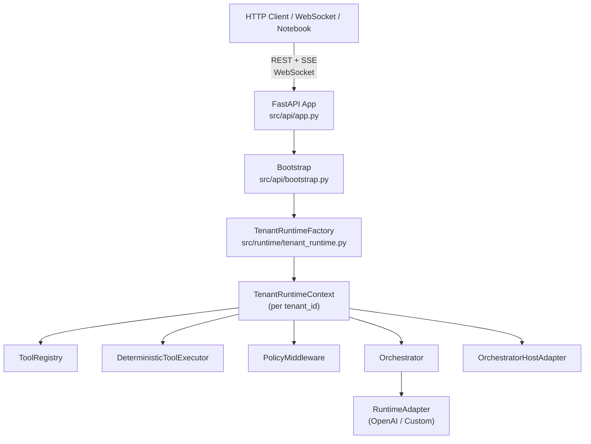

# eXo-brain API Platform Plan

> Status: **Draft — under discussion**
> Last updated: Mar 2, 2026
> Branch: to be created (`feature/api-platform`)

---

## What we are building

Two modules on top of the existing eXo-brain runtime core:

- **Module 1 — Tool & Agent Management** (management plane): users register their Python tools, set agent instructions, configure handoff routes
- **Module 2 — Adapter Playground** (data plane): users create sessions, talk to the AI via any registered adapter, and see the full execution trace — tool intercepted → policy gate → Python executed → result returned → model response — in real time

A **Tenant Runtime Isolation** layer is the foundational prerequisite for both. Without it, one user's tools and sessions leak into another user's context.

---

## Architecture Overview



---

## Gap Analysis

### Already built (reusable as-is)

| Component | File |
|---|---|
| `ToolRegistry` + `ToolDescriptor` | `src/tools/registry.py` |
| `DeterministicToolExecutor` | `src/tools/executor.py` |
| `PolicyMiddleware` + `DeterministicFirstPolicyMiddleware` | `src/policies/middleware.py` |
| `RiskGatePolicy` | `src/policies/risk_gates.py` |
| `Orchestrator` | `src/core/orchestrator.py` |
| `OrchestratorHostAdapter` | `src/integration/host_adapter.py` |
| `SessionContext` + `InMemorySessionStore` | `src/core/session_context.py`, `src/core/session_store.py` |
| `AgentRegistry` + `AgentSpec` + `HandoffRoute` | `src/agents/registry.py`, `src/agents/contracts.py` |
| `TenantQuotaManager` | `src/tenancy/quotas.py` |
| `TenantPolicyOverlayStore` | `src/tenancy/policy_overlay.py` |
| `BackgroundRuntime` + `WorkerPool` | `src/core/background_runtime.py`, `src/core/worker_pool.py` |
| `IdentityContext` + `resolve_identity` | `src/identity/contracts.py`, `src/identity/resolver.py` |
| `AccessPolicyEngine` | `src/access_control/policy_engine.py` |
| `ProviderRegistry` | `src/config/provider_registry.py` |
| `AppSettings` | `src/config/settings.py` |
| `OpenAIAgentsRuntimeAdapter` | `src/runtime/openai_agents_runtime.py` |
| `RuntimeAdapter` ABC | `src/runtime/runtime_adapter.py` |

### Missing (must be built)

| Gap | Slice |
|---|---|
| Per-tenant `ToolRegistry` + `Orchestrator` isolation | Slice 0 |
| FastAPI app factory, bootstrap, DI wiring | Slice 1 |
| Auth middleware (`IdentityContext` from headers) | Slice 1 |
| SSE + WebSocket event envelope format | Slice 1 |
| Pydantic request/response schemas | Slice 1 |
| Tool & agent CRUD endpoints | Slice 2 |
| Session create/get endpoints | Slice 3 |
| Turn execution — SSE streaming | Slice 3 |
| Turn execution — WebSocket (persistent, multi-turn) | Slice 3 |
| Provider health + capabilities endpoints | Slice 3 |
| Tenant policy + quota management endpoints | Slice 4 |

---

## Slice 0 — Tenant Runtime Isolation (Foundation)

**Why first:** Both modules need a dedicated `ToolRegistry`, `Orchestrator`, and `SessionStore` per tenant. Without this, registering a tool in one tenant's context makes it visible to every other tenant.

**New file:** `src/runtime/tenant_runtime.py`

```python
@dataclass(slots=True)
class TenantRuntimeContext:
    tenant_id: str
    tool_registry: ToolRegistry
    policy_middleware: PolicyMiddleware
    tool_executor: DeterministicToolExecutor
    agent_registry: AgentRegistry
    orchestrator: Orchestrator
    host_adapter: OrchestratorHostAdapter
    session_store: SessionStore
    quota_manager: TenantQuotaManager
```

```python
class TenantRuntimeFactory:
    def __init__(self, adapter: RuntimeAdapter, settings: AppSettings) -> None
    def get_or_create(self, tenant_id: str) -> TenantRuntimeContext
    def list_tenants(self) -> list[str]
    def destroy(self, tenant_id: str) -> None
```

`get_or_create` is the single public method the API layer calls. It returns a cached `TenantRuntimeContext` or builds a fresh one — each tenant owns its registry, executor, orchestrator, and session store.

**Acceptance tests:**
- Register a tool in tenant A — not visible from tenant B's `ToolRegistry`
- `destroy(tenant_id)` evicts the context cache; next call to `get_or_create` returns a clean instance
- Quota manager correctly counts active jobs per tenant and blocks when the limit is hit

---

## Slice 1 — API Transport Layer

**New directory:** `src/api/`

```
src/api/
  app.py              # FastAPI app factory: create_app() -> FastAPI
  bootstrap.py        # Wire ProviderRegistry, TenantRuntimeFactory, TenantPolicyOverlayStore into app.state
  dependencies.py     # FastAPI Depends() providers
  middleware/
    auth.py           # Resolve IdentityContext from X-Identity header or Bearer token
  schemas/
    tool_schemas.py
    agent_schemas.py
    session_schemas.py
    turn_schemas.py
    provider_schemas.py
  routers/            # (populated in Slices 2–4)
```

**`dependencies.py` key providers:**
```python
async def get_tenant_context(tenant_id: str, request: Request) -> TenantRuntimeContext
async def get_identity(request: Request) -> IdentityContext
async def require_valid_identity(identity: IdentityContext = Depends(get_identity)) -> IdentityContext
```

### Shared event envelope (SSE + WebSocket)

Both transports emit the same JSON event shape so clients don't need separate parsers:

```json
{"event": "output_delta",  "delta": "The result is",     "correlation_id": "..."}
{"event": "tool_call",     "tool_name": "calculate_result", "arguments": {"operation": "add", "operand1": 5, "operand2": 7, "operand3": 0}}
{"event": "tool_result",   "tool_name": "calculate_result", "result": 110.0, "policy": "LOW_RISK_ALLOWED", "mode": "DETERMINISTIC"}
{"event": "run_complete",  "run_id": "...",               "correlation_id": "..."}
{"event": "error",         "code": "TOOL_EXECUTION_ERROR", "message": "..."}
```

**Acceptance tests:**
- App starts without errors
- Auth middleware rejects requests with missing or `INVALID`/`EXPIRED` identity tokens
- `get_tenant_context` returns the correct isolated context per `tenant_id`

---

## Slice 2 — Module 1: Tool & Agent Management API

**New files:** `src/api/routers/tools.py`, `src/api/routers/agents.py`

### Tool endpoints

| Method | Path | Description |
|---|---|---|
| `POST` | `/tenants/{tenant_id}/tools` | Register a tool. Body: `name`, `handler_ref` (`"module.path:fn_name"`), `risk_tier`, `is_state_changing`, `timeout_ms` |
| `GET` | `/tenants/{tenant_id}/tools` | List all registered tool names + metadata |
| `GET` | `/tenants/{tenant_id}/tools/{name}` | Get full `ToolDescriptor` detail for one tool |
| `DELETE` | `/tenants/{tenant_id}/tools/{name}` | Unregister tool |

`handler_ref` is resolved via `importlib` at registration time (`module.path:function_name`). The function must already exist in the deployed codebase — no code upload, no sandboxing needed for the MVP.

### Agent endpoints

| Method | Path | Description |
|---|---|---|
| `POST` | `/tenants/{tenant_id}/agents` | Register `AgentSpec` (id, role, `capability_tags`, instructions in `metadata`) |
| `GET` | `/tenants/{tenant_id}/agents` | List all registered agents |
| `GET` | `/tenants/{tenant_id}/agents/{agent_id}` | Get agent detail |
| `DELETE` | `/tenants/{tenant_id}/agents/{agent_id}` | Unregister agent (cascades route/fallback cleanup) |
| `POST` | `/tenants/{tenant_id}/agents/routes` | Add a `HandoffRoute` between two agents |
| `POST` | `/tenants/{tenant_id}/agents/fallback` | Set `HandoffFallbackPolicy` for a source role |

**Acceptance tests:**
- Register → list → get → delete round-trip for tools and agents
- 404 on unknown tool/agent name
- 422 when `handler_ref` cannot be resolved by `importlib`
- Handoff route stored and returned in agent detail

---

## Slice 3 — Module 2: Adapter Playground API

**New files:** `src/api/routers/sessions.py`, `src/api/routers/turns.py`, `src/api/routers/providers.py`

### Session endpoints

| Method | Path | Description |
|---|---|---|
| `POST` | `/tenants/{tenant_id}/sessions` | Create a new session. Body: `agent_id`, `provider_id`, optional `correlation_id`. Returns `session_id` |
| `GET` | `/tenants/{tenant_id}/sessions/{session_id}` | Get session state from `SessionStore` |

### Turn execution — two transports

Both transports emit the same event envelope (defined in Slice 1).

**SSE (stateless, one turn per request)**

| Method | Path | Description |
|---|---|---|
| `POST` | `/tenants/{tenant_id}/sessions/{session_id}/turns` | Submit a message, returns `text/event-stream`. Tool calls, policy decisions, results, and final text are all streamed inline |

Flow:
1. Build `SessionContext` from path params + `IdentityContext` from request state
2. Call `host_adapter.submit_turn(session, user_input)`
3. Map each `RuntimeEvent` to the shared event envelope
4. Flush stream; client sees tool interception trace in real time

**WebSocket (persistent, multi-turn)**

| Path | Description |
|---|---|
| `WS /tenants/{tenant_id}/sessions/{session_id}/ws` | Persistent connection for a session. Client sends messages, receives streamed events. Supports mid-session cancellation |

WebSocket message protocol:
```json
// Client → server (send a turn):
{"type": "turn", "input": "What is 5 plus 7?"}

// Client → server (cancel running turn):
{"type": "cancel", "run_id": "..."}

// Server → client (same event envelope as SSE):
{"event": "output_delta", "delta": "The result is", ...}
{"event": "tool_call", ...}
{"event": "tool_result", ...}
{"event": "run_complete", ...}
```

WebSocket is preferable over SSE when:
- The client needs to send multiple turns on the same connection without HTTP overhead per turn
- The client needs to cancel a running turn (send `cancel` mid-stream)
- Building a chat UI that keeps a persistent connection open

SSE is preferable when:
- Simple notebook or script usage (one turn at a time)
- Clients that don't support WebSocket (plain `curl`, some proxies)

### Provider endpoints

| Method | Path | Description |
|---|---|---|
| `GET` | `/providers` | List all registered provider IDs + profiles |
| `GET` | `/providers/{provider_id}/health` | Call `adapter.healthcheck()` → `HealthStatus` |
| `GET` | `/providers/{provider_id}/capabilities` | Call `adapter.get_capabilities()` → `ProviderCapabilityMap` |

**Acceptance tests:**
- Session create → turn submit (SSE) → events received in order (`tool_call` before `tool_result` before `run_complete`)
- Session create → WebSocket connect → send turn → receive events → send second turn without reconnect
- WebSocket `cancel` message stops the running turn and emits `run_cancelled` event
- 404 on unknown session for both SSE and WebSocket
- `tool_result` event present when a tool is registered and called

---

## Slice 4 — Tenant Policy Management

**New file:** `src/api/routers/tenants.py`

| Method | Path | Description |
|---|---|---|
| `GET` | `/tenants/{tenant_id}/policy` | Return current `TenantPolicyOverlayStore.get_overlay(tenant_id)` |
| `PUT` | `/tenants/{tenant_id}/policy` | Call `set_overlay(tenant_id, body)` — takes effect immediately on the next tool call |
| `GET` | `/tenants/{tenant_id}/quota` | Return current active job count and configured limit |
| `PUT` | `/tenants/{tenant_id}/quota` | Update `max_active_jobs_per_tenant` for the tenant |

Policy overlay example — block a specific tool for a tenant:
```json
{
  "deny_tools": ["delete_records"],
  "escalate_risk_tiers": ["HIGH"],
  "escalate_state_changing": true
}
```

This is applied to the `DeterministicFirstPolicyMiddleware` in real time — no restart needed.

**Acceptance tests:**
- `PUT` policy overlay with `deny_tools: ["calculate_result"]` → next tool call blocked with `TOOL_DENIED`
- Quota `PUT` with `max_active_jobs = 1` → second job submission returns 429

---

## Execution Order

```
Slice 0  →  Slice 1  →  Slice 2 + Slice 3 (parallel)  →  Slice 4
```

Slices 2 and 3 share only the `TenantRuntimeContext` dependency from Slice 0, so they can be developed in parallel once Slices 0 and 1 are merged.

---

## What stays out of scope for v1

| Item | Reason |
|---|---|
| Frontend web UI | Can be built on top of this API. The event envelope is already browser-compatible (SSE + WebSocket) |
| Durable persistence (SQLite / Postgres) | Adapters exist in `src/persistence/adapters/`. In-memory is sufficient for MVP. Swap the factory in `bootstrap.py` when ready |
| Code upload / sandbox execution | `handler_ref` requires the function to already exist in the deployed codebase. Sandboxed code execution is a separate security boundary |
| Multi-region / distributed state | `TenantRuntimeContext` is in-process. Horizontal scaling requires moving the context store to Redis or a shared backend |

---

## Open questions / decisions to make before building

1. **Auth format**: `X-Identity` header (plain JSON identity dict) is simplest for MVP. JWT Bearer is the production path. Do we build JWT verification in Slice 1 or defer to the caller?

2. **`handler_ref` vs startup registration**: `importlib` resolution at API call time works for a single process. If users can't modify the deployed codebase, we need an alternative (e.g., a built-in tool library). Decision affects Slice 2 significantly.

3. **WebSocket cancellation**: `BackgroundRuntime.cancel_job` exists. Wiring it to the WebSocket `cancel` message requires the WebSocket handler to hold a reference to the running `asyncio.Task`. Straightforward but adds complexity to `turns.py`.

4. **Persistence choice for sessions**: Should the `InMemorySessionStore` be replaced with the SQLite adapter from `src/persistence/adapters/sqlite.py` from the start, or defer? If the server restarts, all in-progress sessions are lost.
