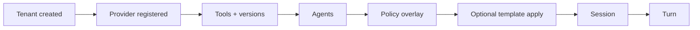

<!--
File: governance-configuration-reference-model.md
Path: docs/plans/governance-configuration-reference-model.md
Role: Unified governance configuration entities, dependency order, precedence, thin-UI mapping.
Used By:
 - README.md
 - AGENTS.md
 - docs/plans/docs-inventory-master.md
Depends On:
 - docs/plans/tenant-tool-execution-architecture.md
 - docs/strategy/entitlement-matrix.md
Notes:
 - Describes implemented behavior; line references are indicative — verify in source when debugging.
-->

# Governance configuration reference model

## Governance metadata

| Field | Value |
|-------|-------|
| **Status** | `active` (baseline; extend with schema excerpts as needed) |
| **Scope** | Configuration entities that feed governed execution |

## Unified configuration entities (as implemented)

| Entity | Storage | API surface | Compiler / resolver |
|--------|---------|-------------|---------------------|
| Tenant policy overlay | `TenantPolicyOverlayStore` | `tenants.py` GET/PUT policy | Merged into ingress chain build |
| Policy template | Catalog in `policy_templates.py` | `tenants.py` template apply | `compile_policy_template_overlay` |
| Ingress profile | Overlay keys + `ingress_profiles.py` | Tenant policy + turn path | `resolve_ingress_profile_settings` |
| Custom ingress rules | Overlay list | Tenant policy schema | Validated in `ingress_profiles.py` |
| Signed ingress plugin | `ingress_signed_plugins.py` | Overlay + lifecycle transitions | `resolve_optional_signed_ingress_plugin` |
| Entitlement tier | Roles → tier | Middleware on routes | `resolve_tier_from_roles` in `entitlements.py` |
| Quota | Tenant quota overlay | `tenants.py` quota routes | `TenantQuotaManager` |
| Tool version manifest | SQLite + artifact store | `tools.py` upload/register | `validate_tool_package_upload`, `descriptor_from_tool_version` |

## Dependency order (apply sequence)

## Precedence rules (observed)

1. **Locked template keys** cannot be overridden via `overlay_extra` (`_LOCKED_TEMPLATE_KEYS` in `policy_templates.py`).
2. **Entitlements** gate feature keys before overlay features take effect on routes.
3. **Ingress chain** evaluates after entitlement on the turn path (`turns.py` order).
4. **Risk gates** apply at tool intent (`risk_gates.py` + policy `middleware.py`).

## Thin-UI mapping (future)

| UI concept | API today | Schema |
|------------|-----------|--------|
| Policy editor | PUT policy | `tenant_schemas.py` |
| Template picker | GET templates + apply | `tenants.py` |
| Ingress profile | overlay `ingress_profile_id` | `ingress_profiles.py` |
| Tool publish | upload package | `tool_schemas.py` |

## Known gap (tracked)

`ingress_profile_compatibility_mode` is represented on resolution types, but overlay read path for compatibility mode is incomplete — see `GAP-GOV-ingress-compatibility-overlay` in `_research_results/10-gaps-and-planned.md` and `docs/plans/tenant-tool-execution-architecture.md`.
