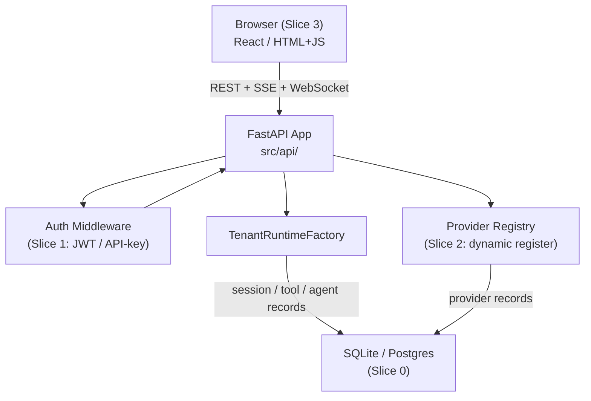

# eXo-brain Platform Extensions Plan

> Status: **Completed — Slices 0–3 merged**
> Created: Mar 2026
> Scope: Four deferred items from the API Platform build
> Prerequisite: API Platform fully merged (PRs #27–#30, 253 tests passing)
> Follow-up: Option C next-phase implementation (adapter packaging, shared control-state backends, blocking SLO gates) is tracked in active execution trackers.

---

## Slice 0 Reconciliation Baseline (Option C)

This section is the canonical cleanup baseline for Option C execution.

- UI/dashboard work is deferred from the active implementation path.
- API-first operation is canonical for platform integration.
- Adapter packaging + dynamic registration are primary integration paths.
- Enterprise shape is control-plane + pluggable adapter plane + hosted/BYOC tool plane.

### Ownership map (clean baseline)

- **Control plane**: `src/api`, `src/core`, `src/policies`, `src/tenancy`, `src/observability`
- **Adapter plane**: `src/runtime` (provider adapters + adapter factory)
- **Data plane**: `src/tools/sandbox`, `src/tools/byoc`, `src/tools/execution_adapter.py`

### Deprecation map (completed in this baseline)

- Removed `.cursor/PORTABLE_PACK.md` (portability artifact, not a runtime/project contract).
- Removed `.cursor/agents/*` profile files (not referenced by active workflow contracts).
- Removed lingering references to `.cursor/PORTABLE_PACK.md` from active audit sources.

### Migration note

If historical sections below mention UI/dashboard slices, treat them as historical context.
Option C workstreams should follow API-first scope unless explicitly re-enabled by plan update.
The active contract freeze matrix is tracked in `docs/plans/option-c-contract-freeze.md`.

---

## What we are building

Four independent extensions that complete the platform from a working backend into a
usable, production-ready product:

| # | Module | What it does | Why it matters |
|---|---|---|---|
| **Slice 0** | Persistent Storage | Tools, agents, and sessions survive server restarts | Without this every restart wipes all registrations |
| **Slice 1** | Auth Hardening | JWT Bearer + API-key authentication | Current MVP uses plain-JSON header — not production-safe |
| **Slice 2** | Dynamic Provider Registration | Register/remove adapters at runtime via API | Without this, adding a new provider requires code change + redeploy |
| **Slice 3** | Web UI Dashboard | Browser UI for tool/agent management and playground chat | Without this, all interactions require curl/Postman |

Each slice is independent and can be built in any order after Slice 0 (persistence is foundational
for Slice 2 and Slice 3).

---

## Current State Snapshot

> Clarification: the "What is already built" and "What is missing" tables below are historical planning snapshots captured before slice execution. Current completion status is tracked by the status header and the project trackers in `.local/control-center/plan.md` and `.local/control-center/work-tracker.md`.
> Canonical current-state + pending gap-closure priority order is maintained in `docs/plans/tenant-tool-execution-architecture.md` under `Canonical Current State (single source)`.

### What is already built and reusable

| Component | File | Status |
|---|---|---|
| `SQLiteSessionStore` | `src/persistence/adapters/sqlite.py` | Built, **not wired** |
| `SessionStore` ABC | `src/persistence/contracts.py` | Built |
| `CheckpointStoreContract` ABC | `src/persistence/contracts.py` | Built |
| `InMemorySessionStore` | `src/core/session_store.py` | Built, wired — to be replaced |
| `ToolRegistry` (in-memory) | `src/tools/registry.py` | Built, no persistence |
| `AgentRegistry` (in-memory) | `src/agents/registry.py` | Built, no persistence |
| `ProviderRegistry` | `src/config/provider_registry.py` | Built, bootstrap-only wiring |
| `bootstrap()` | `src/api/bootstrap.py` | Built, creates in-memory stores |
| `extract_identity()` | `src/api/middleware/auth.py` | Built, plain-JSON only |
| `X-Identity` header | `src/api/dependencies.py` | Built, MVP path |
| Provider CRUD endpoints | `src/api/routers/providers.py` | **Read-only** — no register/delete |

### What is missing

| Gap | Needed for |
|---|---|
| Tool/agent registry is not persisted | Slice 0 |
| `SQLiteSessionStore` not wired into bootstrap | Slice 0 |
| No `SQLiteToolStore` / `SQLiteAgentStore` contract or adapter | Slice 0 |
| `bootstrap()` always creates `InMemorySessionStore` | Slice 0 |
| `auth.py` only handles plain-JSON `X-Identity` | Slice 1 |
| No JWT decode / validation | Slice 1 |
| No API-key lookup / token table | Slice 1 |
| `POST /providers` and `DELETE /providers/{id}` endpoints | Slice 2 |
| Adapter factory / dynamic loader | Slice 2 |
| Provider state not persisted | Slice 2 |
| No frontend application | Slice 3 |
| No tool/agent registration form | Slice 3 |
| No playground chat interface | Slice 3 |
| No session trace viewer | Slice 3 |

---

## Architecture Overview



---

## Slice 0 — Persistent Storage

### Goal

Tools, agents, and sessions registered through the API survive a server restart and are
restored automatically on startup. No functional change to the API surface.

### What is needed

**New contracts** (ABCs in `src/persistence/contracts.py`):

```python
class ToolStore(ABC):
    @abstractmethod
    async def save_tool(self, tenant_id: str, descriptor: ToolDescriptor) -> None: ...
    @abstractmethod
    async def delete_tool(self, tenant_id: str, tool_name: str) -> None: ...
    @abstractmethod
    async def list_tools(self, tenant_id: str) -> list[ToolDescriptor]: ...

class AgentStore(ABC):
    @abstractmethod
    async def save_agent(self, tenant_id: str, spec: AgentSpec) -> None: ...
    @abstractmethod
    async def delete_agent(self, tenant_id: str, agent_id: str) -> None: ...
    @abstractmethod
    async def list_agents(self, tenant_id: str) -> list[AgentSpec]: ...
```

**New SQLite adapters** (`src/persistence/adapters/sqlite.py` — extend existing file):

- `SQLiteToolStore` — upsert/delete/list for `ToolDescriptor` rows
- `SQLiteAgentStore` — upsert/delete/list for `AgentSpec` rows

**Wire persistence into bootstrap**:

- `bootstrap()` accepts optional `persistence_backend: Literal["sqlite", "memory"] = "sqlite"`
- When `"sqlite"`, create `SQLiteSessionStore(db_path)`, `SQLiteToolStore`, `SQLiteAgentStore`
- On startup, load all persisted tools and agents into each tenant's in-memory registries
- On register/unregister calls (tools router, agents router), write-through to the store

**Bootstrap startup hydration**:

```
app startup → load all tenant rows from SQLite
            → for each tenant_id, get_or_create TenantRuntimeContext
            → populate tool_registry and agent_registry
```

### Files to create / modify

| Action | File |
|---|---|
| Extend | `src/persistence/contracts.py` — add `ToolStore`, `AgentStore` ABCs |
| Extend | `src/persistence/adapters/sqlite.py` — add `SQLiteToolStore`, `SQLiteAgentStore` |
| Modify | `src/api/bootstrap.py` — accept backend config, create SQLite stores, expose on `app.state` |
| Modify | `src/runtime/tenant_runtime.py` — accept optional `tool_store` / `agent_store` / `session_store` params |
| Modify | `src/api/routers/tools.py` — write-through to `ToolStore` on register/unregister |
| Modify | `src/api/routers/agents.py` — write-through to `AgentStore` on register/unregister |
| New | `src/api/startup.py` — `hydrate_tenant_registries(app)` called from lifespan event |
| New | `tests/modules/persistence/test_tool_agent_stores.py` |
| New | `tests/modules/api/test_persistence_roundtrip.py` |

### Acceptance criteria

- Register a tool via `POST /tenants/t1/tools`; restart the server; `GET /tenants/t1/tools` returns it.
- Same for agents.
- Sessions created before restart appear in `GET /tenants/t1/sessions/{id}` after restart.
- Tenant isolation: tools for `t1` are not visible under `t2`.
- All existing 253 tests still pass.

---

## Slice 1 — Auth Hardening ✅ Merged

### Goal

Replace the plain-JSON `X-Identity` MVP header with production-grade authentication.
All downstream code already only sees `IdentityContext` — only `auth.py` changes.

### Two-step approach

**Step A — API-key authentication** (simpler, build first):

- A client sends `Authorization: Bearer <api-key>` (or `X-API-Key: <key>`).
- The server looks up the key in a `ApiKeyStore` (SQLite table: `api_keys`).
- On match, resolves tenant_id, roles, subject → builds `IdentityContext`.
- Endpoint to manage keys: `POST /admin/keys`, `DELETE /admin/keys/{key_id}`.

**Step B — JWT Bearer** (build after Step A):

- Standard `Authorization: Bearer <jwt>` header.
- Decode with `python-jose` or `PyJWT`; verify signature against a configurable JWKS URL or static secret.
- Extract `sub`, `tenant_id`, `roles` from JWT claims → `IdentityContext`.
- Config in `AppSettings`: `auth.jwt_secret` or `auth.jwks_url`, `auth.algorithm`.

### Decision: keep `X-Identity` for tests

The plain-JSON `X-Identity` path should be **preserved as a test/development mode**
(only active when `settings.environment == "test"` or `"development"`). This avoids
rewriting all 80+ test calls.

### Files to create / modify

| Action | File |
|---|---|
| Modify | `src/api/middleware/auth.py` — add JWT + API-key extraction, keep JSON path for dev/test |
| Extend | `src/config/settings.py` — add `AuthSettings` dataclass with `mode`, `jwt_secret`, `jwks_url`, `algorithm` |
| New | `src/api/routers/admin_keys.py` — `POST /admin/keys`, `GET /admin/keys`, `DELETE /admin/keys/{id}` |
| New | `src/persistence/adapters/sqlite.py` — `SQLiteApiKeyStore` |
| New | `src/identity/jwt_resolver.py` — decode and validate JWT, return `IdentityContext` |
| New | `tests/modules/api/test_auth_jwt.py` |
| New | `tests/modules/api/test_auth_apikey.py` |

### Acceptance criteria

- `Authorization: Bearer <valid-jwt>` → 200, correct `tenant_id` and roles resolved.
- `Authorization: Bearer <expired-jwt>` → 401 with `EXPIRED` message.
- `Authorization: Bearer <unknown-key>` → 401.
- `X-Identity` plain JSON → 200 only in `environment=test`; 401 in `environment=production`.
- Existing tests (which use `X-Identity`) pass unchanged.

---

## Slice 2 — Dynamic Provider Registration API ✅ Merged

### Goal

Users register a new adapter (provider) at runtime without touching code or restarting
the server. They supply a `provider_id`, `adapter_class_ref`, endpoint config, and
auth config. The adapter is loaded, health-checked, and added to the live registry.

### Current limitation

`ProviderRegistry` is constructed at bootstrap time from a hard-coded list of
`ProviderRecord` objects and adapter instances. There is no way to add a new provider
without code change + restart.

### Design

**Adapter factory** (`src/runtime/adapter_factory.py`):

```python
def load_adapter(adapter_class_ref: str, **kwargs) -> RuntimeAdapter:
    """
    Load a RuntimeAdapter by dotted class ref, e.g.
    "src.runtime.openai_agents_runtime.OpenAIAgentsRuntimeAdapter".
    Validates it inherits RuntimeAdapter before returning.
    """
```

**Mutable provider registry** (extend `ProviderRegistry`):

```python
def register(self, record: ProviderRecord, adapter: RuntimeAdapter) -> None: ...
def unregister(self, provider_id: str) -> None: ...
```

**New endpoints** (extend `src/api/routers/providers.py`):

```
POST   /providers          — register a new provider + adapter
DELETE /providers/{id}     — unregister a provider (rejects if active sessions exist)
GET    /providers          — list all registered providers (already built)
GET    /providers/{id}     — get provider details (already built)
GET    /providers/{id}/health   — health check (already built)
```

**Provider persistence** (new `ProviderStore` in `src/persistence/contracts.py`):

- Persists `ProviderRecord` rows in SQLite
- Hydrated on startup like tools/agents

**Request schema** (`src/api/schemas/provider_schemas.py` — extend):

```python
class ProviderRegisterRequest(BaseModel):
    provider_id: str
    display_name: str
    adapter_class_ref: str          # e.g. "src.runtime.openai_agents_runtime.OpenAIAgentsRuntimeAdapter"
    api_key_env_var: str            # env var name; server reads the value, never the client
    base_url: str
    model: str
    profile: str = "managed_vendor"
```

### Files to create / modify

| Action | File |
|---|---|
| New | `src/runtime/adapter_factory.py` — `load_adapter(class_ref, **kwargs)` |
| Modify | `src/config/provider_registry.py` — add `register()`, `unregister()` methods |
| Extend | `src/persistence/contracts.py` — add `ProviderStore` ABC |
| Extend | `src/persistence/adapters/sqlite.py` — add `SQLiteProviderStore` |
| Extend | `src/api/routers/providers.py` — add `POST /providers`, `DELETE /providers/{id}` |
| Extend | `src/api/schemas/provider_schemas.py` — add `ProviderRegisterRequest`, `ProviderRegisterResponse` |
| Modify | `src/api/bootstrap.py` — expose `provider_registry` on `app.state`, hydrate from store on startup |
| New | `tests/modules/api/test_slice_provider_registration.py` |

### Acceptance criteria

- `POST /providers` with valid `adapter_class_ref` and env var → 201, provider visible in `GET /providers`.
- Adapter health is checked before the 201 response; returns 422 if unhealthy.
- `DELETE /providers/{id}` rejects if active sessions are using that provider (returns 409).
- Registered provider survives server restart (SQLite persistence).
- Session creation using the newly registered `provider_id` works end-to-end.

---

## Slice 3 — Web UI Dashboard (Historical, deferred from active Option C scope)

> This section is retained for historical traceability only. Active Option C execution
> is API-first and does not require backend-served `/ui` artifacts.

### Goal

A browser-based interface for:

1. **Management plane** — register tools, configure agent instructions, manage providers
2. **Playground** — pick an adapter, start a session, chat with the AI, see tool execution traces in real time

### Technology decision

Use **vanilla HTML + TypeScript compiled into `ui/dist` JS assets** (no framework required),
served as static files by FastAPI. This avoids adding a separate dev server and keeps
runtime deployment simple. The build path supports `tsc` when available and a deterministic
fallback transpiler for environments without Node.js.

Alternative: React (if a richer component model is needed later — see trade-offs below).

| Option | Pros | Cons |
|---|---|---|
| Vanilla HTML + TS | No extra runtime, FastAPI serves it, CI stays Python | Limited component reuse, manual DOM |
| React (Vite) | Rich ecosystem, component model | Requires Node.js in CI, separate dev server |
| **Recommendation** | Start with vanilla; migrate to React when UI complexity justifies it | |

### Screens

**Screen 1 — Tool Manager** (`/ui/tools`):

- List registered tools for the current tenant
- Form: register new tool (name, description, handler ref, parameters JSON schema, risk tier)
- Delete button per tool
- Calls: `GET /tenants/{tid}/tools`, `POST /tenants/{tid}/tools`, `DELETE /tenants/{tid}/tools/{name}`

**Screen 2 — Agent Manager** (`/ui/agents`):

- List registered agents
- Form: register new agent (name, instructions textarea, model, capability tags)
- Delete button per agent
- Calls: `GET /tenants/{tid}/agents`, `POST /tenants/{tid}/agents`, `DELETE /tenants/{tid}/agents/{id}`

**Screen 3 — Provider Manager** (`/ui/providers`):

- List registered providers and health status
- Form: register new provider (display name, adapter class ref, API key env var, base URL, model)
- Delete button (with confirmation)
- Calls: `GET /providers`, `POST /providers`, `DELETE /providers/{id}`, `GET /providers/{id}/health`

**Screen 4 — Playground** (`/ui/playground`):

- Tenant ID input (top bar)
- Provider picker (dropdown from `GET /providers`)
- Agent picker (dropdown from `GET /tenants/{tid}/agents`)
- Session create button → calls `POST /tenants/{tid}/sessions`
- Chat input box
- Chat history panel (bubbles: user, assistant, tool-call trace)
- Tool trace panel (expandable per tool call: call_id, arguments, result, policy decision)
- Connection mode: WebSocket (multi-turn persistent) or SSE (one-shot)

### Files created

| File | Description |
|---|---|
| `src/api/routers/ui.py` | Serve static files from `ui/dist/` under `/ui` prefix |
| `ui/dist/index.html` | App shell, nav bar, screen router |
| `ui/src/screens/tools.ts` | Tool Manager screen |
| `ui/src/screens/agents.ts` | Agent Manager screen |
| `ui/src/screens/providers.ts` | Provider Manager screen |
| `ui/src/screens/playground.ts` | Playground screen with WebSocket/SSE chat |
| `ui/src/api.ts` | Typed API client (fetch wrappers for all endpoints) |
| `ui/src/components/chat.ts` | Chat bubble + tool trace component |
| `ui/src/app.ts` | UI entrypoint and screen orchestration |
| `ui/tsconfig.json` | TypeScript config (target ES2020, no framework) |
| `Makefile` + `scripts/ui/build.sh` + `scripts/ui/verify_dist_sync.sh` | Build + verify `ui/dist` sync |
| `tests/modules/api/test_ui_static.py` | Verify `/ui` serves 200 and correct content-type |

### FastAPI static files wiring

```python
# src/api/routers/ui.py
from fastapi import APIRouter
from fastapi.staticfiles import StaticFiles

router = APIRouter()

def mount_ui(app):
    app.mount("/ui", StaticFiles(directory="ui/dist", html=True), name="ui")
```

### Acceptance criteria

- `GET /ui/` returns the dashboard HTML (200).
- Tool registered in the UI appears in `GET /tenants/{tid}/tools`.
- Chat message in playground triggers SSE/WebSocket turn; tool execution trace appears in the UI.
- Provider registered in the UI is usable in a new playground session.
- UI works without auth for `environment=development` (no login form required in this slice).

---

## Recommended Build Order

```
Slice 0 (Persistence) → Slice 1 (Auth) → Slice 2 (Dynamic Providers) → Slice 3 (UI)
       ↑                         ↑                     ↑
  foundational             security gate       required for UI provider picker
```

Slice 1 and Slice 2 can be built in parallel if two branches are used.
Slice 3 depends on Slices 0 and 2 being done (stable data + provider registration API).

---

## Gap Analysis Summary

| Gap | Slice | Effort |
|---|---|---|
| `ToolStore` / `AgentStore` contracts and SQLite adapters | 0 | Medium |
| Persistence write-through in tools/agents routers | 0 | Small |
| Bootstrap wiring for SQLite stores + startup hydration | 0 | Small |
| `AuthSettings` in `AppSettings` | 1 | Small |
| JWT decode + JWKS validation | 1 | Medium |
| API-key store and admin endpoints | 1 | Medium |
| Dev/test mode X-Identity passthrough guard | 1 | Small |
| `adapter_factory.py` dynamic loader | 2 | Small |
| `ProviderRegistry.register()` / `unregister()` | 2 | Small |
| `POST /providers` + `DELETE /providers/{id}` | 2 | Small |
| `ProviderStore` SQLite adapter | 2 | Small |
| Session conflict guard for provider delete | 2 | Small |
| Static file serving under `/ui` | 3 | Tiny |
| Tool Manager screen | 3 | Medium |
| Agent Manager screen | 3 | Medium |
| Provider Manager screen | 3 | Medium |
| Playground with WebSocket + tool trace | 3 | Large |

---

## Historical Open Questions (resolved)

1. **UI framework** — vanilla TS vs React? (Recommendation: vanilla for Slice 3, revisit later)
2. **Auth mode precedence** — if both `X-Identity` and `Authorization: Bearer` are present, which wins?
   - Recommendation: `Authorization: Bearer` takes precedence; `X-Identity` only used if no `Authorization` header.
3. **Persistence database path** — configurable via env var (`EXO_DB_PATH`) or `AppSettings`?
   - Recommendation: env var `EXO_DB_PATH` with default `".exo_data/exo.db"`.
4. **Provider delete safety** — block if any active sessions exist, or drain and close them?
   - Recommendation: block (409 Conflict) in Slice 2; graceful drain deferred.
5. **Multi-tenant UI** — does the dashboard manage one tenant at a time (tenant ID in the UI bar), or does it need a tenant list + admin view?
   - Recommendation: single-tenant per session (tenant ID in the top bar), no admin view in Slice 3.

---

## Decisions (locked)

| # | Decision | Status |
|---|---|---|
| D1 | SQLite as default persistence backend (no external infra) | **Locked** |
| D2 | JWT + API-key both supported; X-Identity retained for test env only | **Locked** |
| D3 | Adapter loaded by dotted class ref string via `importlib` | **Locked** |
| D4 | UI as vanilla TypeScript served as FastAPI static files | **Locked** |
| D5 | `EXO_DB_PATH` env var controls SQLite file location, default `.exo_data/exo.db` | **Locked** |
| D6 | `Authorization: Bearer` takes precedence over `X-Identity` when both present | **Locked** |
| D7 | Provider delete blocks with 409 if active sessions exist; graceful drain deferred | **Locked** |
| D8 | UI dashboard is single-tenant per session; tenant ID typed in top bar | **Locked** |

---

## Clarifications Added Post-Delivery

| # | Clarification | Status |
|---|---|---|
| C1 | Tenant-scoped APIs are tenant-isolated by default; cross-tenant access requires explicit role-gated policy and audit coverage. | **Locked** |
| C2 | `tools/upload` style flows are intended to end in executable active versions, not metadata-only records. | **Locked** |
| C3 | Legacy `handler_ref` path remains compatibility-only for internal/dev usage until import-first executable flow is fully finalized. | **Locked** |

### Follow-up priority notes

1. Completed: tenant identity/path boundary enforcement on tenant-scoped API routes (+ tests).
2. Completed: active uploaded tool versions bound to runtime execution selection.
3. Completed baseline: import-first Tool Manager UX around import/upload/validate/version.
4. Completed baseline: canonical current-state section established and linked in companion docs.
5. Next track (see `docs/plans/tenant-tool-execution-architecture.md`): Tool Manager bundle upload UX, BYOC artifact-integrity parity, and rollout hardening.
