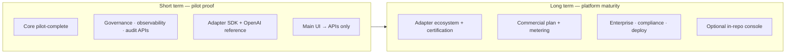
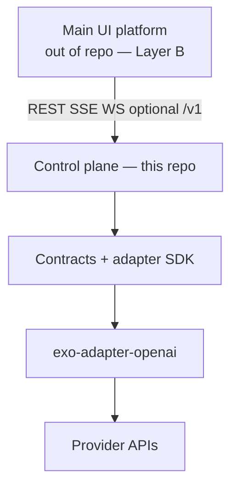
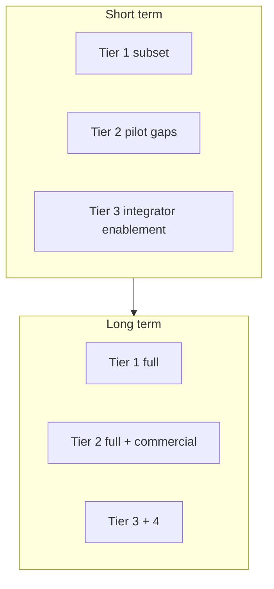

<!--
File: short-long-term-execution-plan.md
Path: docs/plans/short-long-term-execution-plan.md
Role: Canonical short- vs long-term execution horizons; ties pilot GTM to architecture without reprioritizing Tier tables in next-directions.md.
Used By:
 - docs/strategy/next-directions.md
 - docs/strategy/goal.md
 - docs/plans/README.md
 - docs/plans/short-long-term-execution-plan.plan.md
Depends On:
 - docs/strategy/next-directions.md
 - docs/strategy/goal.md
 - docs/strategy/interface-strategy.md
 - docs/strategy/monetization-strategy.md
 - docs/strategy/entitlement-matrix.md
 - docs/plans/tenant-tool-execution-architecture.md
 - docs/plans/control-plane-product-alignment-plan.md
Notes:
 - Does not replace Tier 1–4 tables; maps them to horizons. UI lives outside this repo; APIs remain authoritative.
 - **Implementer companion:** [`short-long-term-execution-plan.plan.md`](short-long-term-execution-plan.plan.md) — workstreams W1–W4 + S4, inlined rules, artifact anchors, implementer checklists, slice boilerplate (active slice scope remains `.local/index-and-planning/current/plan.md`).
-->

# Short- and long-term execution plan

## Governance Metadata

- Status: `active`
- Owner: `Savin I. Razvan`
- Version: `1.0.2`
- Last Reviewed: `2026-03-25`
- Review Cadence: `quarterly`
- Decision Scope: `Near-term pilot proof vs long-term platform maturity; integration with external main UI; adapter SDK reference path.`

---

## 1) Purpose

Provide a **stable horizon split** so execution slices stay ordered and **do not break** existing invariants:

- **Provider-neutral core** and **adapter wall** (governance stays in core; adapters transport-only).
- **API-first control plane** in this repository: **enforcement and persistence are server-side**.
- **Customer / product UI** (including the company **main UI platform**) is a **consumer of APIs**, not a trust boundary — see `docs/strategy/interface-strategy.md` Layer B.

**Canonical detailed backlog** remains `docs/strategy/next-directions.md` (Tier 1–4). This file assigns **horizon** and **exit intent** only.

### 1.1) Diagrams (same model as root `README.md`)

**Short term → long term**

**Integration topology (main UI + this repo + southbound adapters)**

**Tier emphasis (not a replacement for Tier tables)**

---

## 2) Non-breaking rules (do not violate)

| Rule | Why |
|------|-----|
| UI never owns policy truth | All policy, gates, guardrails **apply** via control plane APIs; UI sends configuration, core validates and enforces. |
| No SDK/provider imports in core | Adapter OpenAI work stays in **adapter packages** + contracts; core loads via factory/registry. |
| Same path for UI and automation | If the main UI can do it, an API client can do it; no hidden admin bypass. |
| Tier claims stay evidence-aligned | Market only **Enforceable** rows in `docs/strategy/entitlement-matrix.md` until upgraded. |

---

## 3) Short term (near-term pilot proof)

**Intent:** Prove **one** repeatable story: *governed turns, visible agent/workflow behavior, auditable outcomes*, with **OpenAI** as the first reference adapter — consumed from your **main UI** where users customize and read logs.

**Outcome themes (exit-oriented):**

1. **Core “pilot complete”** — Stable path: ingress → orchestration → policy → deterministic tools for the **reference workflow**; tenant policy/ingress customization documented with **no documented bypass** for side effects. Track implementation status in `docs/plans/tenant-tool-execution-architecture.md` and `docs/strategy/traceability-matrix.md` without expanding scope to “every gap.”
2. **Governance surfaces users need** — Users configure **policy overlay, ingress profiles/gates/guardrails** (vocabulary maps to existing APIs/schemas: predefined + tier-appropriate custom depth per `entitlement-matrix.md`). **Observability:** correlation across turn, ingress decisions, tool outcomes via **existing** audit/runtime APIs (extend only when a slice adds a concrete anchor + tests).
3. **Audit of workflow** — Customers (and your UI) can **query audit/report** and, where tier allows, **signed export/verify** flows; UI displays **server-returned** evidence only.
4. **Adapter SDK + OpenAI first** — **Provider-neutral** contracts and **adapter SDK** readiness; **`exo-adapter-openai`** (or successor package name) as **reference** implementation: isolated install, register provider, run governed turn. Aligns with `next-directions.md` Tier 1 and `docs/plans/adapter-packages-extraction-handoff.md`.

**Main UI platform (outside this repo):**

- Implements **admin/builder** UX: edit governance config, browse logs/traces, drill into audit — **via** control plane REST/SSE/WebSocket (and optional `/v1` bridge where enabled).
- Does **not** ship alternate enforcement paths.

**Maps primarily to:** `next-directions.md` Tier 1 (adapter/SDK/OpenAI reference), Tier 2 (entitlements/governance depth already largely present — finish pilot-facing gaps only), Tier 3 (integration guide, observability export depth as needed for your UI).

---

## 4) Long term (platform and revenue maturity)

**Intent:** Ecosystem scale, durable monetization plumbing, enterprise procurement depth — **without** collapsing horizons into one undifferentiated backlog.

**Themes:**

1. **Adapter ecosystem** — Certification matrix, expansion providers, publish automation, runtime provider router — `next-directions.md` Tier 1 continuation.
2. **Monetization operability** — Subscription/plan source of truth, usage metrics aligned with governance value — `docs/strategy/monetization-strategy.md`, Tier 2 + commercial systems **outside or alongside** core as designed.
3. **Enterprise readiness** — Human approval workflows, external signed-plugin ingestion depth, token/cost governance, MCP policy depth, compliance packaging waves — Tier 2–3 and `docs/strategy/deployment-models.md`.
4. **Optional in-repo console** — Still optional; **not** required if main UI remains the primary surface (`interface-strategy.md` §5).

---

## 5) Horizon × next-directions Tier map

| Horizon | Primary tiers | Notes |
|---------|---------------|--------|
| **Short term** | Tier 1 (subset: SDK + OpenAI reference path), Tier 2 (pilot-critical gaps only), Tier 3 (enablement for UI integrators) | Defer broad provider expansion until reference path + pilot story repeat. |
| **Long term** | Tier 1 (full ecosystem), Tier 2 (full entitlement/commercial depth), Tier 3 (deployment/compliance), Tier 4 (alignment) | Sequence per `execution-board-12-gaps.md` when slices are architecture-impacting. |

---

## 6) Review

On each major slice close: confirm this file still matches `next-directions.md` and `goal.md` §14; update **Last Reviewed** when horizons shift.
