# Multi-Tenant User Tools Architecture Plan

## Goal

Move from developer-only `module.path:function_name` registration to a SaaS-safe model where users can paste/import tool schemas, upload tool logic, and execute tools in isolated tenant runtimes without backend code access, with two execution targets: hosted sandbox or customer-owned AWS/Azure runtime.

## Target Outcome

- UI accepts OpenAI-style function JSON and validates it against tenant tool artifacts.
- Backend stores tenant-owned tool definitions and versions (schema + code package).
- Tool execution supports dual mode:
  - Hosted sandbox runtime (managed by eXo-brain)
  - BYOC runtime connector (executed in customer AWS/Azure)
- Both modes keep strict per-tenant isolation, quotas, and policy gates.
- Existing deterministic execution contract remains intact (`model intent -> deterministic runtime executes side effects`).
- Streaming remains first-class for both SSE and WebSocket with tool-progress and cancellation propagation.

## Option C Reconciliation Baseline (Mar 2026)

This section supersedes conflicting historical wording in this document.

- Active delivery path is API-first (no required UI/dashboard dependency).
- Enterprise deployment target is:
  - control-plane services for policy/orchestration/API
  - pluggable adapter plane for provider packages
  - data-plane workers for hosted sandbox and BYOC execution
- Performance-first rules are locked as implementation gates:
  - SLO budgets (p50/p95 latency, error/timeout rate, queue wait)
  - tenant fairness + bounded admission
  - autoscaling signals from real runtime metrics
  - staged load tests for 1/10/100 tenant profiles before rollout

## Canonical Current State (single source)

- Completed implementation baseline:
  - Slices `0`, `1`, `2`, `4.0` through `4.3`, `5.0` through `5.3`, and `6.0` through `6.4`.
  - Post-6.4 gap-closure track `T1` through `T4` completed (tenant scope guard, active uploaded-version execution wiring, import-first Tool Manager baseline, canonical docs synchronization baseline).
  - Executable uploaded tool bundle baseline completed:
    - persisted `tool.yaml` + `handler.py` artifacts
    - runtime loading from persisted artifact paths
    - artifact integrity metadata (SHA-256 hash + HMAC signature/version)
    - activation/startup/runtime verification against tampering
- Next implementation track (delivered):
  1. `N1` (P1) Tool Manager bundle upload UX + integrity visibility.
  2. `N2` (P1) BYOC artifact-integrity parity and worker-side verification contract.
  3. `N3` (P2) rollout/operations hardening for hosted external beta.
  4. RC signoff evidence ingestion hardening:
     - structured gate metadata in markdown evidence (`command`, `exit_code`, `duration_ms`)
     - normalized JSON parser support with backward compatibility for legacy evidence
- Companion trackers that should mirror this exact status:
  - `.cursor/research-for-refactor/12-bootstrap-checklist.md`
  - `.cursor/research-for-refactor/06-mvp-build-sequence.md`

### Reconciled Backlog Status (post-delivery)

- Closed/delivered:
  - P0 backlog closure: tenant-aware access-request contract propagation, async-safe SQLite runtime paths, and canonical deferred-backlog reconciliation across plan/tracker docs.
  - P1 backlog closure: provider delete graceful-drain mode (policy-gated), observability sink/export hardening, and resilience/quota deferred edge-path coverage.
  - P2 baseline closure: BYOC webhook submit path for worker push results (`/tenants/{tenant_id}/admin/byoc/webhook/jobs/submit`).
- Open implementation queue:
  - P2 expansion queue is closed in `docs/plans/p2-expansion-roadmap.md`.
  - Backlog reconciliation v3 queue is closed after full gates + UI validation handoff.
  - Backlog reconciliation v4 queue is closed in `docs/plans/backlog-reconciliation-v4-execution-board.md`.
  - Current active implementation track is Option C next-phase:
    - adapter packaging execution (`packages/exo-brain-core-contracts`, `packages/exo-brain-adapter-sdk`, `packages/exo-adapter-openai`)
    - shared control-state backend patterns (`SQLiteRunControlRegistry`, `SQLiteTenantRateLimiter`, sqlite fairness backend)
    - blocking SLO gate enforcement for release promotion (`scripts/perf/option_c_load_profiles.py --enforce`)

## Architecture Slice Plan

### Slice A — Contracts & Standard (no runtime execution yet)

- Define a tenant tool standard with explicit package format:
  - `tool.yaml` (name, version, input schema, timeout, risk tier)
  - `handler.py` with required entrypoint `def run(input: dict, context: dict) -> dict`
  - Optional `requirements.txt` (allowlisted)
- Add backend contracts/schemas for:
  - `ToolPackageManifest`
  - `ToolVersionRecord`
  - `ToolValidationResult`
- Keep compatibility layer for existing `handler_ref` tools used by internal/dev workflows.

Likely files:

- [src/persistence/contracts.py](src/persistence/contracts.py)
- [src/api/schemas/tool_schemas.py](src/api/schemas/tool_schemas.py)
- [src/schemas/tool_io.py](src/schemas/tool_io.py)
- New: [src/tools/user_tool_contracts.py](src/tools/user_tool_contracts.py)

### Slice B — Tenant Tool Registry API

- Introduce user-facing APIs (tenant scoped):
  - `POST /tenants/{tenant_id}/tools/import-schema`
  - `POST /tenants/{tenant_id}/tools/upload` (manifest + code bundle)
  - `GET /tenants/{tenant_id}/tools/validate/{tool_name}`
  - `GET /tenants/{tenant_id}/tools/versions`
- Persist tool versions and validation states; mark active version per tool.
- Add schema/entrypoint validation before acceptance.

Likely files:

- [src/api/routers/tools.py](src/api/routers/tools.py)
- New: [src/api/schemas/user_tool_schemas.py](src/api/schemas/user_tool_schemas.py)
- New: [src/persistence/adapters/sqlite_user_tools.py](src/persistence/adapters/sqlite_user_tools.py)

### Slice C — Execution Runtime Adapters (strict tenant isolation)

- Add a `ToolExecutionAdapter` abstraction with two implementations:
  - `TenantSandboxToolRuntime` (hosted)
  - `TenantByocConnectorRuntime` (customer-owned)
- Hosted runtime:
  - build/load per-tenant isolated runtime (container or micro-VM)
  - execute `run(input, context)` with timeout/memory/cpu/network policies
  - structured result/error envelope with correlation IDs
- BYOC runtime:
  - dispatch signed tool jobs to customer worker endpoint/queue
  - support pull-worker mode first (recommended), webhook mode second
  - receive result callbacks with idempotency and retries
- Integrate runtime into deterministic executor path (policy middleware still gates risky tools).
- Enforce per-tenant quotas, retry rules, and kill-on-timeout.

Likely files:

- [src/tools/executor.py](src/tools/executor.py)
- New: [src/tools/sandbox/runtime.py](src/tools/sandbox/runtime.py)
- New: [src/tools/sandbox/pool.py](src/tools/sandbox/pool.py)
- New: [src/tools/sandbox/policy.py](src/tools/sandbox/policy.py)
- New: [src/tools/byoc/connector_runtime.py](src/tools/byoc/connector_runtime.py)
- New: [src/tools/byoc/job_contracts.py](src/tools/byoc/job_contracts.py)
- New: [src/tools/byoc/worker_auth.py](src/tools/byoc/worker_auth.py)

### Slice D — Dashboard UX (red/green + import-first)

- Update Tool Manager UX:
  - paste OpenAI function JSON or workflow snippet
  - auto-normalize name/description/schema
  - show validation badge states:
    - red: no backend tool version/entrypoint mismatch
    - green: valid + active tool version
    - amber: schema drift/version mismatch
- Replace raw `handler_ref` field for external users with import/upload flow.

Likely files:

- [ui/src/screens/tools.ts](ui/src/screens/tools.ts)
- [ui/dist/index.html](ui/dist/index.html)
- [ui/src/api.ts](ui/src/api.ts)

### Slice E — Security/Governance & Scale Controls

- Add allowlist for dependencies and blocked imports.
- Add audit logs per tool call (`tenant_id`, `tool`, `version`, `runtime_id`, `correlation_id`).
- Add abuse controls: rate limits, concurrent execution caps per tenant, artifact size limits.
- Add lifecycle actions: deactivate version, rollback to previous, revoke package.
- Add BYOC trust controls:
  - mTLS or short-lived signed JWT between control plane and customer workers
  - idempotency keys for job/result callbacks
  - signed callback verification and replay protection

Likely files:

- New: [src/policies/tool_package_policy.py](src/policies/tool_package_policy.py)
- New: [src/observability/tool_audit.py](src/observability/tool_audit.py)
- New: [src/tools/byoc/callback_verifier.py](src/tools/byoc/callback_verifier.py)

### Slice F — Streaming Tool Events & Cancellation

- Add tool event state machine:
  - `queued -> running -> partial* -> completed|failed|timed_out|cancelled`
- Relay tool progress events to existing turn streams (SSE and WebSocket).
- Propagate user cancellation to hosted runtime and BYOC jobs.
- Keep deterministic replay artifacts for side-effecting tools.

Likely files:

- [src/api/routers/turns.py](src/api/routers/turns.py)
- [src/api/routers/sessions.py](src/api/routers/sessions.py)
- [src/schemas/events.py](src/schemas/events.py)
- [src/core/orchestrator.py](src/core/orchestrator.py)

## Execution Flow (target)

```mermaid
flowchart LR
  uiPaste[UserPastesToolJSON] --> apiNormalize[ToolImportAPI]
  apiNormalize --> validatePack[ValidateManifestAndEntrypoint]
  validatePack --> persistVer[PersistToolVersion]
  persistVer --> activateVer[ActivateTenantToolVersion]
  activateVer --> runTurn[OrchestratorEmitsToolIntent]
  runTurn --> detExec[DeterministicExecutor]
  detExec --> routeExec[ExecutionModeRouter]
  routeExec --> hostedExec[HostedSandboxRuntime]
  routeExec --> byocExec[ByocWorkerRuntime]
  hostedExec --> resultEnvelope[StructuredToolResult]
  byocExec --> resultEnvelope
  resultEnvelope --> modelContinue[RuntimeSubmitToolResults]
  resultEnvelope --> streamRelay[StreamRelaySSEWS]
```

## Acceptance Gates

- Contract tests: schema import/normalization for OpenAI-style tool JSON.
- Security tests: blocked imports/dependencies, timeout kill, no cross-tenant access.
- Isolation tests: one tenant cannot list/execute another tenant’s tool versions.
- Reliability tests: retries, runtime restart recovery, deterministic result envelope shape.
- UI tests: red/amber/green validation state transitions.
- BYOC tests: worker auth verification, callback idempotency, replay rejection.
- Streaming tests: tool progress relayed over SSE/WS and cancellation propagation.

## Rollout Strategy

- Phase 1: internal tenants only (feature flag).
- Phase 2: external beta with Hosted Sandbox only.
- Phase 3: BYOC private preview (AWS/Azure worker connector).
- Phase 4: broad dual-mode rollout after perf + security gates pass.
- Keep legacy `handler_ref` path for internal/dev until migration complete.

## Implementation Slices And Tasks

### Slice 0 — Foundations And Contracts

Goal: establish stable contracts and persistence before runtime changes.

Tasks:
- Create `ToolPackageManifest`, `ToolVersionRecord`, and `ToolValidationResult` contracts.
- Add tenant tool version persistence interfaces and SQLite adapter scaffolding.
- Define canonical package standard (`tool.yaml`, `handler.py::run`, optional `requirements.txt`).
- Keep backward compatibility for current `handler_ref` registration path.
- Add validation utility for OpenAI JSON normalization (`name`, `description`, `parameters`).

Done criteria:
- Contracts and persistence types compile and are covered by unit tests.
- Existing API tests still pass unchanged.
- OpenAI-style schema normalization tests pass for wrapper and non-wrapper JSON.

### Slice 1 — Tenant Tool Registry API

Goal: allow users to import schema and upload tool packages without backend code access.

Tasks:
- Add `POST /tenants/{tenant_id}/tools/import-schema`.
- Add `POST /tenants/{tenant_id}/tools/upload`.
- Add `GET /tenants/{tenant_id}/tools/validate/{tool_name}`.
- Add `GET /tenants/{tenant_id}/tools/versions`.
- Persist active version marker per tenant tool.
- Add API-level input validation and error envelopes.

Done criteria:
- End-to-end API tests cover import/upload/validate/list versions.
- Tenant isolation tests confirm no cross-tenant visibility.
- Validation states are persisted and retrievable.

### Slice 2 — Hosted Sandbox Runtime Path

Goal: execute tenant tools in isolated hosted runtime while preserving deterministic orchestration.

Tasks:
- Implement `TenantSandboxToolRuntime`.
- Add per-tenant runtime pool lifecycle (create/reuse/evict).
- Wire deterministic executor to route tool calls to hosted adapter.
- Add timeout, memory, and CPU enforcement hooks.
- Emit structured result/error envelope with correlation IDs.

Done criteria:
- Deterministic executor tests pass using hosted runtime adapter.
- Timeout and crash behavior are covered by failure-path tests.
- Policy gate integration remains enforced for risky/state-changing tools.

Current hardening notes (implemented baseline):
- Thread-pool mode timeout semantics: best-effort `future.cancel()` (non-preemptive for active Python work).
- Process mode timeout semantics: `terminate()` then `kill()` fallback for hard stop behavior.
- Cancellation token plumbing: runtime supports pre-dispatch cancel tokens keyed by `call_id` and returns `ToolStatus.CANCELLED`.
- Worker cleanup observability: runtime pool surfaces cleanup counters and recent events (explicit, idle TTL, capacity LRU, close).
- Runtime control API: internal/admin endpoints expose control stats, cleanup events, call cancellation, and run-level cancellation/query.
- Canonical run-control registry: app-scoped run lifecycle state persists transport metadata (`tenant_id`, `session_id`, `run_id`, `call_ids`, status, cancel reason).
- Cross-transport cancellation propagation: WebSocket cancel and SSE interrupted-stream flows forward call-id cancellation tokens through hosted runtime control hooks.

Delivered evidence snapshot:
- Runtime controls: `src/api/routers/runtime_control.py`, `src/api/schemas/runtime_control_schemas.py`.
- Run lifecycle registry: `src/core/run_control_registry.py`, wired in `src/api/bootstrap.py`.
- Transport propagation: `src/api/routers/turns.py` (SSE + WebSocket).
- Tests: `tests/modules/api/test_runtime_control_api.py`, `tests/modules/api/test_slice3_playground.py`, `tests/modules/tools/test_sandbox_runtime.py`, `tests/modules/tools/test_sandbox_pool.py`.

### Slice 3 — Dashboard UX For Import-First Tools

Goal: replace developer-centric handler input with user-friendly import and validation UX.

Tasks:
- Add “paste OpenAI JSON” import flow in Tool Manager.
- Add validation status badge states (red/amber/green).
- Show active version and validation details per tool.
- Hide or de-emphasize raw `handler_ref` for external users.
- Add UI error handling for parse/validation/API failures.

Done criteria:
- Browser/UI tests cover all badge state transitions.
- User can paste full OpenAI function JSON and complete registration flow.
- No manual Python path knowledge is required for standard flow.

### Slice 4 — BYOC Connector (AWS/Azure)

Goal: support customer-owned compute while keeping eXo-brain as control plane.

Tasks:
- Implement `TenantByocConnectorRuntime`.
- Define job/result contracts with idempotency keys and correlation IDs.
- Implement worker authentication (mTLS or signed JWT).
- Support pull-worker mode first; defer webhook mode to follow-up if needed.
- Add callback verification and replay protection.

Done criteria:
- Integration tests pass with simulated remote worker.
- Duplicate callback/result delivery is safely de-duplicated.
- Auth and replay tests pass for invalid/expired signatures.

Historical checkpoint (already implemented): Slice 4.0 — BYOC Pull Worker Skeleton

Scope:
- Add `TenantByocConnectorRuntime` skeleton behind runtime configuration gate (no default-path behavior change).
- Define job contract envelope (`job_id`, `tenant_id`, `run_id`, `call_id`, `tool_name`, `arguments`, `timeout_ms`, `correlation_id`, idempotency key).
- Implement signed worker auth baseline (short-lived JWT) and verification helper.
- Add control-plane pull API stubs (`claim next job`, `submit result`) with deterministic envelope mapping.
- Add idempotent result ingestion store contract and in-memory adapter for tests.

Acceptance for Slice 4.0:
- Hosted runtime path remains default unless BYOC mode is explicitly enabled.
- BYOC runtime contract tests pass for enqueue/claim/submit-result happy path.
- Duplicate result callback with same idempotency key is accepted as no-op.
- Invalid/expired worker signature is rejected with structured error code.

Slice 4.1 hardening (implemented):
- Durable BYOC queue/lease state contract added with in-memory adapter (`ByocJobQueueStore`).
- Lease semantics added to pull workflow (`lease_token`, `lease_expires_at_epoch`, `claim_attempt`) with expiry requeue behavior.
- Replay protection strengthened with worker JWT `jti` plus per-request nonce tracking on claim/submit operations.
- Result ingestion keeps idempotent callback behavior while validating active lease ownership on first-result acceptance.
- Integration tests now cover lease-expiry retry/reclaim and duplicate callback races.

Delivered evidence snapshot (Slice 4.1):
- Runtime/store/auth: `src/tools/byoc/connector_runtime.py`, `src/tools/byoc/job_store.py`, `src/tools/byoc/result_store.py`, `src/tools/byoc/worker_auth.py`, `src/tools/byoc/job_contracts.py`.
- API control plane: `src/api/routers/runtime_control.py`, `src/api/schemas/runtime_control_schemas.py`.
- Tests: `tests/modules/tools/test_byoc_runtime.py`, `tests/modules/api/test_byoc_runtime_control_api.py`, `tests/modules/runtime/test_tenant_runtime.py`.

Historical checkpoint (already implemented): Slice 4.2 — BYOC Durable Persistence Adapter

Scope:
- Add SQLite-backed `ByocJobQueueStore` and `ByocResultStore` adapters for process-restart durability.
- Persist lease transitions and replay-guard entries with TTL cleanup strategy.
- Add crash-recovery integration tests (enqueue -> restart -> claim/submit completion).

Acceptance for Slice 4.2:
- BYOC queued/leased jobs survive process restart in sqlite mode.
- Expired leases are requeued deterministically after restart.
- Replay-protection records survive restart long enough to block duplicate nonce/jti windows.

Slice 4.2 (implemented):
- Added SQLite-backed BYOC stores:
  - `SQLiteByocJobQueueStore` (durable queued/leased/completed state)
  - `SQLiteByocResultStore` (idempotent result ingestion + one-shot consume)
  - `SQLiteReplayGuard` (nonce/jti replay windows with TTL pruning)
- Runtime wiring now supports `byoc_store_backend=sqlite` with configurable DB path.
- BYOC runtime consumes results from store polling, enabling cross-instance/restart completion paths.
- Added restart-recovery coverage for enqueue/claim/submit across separate runtime instances using same SQLite file.

Delivered evidence snapshot (Slice 4.2):
- Stores: `src/tools/byoc/sqlite_store.py`, `src/tools/byoc/job_store.py`, `src/tools/byoc/result_store.py`.
- Runtime wiring: `src/tools/byoc/connector_runtime.py`, `src/runtime/tenant_runtime.py`, `src/config/settings.py`, `src/api/app.py`.
- Tests: `tests/modules/tools/test_byoc_sqlite_recovery.py`, `tests/modules/tools/test_byoc_runtime.py`, `tests/modules/runtime/test_tenant_runtime.py`.

Slice 4.3 (implemented):

- Added explicit BYOC cleanup control endpoint:
  - `POST /tenants/{tenant_id}/admin/byoc/cleanup`
- Added retention/compaction hooks on BYOC stores:
  - `cleanup_retention(...)` + `health_metrics(...)` on queue/result/replay adapters.
  - SQLite retention is tenant-scoped for completed/cancelled jobs, result payloads, idempotency keys, and replay keys.
- Added bounded retention controls in runtime settings (cleanup interval + TTL/cap settings).
- Added periodic cleanup execution in BYOC runtime path with cumulative cleanup counters.
- Runtime control stats now expose BYOC health metrics (`queued/leased/completed/cancelled`, pending results, replay active keys) via tenant-scoped control-stats path.

Delivered evidence snapshot (Slice 4.3):

- Runtime + stores:
  - `src/tools/byoc/connector_runtime.py`
  - `src/tools/byoc/job_store.py`
  - `src/tools/byoc/result_store.py`
  - `src/tools/byoc/sqlite_store.py`
- API + config wiring:
  - `src/api/routers/runtime_control.py`
  - `src/api/schemas/runtime_control_schemas.py`
  - `src/config/settings.py`
  - `src/api/app.py`
  - `src/runtime/tenant_runtime.py`
- Tests:
  - `tests/modules/tools/test_byoc_sqlite_recovery.py`
  - `tests/modules/api/test_byoc_runtime_control_api.py`
  - existing BYOC/runtime regression suites

Historical checkpoint (already implemented): Slice 5 — Streaming And Cancellation Across Runtimes

Scope:
- Unify hosted/BYOC tool state machine for stream events (`queued/running/partial/completed/failed/timed_out/cancelled`).
- Emit tool-progress envelopes consistently over SSE and WebSocket for both runtime modes.
- Ensure cancellation propagation reaches BYOC leased jobs and hosted executions with terminal-state consistency.

Acceptance for Slice 5:
- Streaming tests pass for both SSE and WebSocket with runtime-agnostic event semantics.
- Cancellation propagates end-to-end (transport -> run registry -> runtime adapter) and no orphan jobs remain.
- Tool-progress and terminal events remain deterministic and auditable by correlation/run identifiers.

### Slice 5 — Streaming And Cancellation Across Runtimes

Goal: keep SSE/WebSocket first-class with tool progress and cancellation in hosted + BYOC modes.

Tasks:
- Add tool execution state machine (`queued`, `running`, `partial`, `completed`, `failed`, `timed_out`, `cancelled`).
- Relay `tool_progress` and terminal events over SSE and WebSocket.
- Propagate user cancellation to hosted runtime and BYOC worker jobs.
- Add deterministic replay artifact checks for side-effecting tools.

Done criteria:
- Streaming tests pass for both SSE and WebSocket.
- Cancellation stops downstream execution and emits terminal cancelled state.
- No orphaned jobs remain after disconnect/cancel scenarios.

Slice 5.0 baseline (implemented):
- Added provider-neutral runtime event `tool_progress` with normalized states:
  - `queued`, `running`, `completed`, `failed`, `timed_out`, `cancelled`
- Deterministic orchestration path now emits tool lifecycle progress events around tool execution.
- Transport mapping updated so SSE/WebSocket emit `tool_progress` envelopes consistently.
- Run-control call tracking now records `call_id` from both `tool_call` and `tool_progress`, improving cancellation forwarding reliability.
- Added regression coverage for state-machine emission and WebSocket cancellation forwarding when only `tool_progress` is observed.

Delivered evidence snapshot (Slice 5.0):
- Runtime/events/orchestration:
  - `src/schemas/events.py`
  - `src/core/orchestrator.py`
- Transport:
  - `src/api/routers/turns.py`
  - `src/api/schemas/turn_schemas.py`
- Tests:
  - `tests/modules/core/test_orchestrator_turn.py`
  - `tests/modules/api/test_slice3_playground.py`

Slice 5.1 BYOC progress emission (implemented):
- Added adapter-level progress hook contract:
  - `ToolExecutionAdapter.drain_progress_events(call_id)`
- BYOC adapter now records adapter-originated progress transitions:
  - `queued` at enqueue
  - `running` at worker claim
  - terminal (`completed` / `failed` / `timed_out` / `cancelled`) on result mapping
- Orchestrator now consumes adapter-originated progress for BYOC runtime and emits `tool_progress` events from adapter data (not only generic deterministic scaffolding).
- Added SSE/WebSocket transport assertions validating ordered `tool_progress` state transitions.

Delivered evidence snapshot (Slice 5.1):
- Adapter/contracts:
  - `src/tools/execution_adapter.py`
  - `src/tools/byoc/connector_runtime.py`
- Orchestration:
  - `src/core/orchestrator.py`
- Tests:
  - `tests/modules/core/test_orchestrator_turn.py`
  - `tests/modules/api/test_slice3_playground.py`

Slice 5.2 BYOC progress metadata + cancel-race guarantees (implemented):
- Extended streamed `tool_progress` payload with BYOC metadata fields:
  - `job_id`, `lease_token`, `lease_expires_at_epoch`, `claim_attempt`
- BYOC adapter progress recorder now emits lease metadata at `running` and propagates job/lease context to terminal states.
- Turn transport mapping now forwards full BYOC progress metadata into SSE/WS envelopes.
- Added cancellation terminal-state guarantees for forced disconnect/cancel races:
  - Explicit non-terminal guard helper to mark `cancelled` terminal state only when run is still non-terminal.
  - SSE stream-finalizer now respects pre-existing cancel requests and emits cancelled terminal state on stream close.
  - WebSocket cancel/disconnect paths now enforce cancellation forwarding + terminal-state marking without overriding completed/errored runs.

Delivered evidence snapshot (Slice 5.2):
- Contracts/runtime:
  - `src/schemas/events.py`
  - `src/tools/byoc/connector_runtime.py`
  - `src/core/orchestrator.py`
- Transport:
  - `src/api/routers/turns.py`
  - `src/api/schemas/turn_schemas.py`
- Tests:
  - `tests/modules/core/test_orchestrator_turn.py`
  - `tests/modules/tools/test_byoc_runtime.py`
  - `tests/modules/api/test_slice3_playground.py`

Slice 5.3 in-flight cancelled progress + ordering guarantees (implemented):
- Transport cancellation paths now emit explicit in-flight `tool_progress` events with `state=cancelled` before terminal cancel signaling.
- Added deterministic ordering guarantees on WebSocket cancel flow:
  - emit `tool_progress(cancelled)` for observed `call_id`s
  - then emit terminal `run_cancelled` event
- Added SSE in-flight cancellation handling:
  - when run cancellation is requested mid-stream, emit `tool_progress(cancelled)` and stop forwarding late terminal run events.
- Preserved runtime cancellation forwarding to hosted/BYOC adapters while avoiding terminal-state overwrite races.

Delivered evidence snapshot (Slice 5.3):
- Transport:
  - `src/api/routers/turns.py`
- Tests:
  - `tests/modules/api/test_slice3_playground.py`

### Slice 6 — Security, Governance, And Scale Hardening

Goal: production readiness for multi-tenant external usage.

Tasks:
- Add dependency allowlists and blocked import rules.
- Add per-tenant rate limits and concurrency caps.
- Add artifact size limits and upload scanning checks.
- Add full audit pipeline (`tenant_id`, `tool`, `version`, `runtime_id`, `correlation_id`).
- Add lifecycle controls (deactivate version, rollback, revoke package).

Done criteria:
- Security and abuse-case tests pass.
- Observability dashboards/alerts cover failures and quota breaches.
- Release checklist gates are green (tests + architecture checks + docs updates).

Slice 6.0 security/governance baseline (implemented):
- Dependency guardrails on tool package upload:
  - blocked requirement tokens (VCS/URL/editable/index overrides)
  - optional allowlist prefix enforcement via settings
- Artifact upload guardrails:
  - tenant upload rate limiting
  - package size enforcement (`artifact_size_bytes` against configured max)
  - package reference scanning for blocked tokens
- Per-tenant runtime safety caps on turn ingress:
  - max active runs per tenant (concurrency gate)
  - max turn requests per minute per tenant (rate gate)
  - enforced on both SSE and WebSocket turn paths
- Audit pipeline baseline:
  - structured + persisted audit emission for tool uploads and turn-limit rejections

Delivered evidence snapshot (Slice 6.0):
- Policy/limits/audit:
  - `src/policies/tool_package_policy.py`
  - `src/config/settings.py`
  - `src/observability/tool_audit.py`
  - `src/tenancy/rate_limiter.py`
- API/runtime wiring:
  - `src/api/routers/tools.py`
  - `src/api/routers/turns.py`
  - `src/api/bootstrap.py`
  - `src/api/app.py`
  - `src/core/run_control_registry.py`
  - `src/api/schemas/tool_schemas.py`
- Tests:
  - `tests/modules/api/test_tool_version_api.py`
  - `tests/modules/api/test_slice3_playground.py`

Slice 6.1 lifecycle governance + audit query/report APIs (implemented):
- Added lifecycle governance endpoints for tool versions:
  - deactivate active version
  - rollback active version to a target version
  - revoke package version (with active-version safety guard + `force` override)
- Extended persistence contracts/store adapter for lifecycle operations:
  - clear active tool version
  - delete specific tool version
- Added tenant audit APIs:
  - list audit events (recent or by correlation id)
  - audit report summary grouped by `event_type`
- Added audit store list contract to support report/list endpoints without leaking cross-tenant records.

Delivered evidence snapshot (Slice 6.1):
- API:
  - `src/api/routers/tools.py`
  - `src/api/routers/audit.py`
  - `src/api/schemas/tool_schemas.py`
  - `src/api/schemas/audit_schemas.py`
  - `src/api/app.py`
- Persistence:
  - `src/persistence/contracts.py`
  - `src/persistence/adapters/sqlite.py`
  - `src/persistence/audit_store.py`
- Tests:
  - `tests/modules/api/test_tool_version_api.py`
  - `tests/modules/api/test_audit_api.py`

Slice 6.2 audit export artifacts + retention controls (implemented):
- Added tenant audit export bundle API with tamper-evident chain verification:
  - exports bounded tenant audit records
  - computes deterministic hash chain over exported records
  - returns chain validity and terminal hash for evidence tracking
- Added tenant audit retention cleanup API:
  - prunes oldest tenant audit events to configured/explicit cap
  - returns deterministic prune counts for operational observability
- Added configurable limits for audit retention/export sizing in runtime settings.

Delivered evidence snapshot (Slice 6.2):
- API:
  - `src/api/routers/audit.py`
  - `src/api/schemas/audit_schemas.py`
  - `src/api/app.py`
- Persistence/contracts:
  - `src/persistence/contracts.py`
  - `src/persistence/audit_store.py`
  - `src/persistence/adapters/sqlite.py`
- Config:
  - `src/config/settings.py`
- Tests:
  - `tests/modules/api/test_audit_api.py`

Slice 6.3 audit evidence signing + file export + verification endpoint (implemented):
- Added signed audit evidence bundle support:
  - deterministic HMAC-SHA256 signature over canonicalized bundle payload
  - explicit signature verification helper for admin validation workflows
- Added export-to-file workflow:
  - tenant-scoped file export endpoint writes signed bundle JSON to configured audit export directory
  - file path validation prevents path traversal outside configured export root
- Added admin verification endpoint:
  - verifies signature integrity and hash-chain consistency
  - supports file-based verification and direct bundle payload verification
- Added configuration controls:
  - audit export directory
  - audit bundle signing secret

Delivered evidence snapshot (Slice 6.3):
- Compliance/signing:
  - `src/compliance/evidence_bundle.py`
- API:
  - `src/api/routers/audit.py`
  - `src/api/schemas/audit_schemas.py`
  - `src/api/app.py`
- Config/contracts:
  - `src/config/settings.py`
  - `src/persistence/contracts.py`
  - `src/persistence/audit_store.py`
- Tests:
  - `tests/modules/api/test_audit_api.py`

Slice 6.4 audit signing operationalization (implemented):
- Added signing key rotation strategy with active-version controls:
  - versioned signing keyring support (`v1`, `v2`, etc.)
  - active signing version selection for newly exported bundles
- Added backward-compatible signature-version verification:
  - verification supports explicit `signature_version` bundles
  - legacy bundles without `signature_version` remain verifiable through fallback key matching
- Extended audit payloads with signature-version metadata:
  - exported bundles include `signature_version`
  - verify responses include declared signature version and the version key actually used to verify
- Added configuration controls:
  - `audit_bundle_signing_active_version`
  - `audit_bundle_signing_secrets_by_version`

Delivered evidence snapshot (Slice 6.4):
- Compliance/signing:
  - `src/compliance/evidence_bundle.py`
- API/schemas:
  - `src/api/routers/audit.py`
  - `src/api/schemas/audit_schemas.py`
- Config wiring:
  - `src/config/settings.py`
  - `src/api/app.py`
- Tests:
  - `tests/modules/api/test_audit_api.py`

## Clarifications And Follow-up Tasks (post Slice 6.4)

Clarification C1 (tenant boundary policy):
- Cross-tenant admin operations are **not** the default behavior for tenant-scoped routes.
- Any route under `/tenants/{tenant_id}/...` must enforce tenant scoping by default.
- If future global-admin exceptions are introduced, they must be explicitly documented with:
  - role requirement
  - endpoint scope
  - audit trail requirements
  - tests proving non-admin users cannot cross tenant boundaries

Clarification C2 (tool upload semantics):
- `tools/import-schema` and `tools/upload` are not intended to be metadata-only end state.
- The intended end state is executable active versions:
  - uploaded package version selected as active for tenant/tool
  - runtime execution resolves against that active version in hosted/BYOC paths
- Legacy `handler_ref` remains internal/dev compatibility path only until external import-first execution wiring is fully complete.

Task T1 (P0): tenant-identity enforcement on tenant-scoped APIs — completed
- Add a shared dependency guard that enforces `identity.tenant_id == path tenant_id` for tenant-scoped endpoints.
- Add explicit role-gated bypass only if super-admin scope is intentionally enabled.
- Add API tests for:
  - same-tenant access allowed
  - cross-tenant access denied
  - super-admin override behavior (if enabled)

Task T2 (P0): bind active uploaded tool version to runtime execution — completed
- Implement runtime resolution path from active `ToolVersionStore` record to executable handler package.
- Ensure hosted runtime and BYOC runtime execute the tenant's active version (not only legacy registry descriptors).
- Add end-to-end tests: upload -> activate -> turn executes uploaded version -> rollback changes executed version.

Task T3 (P1): complete import-first Tool Manager UX — completed baseline
- Switch default UI flow to `import-schema -> upload -> validate -> versions`.
- Surface validation status badges (red/amber/green) and active version details.
- De-emphasize raw `handler_ref` input for external-user flows.
- Add browser/UI tests for badge transitions and full happy-path registration flow.

Task T4 (P2): documentation synchronization cleanup — completed baseline
- Remove or relabel stale "next slice prepared" notes now that slices are implemented.
- Keep one canonical status block for completed vs pending tasks.
- Add explicit links to required evidence artifacts for operational sign-off.

## Next Implementation Track (delivered after PR #38)

N1 (P1): Tool Manager bundle upload UX + integrity visibility
- Add user-facing bundle upload controls for `tool.yaml` and `handler.py` in Tool Manager.
- Show artifact integrity status in UI (for example: verified, mismatch, missing metadata).
- Keep import-first schema flow, but make bundle upload the default executable path.
- Add UI/API integration tests for upload -> activate -> execute -> integrity status visibility.

N2 (P1): BYOC artifact integrity parity
- Extend BYOC claim/result contracts with artifact hash/signature metadata fields.
- Add worker-side verification helpers and deterministic rejection codes for integrity failures.
- Ensure cancel/retry/idempotency behavior remains deterministic when integrity checks fail.
- Add integration tests for valid signature, tampered artifact, stale signature version, and replay scenarios.

N3 (P2): Rollout and operations hardening
- Define production profile defaults for artifact storage/signing key rotation.
- Add operational dashboards/alerts for artifact verification failures by tenant/tool/version.
- Add runbook updates for integrity incident triage and key-rotation procedures.
- Sync companion trackers and release checklist evidence links for hosted external beta.

N3 completion snapshot:
- Completed: profile-aware app defaults for deployment profiles (`managed_cloud`, `self_hosted`, `hybrid`) covering artifact/audit directories and BYOC store/cleanup settings.
- Completed: operational dashboard/runbook baseline for BYOC artifact-integrity triage and alerting.
- Completed: key-rotation runbook procedure added for audit/artifact signing operational drills.
- Completed: companion tracker synchronization with hosted external beta evidence links.

Hosted external beta evidence links:
- Unified RC checklist artifact:
  - `docs/operations/release-candidate-signoff-checklist.md`
- Profile defaults wiring + tests:
  - `src/config/settings.py`
  - `src/api/app.py`
  - `tests/modules/api/test_deployment_profile_defaults.py`
- Operational docs:
  - `docs/operations/byoc-artifact-integrity-dashboard.md`
  - `.cursor/research-for-refactor/18-enterprise-operational-runbooks.md`
  - `.cursor/research-for-refactor/26-deployment-profiles-matrix.md`
- Required gates:
  - `python -m pytest -q`
  - `python scripts/architecture/validate_layers.py`
  - `python scripts/architecture/scan_forbidden_imports.py`

## Execution Order And Dependencies

- Slice 0 blocks all later slices.
- Slice 1 depends on Slice 0.
- Slice 2 depends on Slices 0 and 1.
- Slice 3 depends on Slice 1 (can overlap late Slice 2 work).
- Slice 4 depends on Slices 0 and 1; recommended after Slice 2 baseline.
- Slice 5 depends on Slices 2 and 4.
- Slice 6 runs in parallel partially, but final sign-off depends on all prior slices.

## First Delivery Cut (Recommended)

Deliver these first for fastest external value:
- Slice 0 + Slice 1 + Slice 3 (import-first UX and registry flow).
- Then Slice 2 (hosted runtime execution).
- Keep BYOC (Slice 4) immediately after hosted baseline stabilizes.
